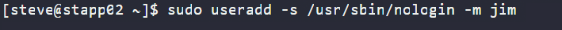
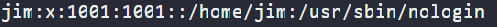
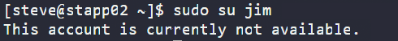

# Day 1: Linux User Setup with Non-Interactive Shell 

<div style="border:1px solid #ccc; padding:10px; border-radius:10px; box-shadow:2px 2px 8px rgba(0,0,0,0.2); display:inline-block;">
  
</div>

## 🎯 Content:
> Today I worked on setting up a Linux user with a non-interactive shell as part of my 100 Days of DevOps journey.
> 
> This type of user is mainly used for service accounts and automation tasks where login access is not required.

## What I Learned

*   How to create a user with a non-interactive shell
    
*   The importance of restricting login access for service accounts
    
*   Basic user management in Linux
    
## Task Details

<div style="border:1px solid #ccc; padding:10px; border-radius:10px; box-shadow:2px 2px 8px rgba(0,0,0,0.2); display:inline-block;">
  
</div>

## Steps I Followed

### 1\. Connect to the server

```plaintext
ssh user@server-name
```

<div style="border:1px solid #ccc; padding:10px; border-radius:10px; box-shadow:2px 2px 8px rgba(0,0,0,0.2); display:inline-block;">
  
</div>

### 2\. Create a user with non-interactive shell

```plaintext
sudo useradd -s /usr/sbin/nologin -m rose
```
<div style="border:1px solid #ccc; padding:10px; border-radius:10px; box-shadow:2px 2px 8px rgba(0,0,0,0.2); display:inline-block;">
  
</div>

### 3\. Verify user creation

```plaintext
cat /etc/passwd
```

Check if the new user appears in the list.
<div style="border:1px solid #ccc; padding:10px; border-radius:10px; box-shadow:2px 2px 8px rgba(0,0,0,0.2); display:inline-block;">
  
</div>

<div style="border:1px solid #ccc; padding:10px; border-radius:10px; box-shadow:2px 2px 8px rgba(0,0,0,0.2); display:inline-block;">
  
</div>

### 4\. Test login

```plaintext
sudo su rose
```

Output:

```plaintext
This account is currently not available.
```
<div style="border:1px solid #ccc; padding:10px; border-radius:10px; box-shadow:2px 2px 8px rgba(0,0,0,0.2); display:inline-block;">
  
</div>

### My Understanding

Using a non-interactive shell helps improve system security by preventing direct login access.  
This is useful for background services and automated processes that don’t require user interaction.

* * *

### Topics Covered

- ***Useradd command***
- ***User Management***
- ***Non-interactive Shell***