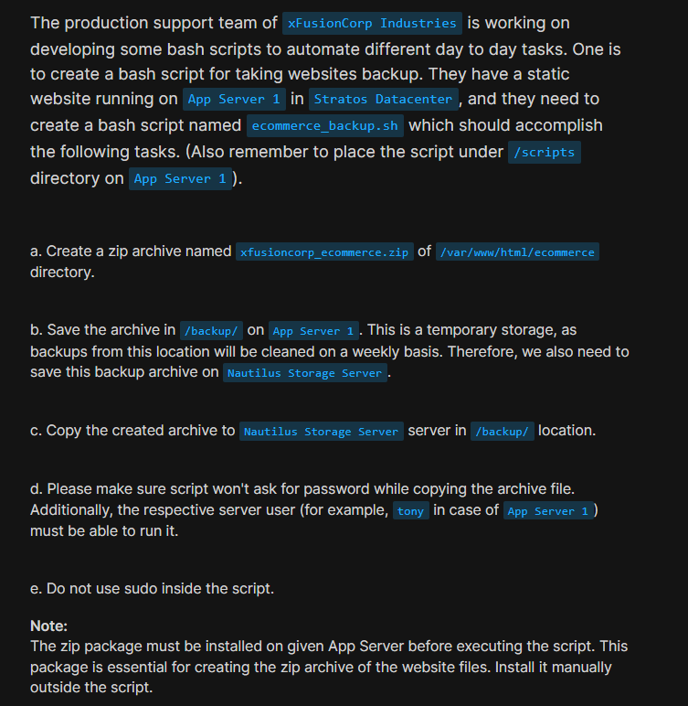
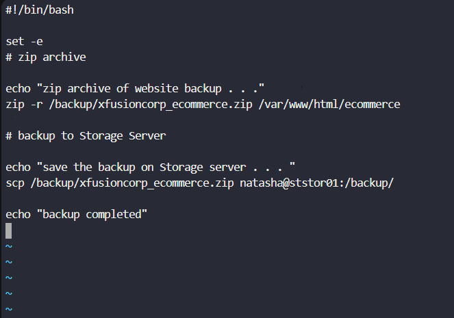
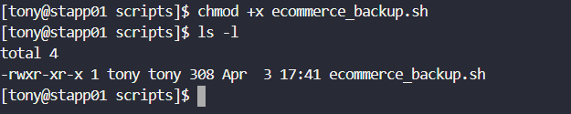
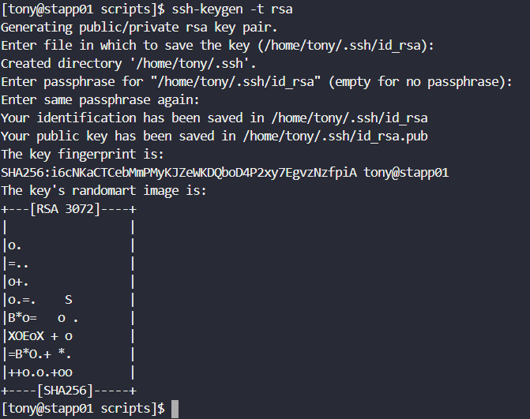
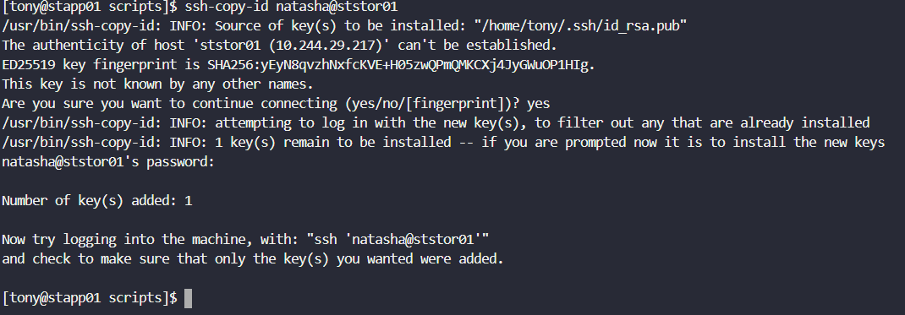
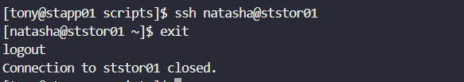
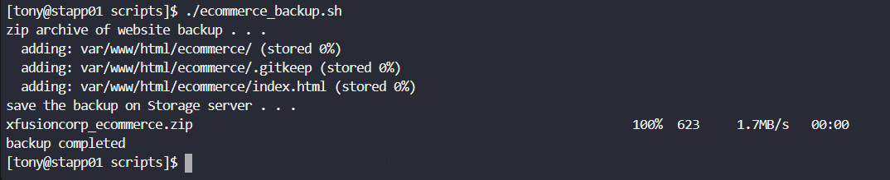
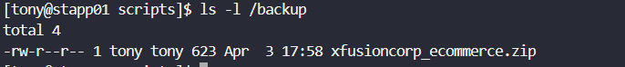
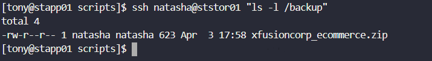

# Day 10: Linux Bash Scripts

<div style="border:1px solid #ccc; padding:10px; border-radius:10px; box-shadow:2px 2px 8px rgba(0,0,0,0.2); display:inline-block;">
  
</div>

## **Content:**

>Today I worked on creating a Bash script to automate website backup tasks. The goal was to create a script that compresses website files and securely transfers the backup to a storage server without requiring a password.

>This task helped me understand how shell scripting can simplify repetitive administrative work in a real DevOps environment.

---

## **What I Learned**

Through this task, I understood:

* How to create and execute a Bash script
* How to use the `zip` command to compress directories
* How to transfer files securely using `scp`
* How to set up passwordless SSH authentication
* Importance of automation in backup processes

---

<div style="border:1px solid #ccc; padding:10px; border-radius:10px; box-shadow:2px 2px 8px rgba(0,0,0,0.2); display:inline-block;">
  
</div>

## **Steps I Followed :**

### **1. Connected to Application Server**

```bash
ssh tony@stapp01
```
<div style="border:1px solid #ccc; padding:10px; border-radius:10px; box-shadow:2px 2px 8px rgba(0,0,0,0.2); display:inline-block;">
  
</div>

Logged into the App Server where the website is hosted.

---

### **2. Created Script Directory and File**

```bash
cd /scripts
vi ecommerce_backup.sh
```
<div style="border:1px solid #ccc; padding:10px; border-radius:10px; box-shadow:2px 2px 8px rgba(0,0,0,0.2); display:inline-block;">
  
</div>

Created the script file to write automation commands.

---

### **3. Wrote Bash Script**

<div style="border:1px solid #ccc; padding:10px; border-radius:10px; box-shadow:2px 2px 8px rgba(0,0,0,0.2); display:inline-block;">
  
</div>

```bash
#!/bin/bash

set -e
# zip archive 

echo "zip archive of website backup . . ."
zip -r /backup/xfusioncorp_ecommerce.zip /var/www/html/ecommerce

# backup to storage server

echo "save the backup on Storage server . . ."
scp /backup/xfusioncorp_ecommerce.zip natasha@ststor01:/backup/


echo "backup completed"

```

This script:

* Creates backup directory
* Compresses website files
* Transfers backup to Storage Server

<div style="border:1px solid #ccc; padding:10px; border-radius:10px; box-shadow:2px 2px 8px rgba(0,0,0,0.2); display:inline-block;">
  
</div>

---

### **4. Set Execute Permission**

<div style="border:1px solid #ccc; padding:10px; border-radius:10px; box-shadow:2px 2px 8px rgba(0,0,0,0.2); display:inline-block;">
  
</div>

```bash
chmod +x ecommerce_backup.sh
```

<div style="border:1px solid #ccc; padding:10px; border-radius:10px; box-shadow:2px 2px 8px rgba(0,0,0,0.2); display:inline-block;">
  
</div>

Made the script executable.

---

### **5. Setup Passwordless SSH**

<div style="border:1px solid #ccc; padding:10px; border-radius:10px; box-shadow:2px 2px 8px rgba(0,0,0,0.2); display:inline-block;">
  
</div>

<div style="border:1px solid #ccc; padding:10px; border-radius:10px; box-shadow:2px 2px 8px rgba(0,0,0,0.2); display:inline-block;">
  
</div>

```bash
ssh-keygen -t rsa
ssh-copy-id natasha@ststor01
```

Enabled secure login without password for automation.

<div style="border:1px solid #ccc; padding:10px; border-radius:10px; box-shadow:2px 2px 8px rgba(0,0,0,0.2); display:inline-block;">
  
</div>

<div style="border:1px solid #ccc; padding:10px; border-radius:10px; box-shadow:2px 2px 8px rgba(0,0,0,0.2); display:inline-block;">
  
</div>


---

### **6. Tested SSH Connection**

```bash
ssh natasha@ststor01
```

<div style="border:1px solid #ccc; padding:10px; border-radius:10px; box-shadow:2px 2px 8px rgba(0,0,0,0.2); display:inline-block;">
  
</div>

Verified that login works without password.

---

### **7. Executed Script**

```bash
./ecommerce_backup.sh
```

Ran the script to perform backup and transfer.

<div style="border:1px solid #ccc; padding:10px; border-radius:10px; box-shadow:2px 2px 8px rgba(0,0,0,0.2); display:inline-block;">
  
</div>
---

### **8. Verified Backup**

On App Server:

```bash
ls -l /backup
```
<div style="border:1px solid #ccc; padding:10px; border-radius:10px; box-shadow:2px 2px 8px rgba(0,0,0,0.2); display:inline-block;">
  
</div>

On Storage Server:

```bash
ssh natasha@ststor01 "ls -l /backup"
```
<div style="border:1px solid #ccc; padding:10px; border-radius:10px; box-shadow:2px 2px 8px rgba(0,0,0,0.2); display:inline-block;">
  
</div>

Confirmed that backup file exists in both locations.

---

## **My Understanding**

This task showed how Bash scripting can automate repetitive operations like backups. Combining tools like `zip`, `scp`, and SSH keys helps build efficient and secure workflows in real-world DevOps environments.

---

## **What I Found Interesting**

It was interesting to see how multiple commands can be combined into a single script to fully automate a backup process. Setting up passwordless SSH was especially useful, as it enables seamless communication between servers without manual intervention.

---

### Topics Covered
- ***Bash scripting for automation***
- ***Website backup using zip***
- ***Secure file transfer using scp***
- ***Passwordless SSH authentication***
- ***File permissions and script execution***


**Previous Task**: [Day 9: MariaDB Troubleshooting](../Day_9/day_9.md)

**Next Task**: [Day 11: Install and Configure Tomcat Server](../Day_11/day_11.md)

