# Day 100: Create and Configure Alarm Using CloudWatch Using Terraform

<div style="border:1px solid #ccc; padding:10px; border-radius:10px; box-shadow:2px 2px 8px rgba(0,0,0,0.2); display:inline-block;">
  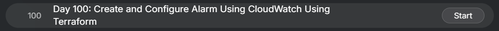
</div>

## Content

> Today I learned how to provision an **EC2 instance** and configure an **Amazon CloudWatch Alarm** using Terraform. I also learned how to connect the alarm to an existing **SNS topic** so that notifications are sent automatically when the EC2 instance's CPU utilization exceeds a defined threshold. This task demonstrated how Terraform can be used to provision compute resources while simultaneously configuring monitoring and alerting as infrastructure as code.

* * *

## 🔹 What I Learned

*   Launching an EC2 instance using Terraform
    
*   Creating a CloudWatch Metric Alarm
    
*   Monitoring EC2 CPU utilization
    
*   Connecting CloudWatch Alarms to an SNS topic
    
*   Using Terraform outputs to retrieve resource information
    

* * *

## 🔹 Task Requirement

<div style="border:1px solid #ccc; padding:10px; border-radius:10px; box-shadow:2px 2px 8px rgba(0,0,0,0.2); display:inline-block;">
  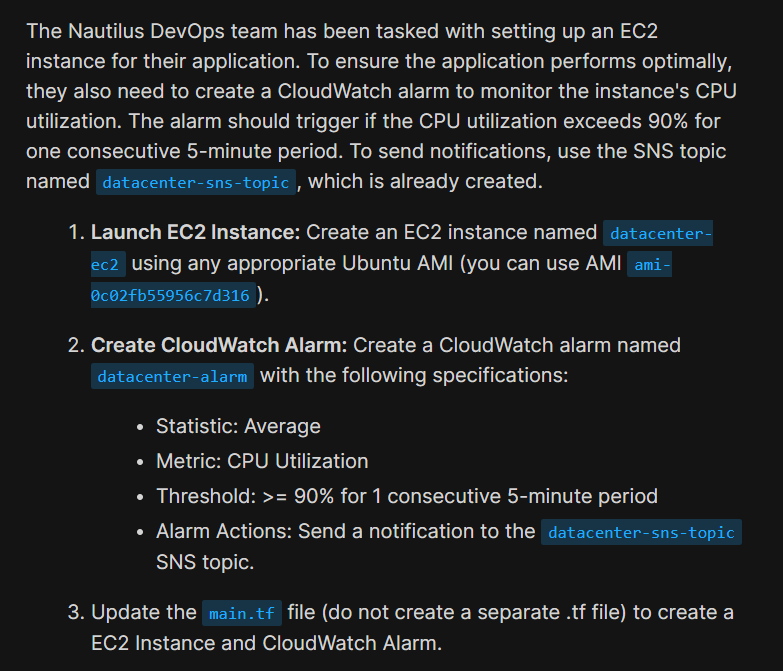
</div>
<div style="border:1px solid #ccc; padding:10px; border-radius:10px; box-shadow:2px 2px 8px rgba(0,0,0,0.2); display:inline-block;">
  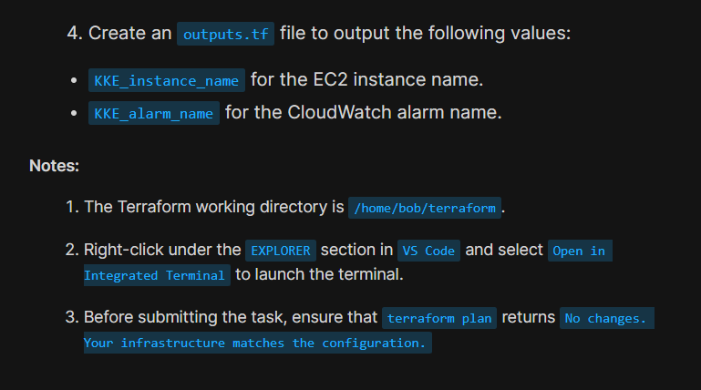
</div>

The Terraform working directory was already available at:

```text
/home/bob/terraform
```

A `provider.tf` file was already configured with:

*   AWS Provider
    
*   Region
    

```text
us-east-1
```

*   LocalStack endpoints
    

The `main.tf` file already contained an existing SNS topic:

```hcl
resource "aws_sns_topic" "sns_topic" {
  name = "datacenter-sns-topic"
}
```

The task required updating `main.tf` to create:

*   EC2 Instance
    

```text
datacenter-ec2
```

*   Ubuntu AMI
    

```text
ami-0c02fb55956c7d316
```

*   Instance Type
    

```text
t2.micro
```

*   CloudWatch Alarm
    

```text
datacenter-alarm
```

The alarm needed to:

*   Monitor EC2 CPU Utilization
    
*   Use the Average statistic
    
*   Trigger when CPU utilization is **greater than or equal to 90%**
    
*   Evaluate **1 consecutive 5-minute period**
    
*   Send notifications to the existing SNS topic
    

Additionally, an `outputs.tf` file needed to be created containing:

*   `KKE_instance_name`
    
*   `KKE_alarm_name`
    

* * *

# 🔹 Steps I Followed

## 1\. Navigated to the Terraform Working Directory

The Terraform working directory was already opened in VS Code.

I verified that the AWS provider configuration was already available.

* * *

## 2\. Reviewed the Existing Provider Configuration

The `provider.tf` file already contained:

*   AWS provider
    
*   Region configuration
    
*   LocalStack endpoints
    
<div style="border:1px solid #ccc; padding:10px; border-radius:10px; box-shadow:2px 2px 8px rgba(0,0,0,0.2); display:inline-block;">
  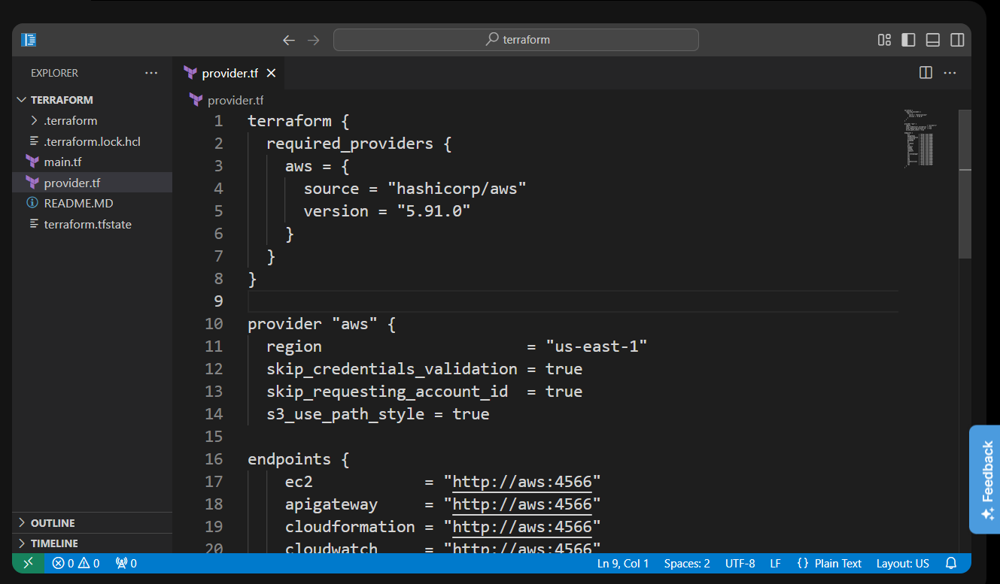
</div>

Since the provider was already configured, no modifications were required.

* * *

## 3\. Reviewed the Existing `main.tf`

The existing configuration already contained the SNS topic:

```hcl
resource "aws_sns_topic" "sns_topic" {
  name = "datacenter-sns-topic"
}
```

<div style="border:1px solid #ccc; padding:10px; border-radius:10px; box-shadow:2px 2px 8px rgba(0,0,0,0.2); display:inline-block;">
  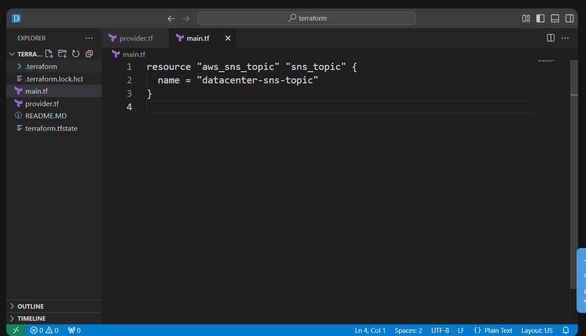
</div>

Since the task specified that the SNS topic already existed, no changes were made to this resource.

* * *

## 4\. Updated `main.tf`

<div style="border:1px solid #ccc; padding:10px; border-radius:10px; box-shadow:2px 2px 8px rgba(0,0,0,0.2); display:inline-block;">
  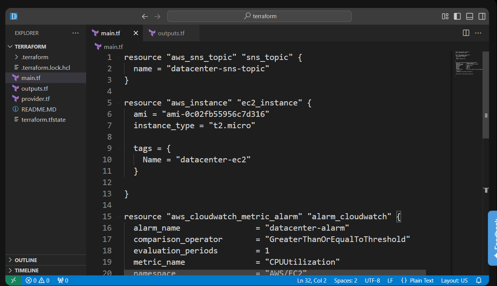
</div>
<div style="border:1px solid #ccc; padding:10px; border-radius:10px; box-shadow:2px 2px 8px rgba(0,0,0,0.2); display:inline-block;">
  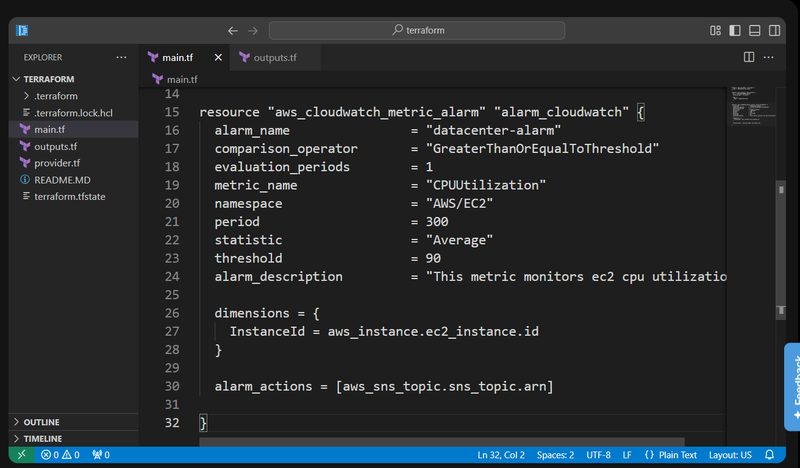
</div>

Added the EC2 instance:

```hcl
resource "aws_instance" "ec2_instance" {
  ami           = "ami-0c02fb55956c7d316"
  instance_type = "t2.micro"

  tags = {
    Name = "datacenter-ec2"
  }
}
```

Added the CloudWatch Alarm:

```hcl
resource "aws_cloudwatch_metric_alarm" "alarm_cloudwatch" {
  alarm_name          = "datacenter-alarm"
  comparison_operator = "GreaterThanOrEqualToThreshold"
  evaluation_periods  = 1
  metric_name         = "CPUUtilization"
  namespace           = "AWS/EC2"
  period              = 300
  statistic           = "Average"
  threshold           = 90

  alarm_description = "This metric monitors ec2 cpu utilization"

  dimensions = {
    InstanceId = aws_instance.ec2_instance.id
  }

  alarm_actions = [
    aws_sns_topic.sns_topic.arn
  ]
}
```

* * *

## 5\. Created `outputs.tf`

```hcl
output "KKE_instance_name" {
  value = aws_instance.ec2_instance.tags["Name"]
}

output "KKE_alarm_name" {
  value = aws_cloudwatch_metric_alarm.alarm_cloudwatch.alarm_name
}
```
<div style="border:1px solid #ccc; padding:10px; border-radius:10px; box-shadow:2px 2px 8px rgba(0,0,0,0.2); display:inline-block;">
  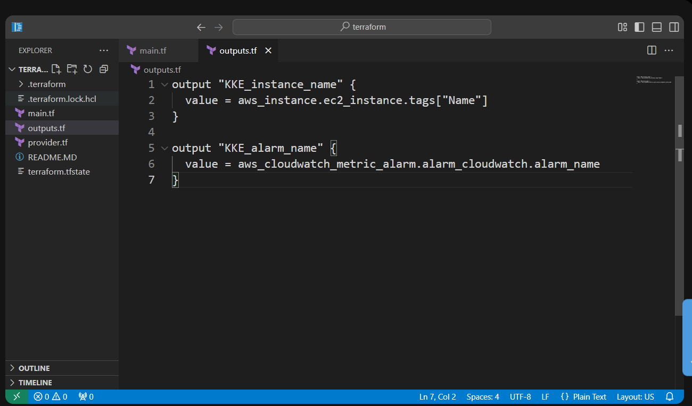
</div>

### Observation

Outputs display the EC2 instance name and CloudWatch alarm name after deployment.

* * *

# 📘 Understanding the Code

### EC2 Instance

The EC2 instance is created using the specified Ubuntu AMI.

```text
ami-0c02fb55956c7d316
```

It is launched as a:

```text
t2.micro
```

instance and tagged with:

```text
datacenter-ec2
```

* * *

### CloudWatch Alarm

The CloudWatch Alarm continuously monitors the EC2 instance's CPU utilization.

It uses:

*   Namespace
    

```text
AWS/EC2
```

*   Metric
    

```text
CPUUtilization
```

*   Statistic
    

```text
Average
```

The alarm is triggered when the CPU utilization reaches:

```text
90%
```

or higher during:

```text
1 consecutive 5-minute period
```

* * *

### Alarm Dimensions

The alarm monitors only the EC2 instance created by Terraform.

```hcl
dimensions = {
  InstanceId = aws_instance.ec2_instance.id
}
```

Terraform automatically retrieves the instance ID after creating the EC2 instance.

* * *

### SNS Alarm Action

The alarm sends notifications to the existing SNS topic.

```hcl
alarm_actions = [
  aws_sns_topic.sns_topic.arn
]
```

This links CloudWatch with Amazon SNS so that notifications are sent whenever the alarm enters the **ALARM** state.

* * *

### Outputs

The outputs display:

*   EC2 instance name
    
*   CloudWatch alarm name
    

after `terraform apply` completes.

* * *

## 6\. Initialized Terraform

```bash
terraform init
```

### Observation

Terraform initialized the working directory and reused the existing AWS provider.

* * *

## 7\. Formatted the Configuration

```bash
terraform fmt
```
<div style="border:1px solid #ccc; padding:10px; border-radius:10px; box-shadow:2px 2px 8px rgba(0,0,0,0.2); display:inline-block;">
  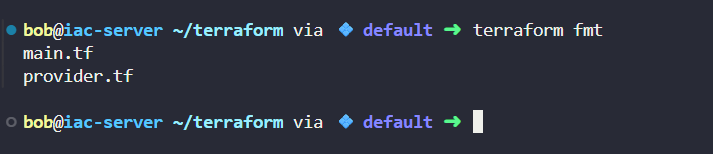
</div>

### Observation

Terraform formatted the configuration files according to standard HCL formatting.

* * *

## 8\. Validated the Configuration

```bash
terraform validate
```

Output

```text
Success! The configuration is valid.
```

### Observation

Terraform confirmed that the configuration syntax was correct.

* * *

## 9\. Reviewed the Execution Plan

```bash
terraform plan
```
<div style="border:1px solid #ccc; padding:10px; border-radius:10px; box-shadow:2px 2px 8px rgba(0,0,0,0.2); display:inline-block;">
  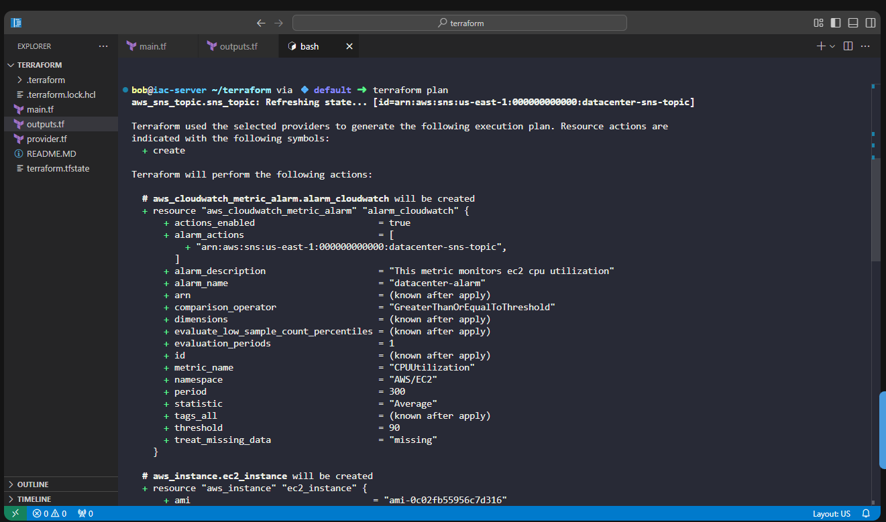
</div>
<div style="border:1px solid #ccc; padding:10px; border-radius:10px; box-shadow:2px 2px 8px rgba(0,0,0,0.2); display:inline-block;">
  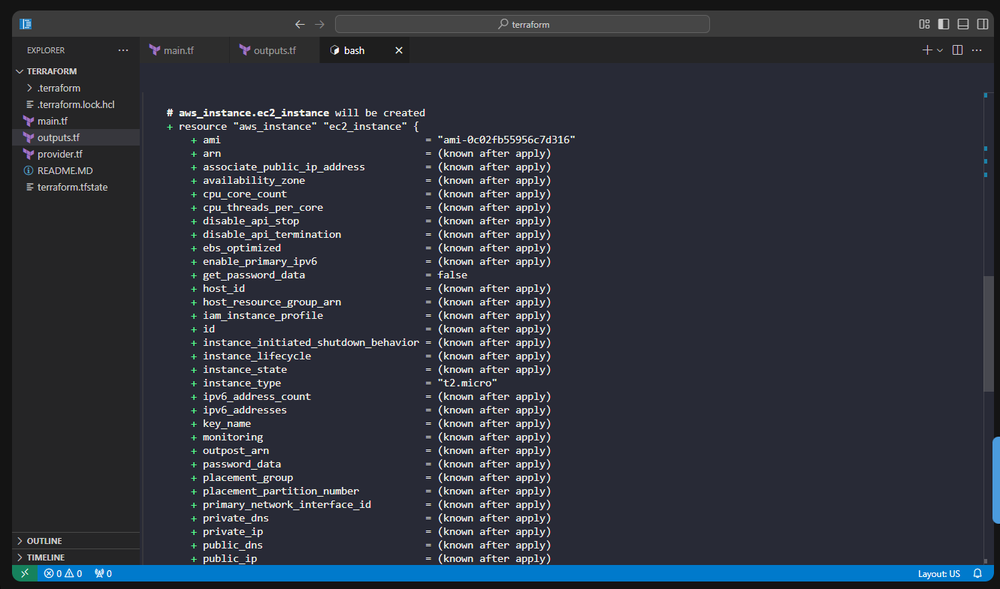
</div>
<div style="border:1px solid #ccc; padding:10px; border-radius:10px; box-shadow:2px 2px 8px rgba(0,0,0,0.2); display:inline-block;">
  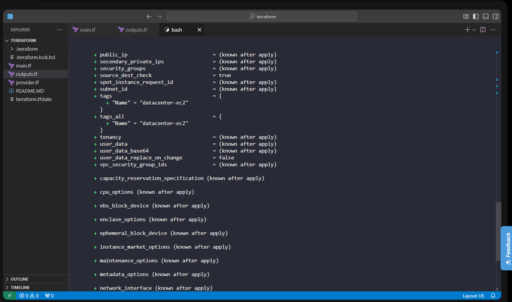
</div>
<div style="border:1px solid #ccc; padding:10px; border-radius:10px; box-shadow:2px 2px 8px rgba(0,0,0,0.2); display:inline-block;">
  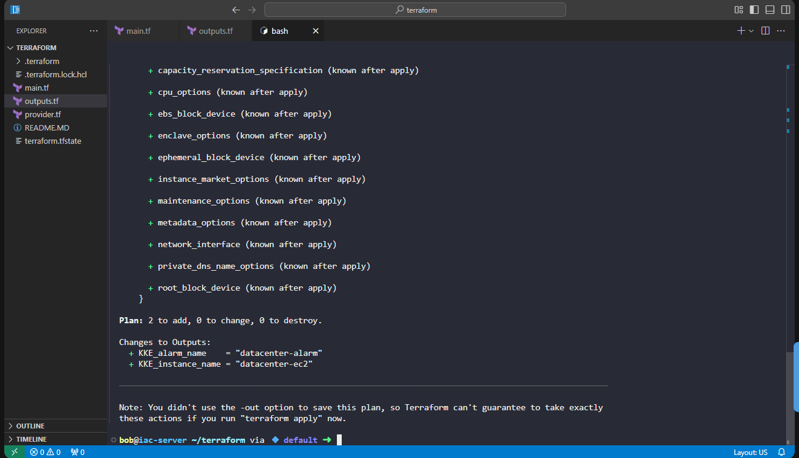
</div>


Terraform displayed:

```text
Plan: 2 to add, 0 to change, 0 to destroy.
```

### Observation

Terraform planned to create:

*   EC2 Instance
    
*   CloudWatch Alarm
    

The outputs also showed:

```text
KKE_instance_name = "datacenter-ec2"
KKE_alarm_name = "datacenter-alarm"
```

* * *

## 10\. Applied the Configuration

```bash
terraform apply -auto-approve
```

<div style="border:1px solid #ccc; padding:10px; border-radius:10px; box-shadow:2px 2px 8px rgba(0,0,0,0.2); display:inline-block;">
  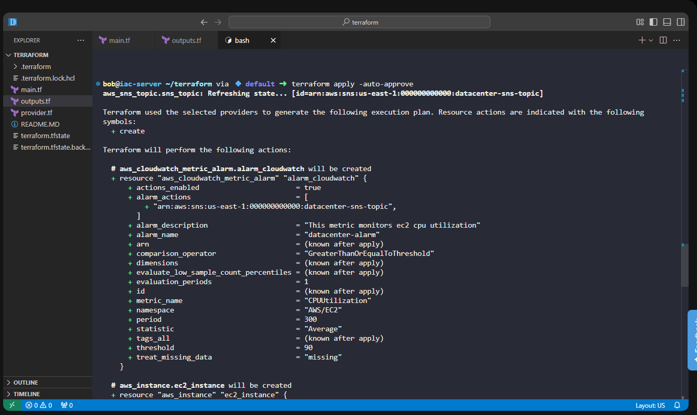
</div>
<div style="border:1px solid #ccc; padding:10px; border-radius:10px; box-shadow:2px 2px 8px rgba(0,0,0,0.2); display:inline-block;">
  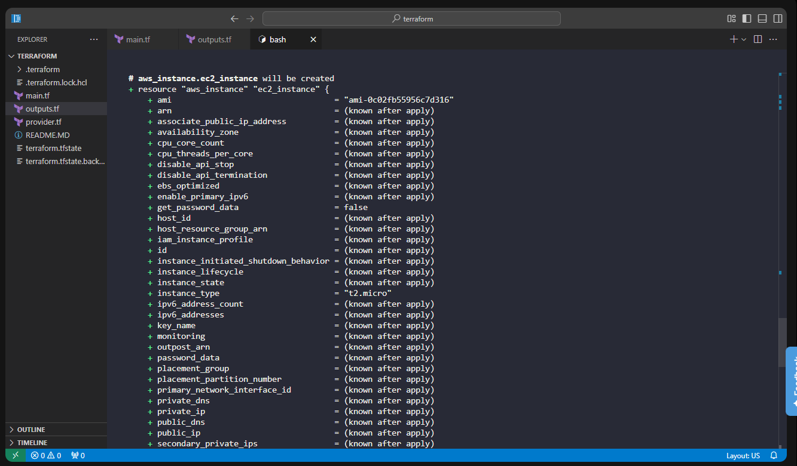
</div>
<div style="border:1px solid #ccc; padding:10px; border-radius:10px; box-shadow:2px 2px 8px rgba(0,0,0,0.2); display:inline-block;">
  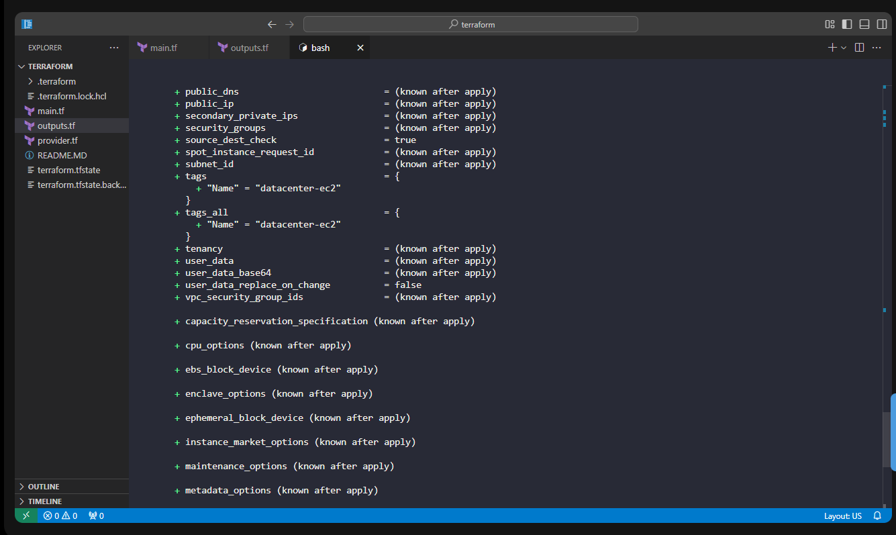
</div>
<div style="border:1px solid #ccc; padding:10px; border-radius:10px; box-shadow:2px 2px 8px rgba(0,0,0,0.2); display:inline-block;">
  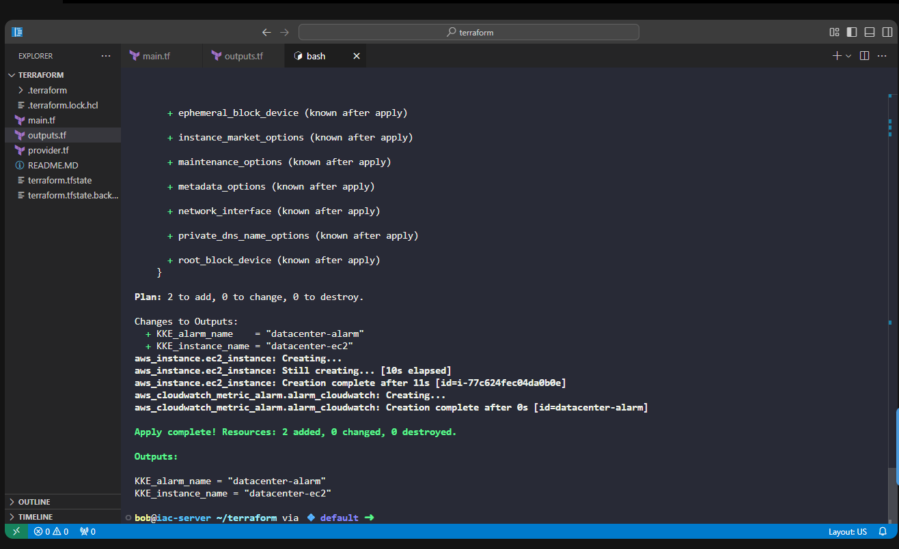
</div>

Output

```text
Apply complete!
Resources: 2 added, 0 changed, 0 destroyed.
```

### Observation

Terraform successfully created the EC2 instance and CloudWatch Alarm.

* * *

## 11\. Verified the Deployment

```bash
terraform plan
```
<div style="border:1px solid #ccc; padding:10px; border-radius:10px; box-shadow:2px 2px 8px rgba(0,0,0,0.2); display:inline-block;">
  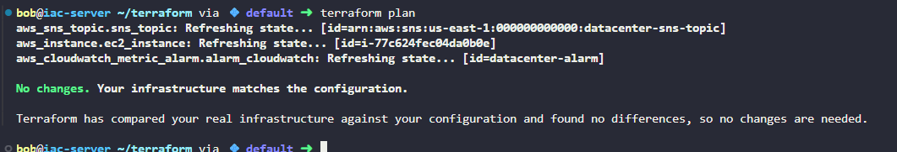
</div>

Output

```text
No changes.
Your infrastructure matches the configuration.
```

### Observation

This confirmed that the deployed infrastructure exactly matched the Terraform configuration.

* * *

## 12\. Verified the Terraform State

```bash
terraform state list
```
<div style="border:1px solid #ccc; padding:10px; border-radius:10px; box-shadow:2px 2px 8px rgba(0,0,0,0.2); display:inline-block;">
  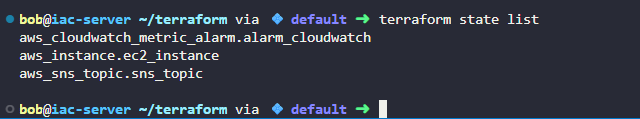
</div>

Output

```text
aws_cloudwatch_metric_alarm.alarm_cloudwatch
aws_instance.ec2_instance
aws_sns_topic.sns_topic
```

### Observation

Terraform state contained the existing SNS topic along with the newly created EC2 instance and CloudWatch Alarm.

* * *

## 📚 References Used

*   Terraform AWS Provider – EC2 Instance [https://registry.terraform.io/providers/hashicorp/aws/latest/docs/resources/instance](https://registry.terraform.io/providers/hashicorp/aws/latest/docs/resources/instance)
    
*   Terraform AWS Provider – CloudWatch Metric Alarm [https://registry.terraform.io/providers/hashicorp/aws/latest/docs/resources/cloudwatch\_metric\_alarm](https://registry.terraform.io/providers/hashicorp/aws/latest/docs/resources/cloudwatch_metric_alarm)
    
*   Terraform AWS Provider – SNS Topic [https://registry.terraform.io/providers/hashicorp/aws/latest/docs/resources/sns\_topic](https://registry.terraform.io/providers/hashicorp/aws/latest/docs/resources/sns_topic)
    

* * *

## 🔹 Verification

*   ✅ Used the existing AWS provider configuration
    
*   ✅ Reused the existing SNS topic
    
*   ✅ Created an EC2 instance
    
*   ✅ Created a CloudWatch Alarm
    
*   ✅ Configured the alarm to monitor EC2 CPU utilization
    
*   ✅ Set the threshold to **90%** for **1 consecutive 5-minute period**
    
*   ✅ Connected the alarm to the existing SNS topic
    
*   ✅ Created `outputs.tf`
    
*   ✅ Successfully provisioned the infrastructure using `terraform apply`
    
*   ✅ Verified the deployment using `terraform plan`
    
*   ✅ Confirmed Terraform state contained all required resources
    

* * *

## 🔹 My Understanding

I learned how Terraform can be used not only to provision infrastructure but also to configure monitoring and alerting. By creating an EC2 instance and a CloudWatch Alarm together, Terraform automatically handled the dependency between the resources. I also learned how CloudWatch uses dimensions to monitor a specific EC2 instance and how SNS integrates with CloudWatch to send notifications whenever an alarm threshold is exceeded.

* * *

## 🔹 What I Found Interesting

I found it interesting that CloudWatch Alarms can directly reference Terraform-managed resources using their attributes, such as the EC2 instance ID. This allows Terraform to automatically configure monitoring for the correct instance without manually looking up resource identifiers. I also liked how easily CloudWatch integrates with SNS, making it simple to build automated monitoring and notification workflows as code.

* * *

* * *

### Topics Covered

- ***Terraform***
- ***Amazon Cloud watch***
- ***CloudWatch Alarm ***
- ***EC2 CPU utilization***
- ***SNS topic***
- ***Terraform Variables***
- ***Terraform Outputs***
- ***Infrastructure as Code (IaC)***


**Previous Task**: [Day 99: Attach IAM Policy for DynamoDB Access Using Terraform](../Day_99/day_99.md)