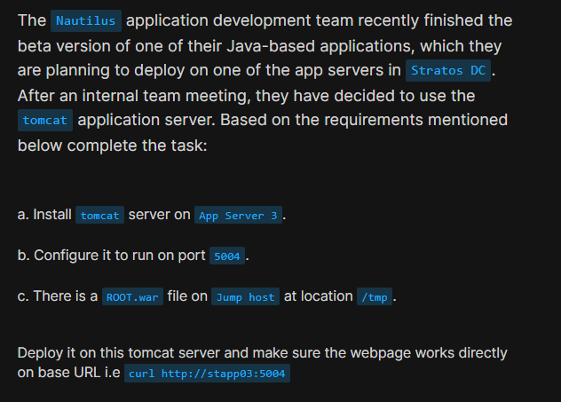
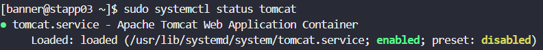
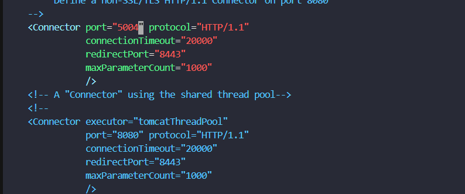
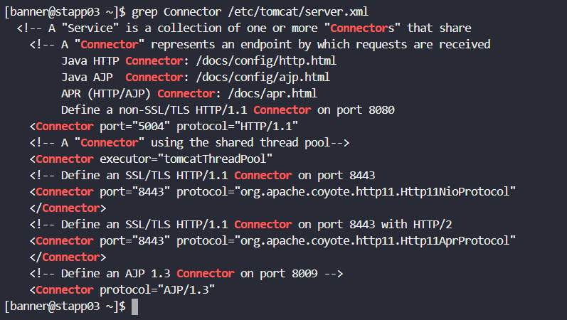
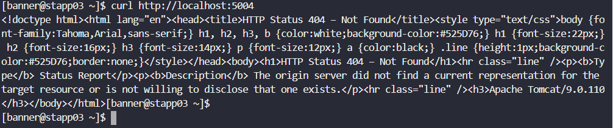
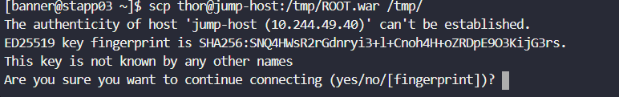
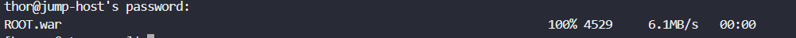
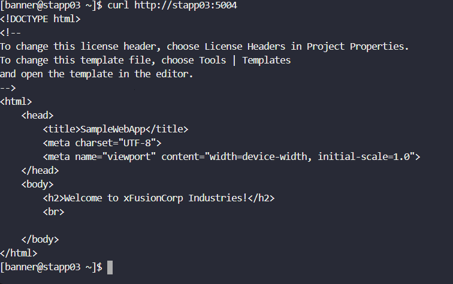

# Day 11: Install and Configure Tomcat Server

<div style="border:1px solid #ccc; padding:10px; border-radius:10px; box-shadow:2px 2px 8px rgba(0,0,0,0.2); display:inline-block;">
  
</div>

## Content:

Today I worked on deploying a Java-based application using the Apache Tomcat application server. The task involved installing Tomcat, configuring it to run on a custom port, and deploying a `.war` file so that the application is accessible directly from the base URL.

This task gave me hands-on experience with application server setup and deployment, which is a key responsibility in real-world DevOps environments.

* * *

# What I Learned

Through this task, I understood:

*   How to install and manage Apache Tomcat on a Linux server
    
*   How to configure Tomcat to run on a custom port
    
*   How `.war` files are deployed and executed in Tomcat
    
*   How ROOT applications work in web servers
    
*   Importance of proper configuration before deployment
    

* * *
<div style="border:1px solid #ccc; padding:10px; border-radius:10px; box-shadow:2px 2px 8px rgba(0,0,0,0.2); display:inline-block;">
  
</div>

## Steps I Followed

* * *

## 1\. Connected to Application Server

```bash
ssh banner@stapp03
```

I first connected to **App Server 3**, where the application needed to be deployed.

👉 This step is important because all configurations and deployments must be done on the correct target server.

<div style="border:1px solid #ccc; padding:10px; border-radius:10px; box-shadow:2px 2px 8px rgba(0,0,0,0.2); display:inline-block;">
  
</div>

* * *

## 2\. Verified Operating System

```bash
cat /etc/os-release
```

Before installing anything, I checked the OS version.

👉 Why? Different Linux distributions use different package managers. Since this was **CentOS Stream 9**, I knew I had to use `dnf` for installation.

* * *

## 3\. Installed Apache Tomcat

```bash
sudo dnf install -y tomcat
```

<div style="border:1px solid #ccc; padding:10px; border-radius:10px; box-shadow:2px 2px 8px rgba(0,0,0,0.2); display:inline-block;">
  
</div>


This installs Tomcat along with required dependencies like Java libraries.

👉 Why Tomcat? Tomcat is widely used for deploying Java applications because it can run `.war` files directly.

* * *

## 4\. Started and Enabled Tomcat

```bash
sudo systemctl start tomcat
sudo systemctl enable tomcat
```

<div style="border:1px solid #ccc; padding:10px; border-radius:10px; box-shadow:2px 2px 8px rgba(0,0,0,0.2); display:inline-block;">
  
</div>


👉 Why both commands?

*   `start` → runs Tomcat immediately
    
*   `enable` → ensures it starts automatically after reboot
    

This is crucial in production environments.

<div style="border:1px solid #ccc; padding:10px; border-radius:10px; box-shadow:2px 2px 8px rgba(0,0,0,0.2); display:inline-block;">
  
</div>


* * *

## 5\. Configured Tomcat to Run on Port 5004

```bash
sudo vi /etc/tomcat/server.xml
```

<div style="border:1px solid #ccc; padding:10px; border-radius:10px; box-shadow:2px 2px 8px rgba(0,0,0,0.2); display:inline-block;">
  
</div>

I modified this line:

```xml
<Connector port="8080" protocol="HTTP/1.1"
```

to:

```xml
<Connector port="5004" protocol="HTTP/1.1"
```

<div style="border:1px solid #ccc; padding:10px; border-radius:10px; box-shadow:2px 2px 8px rgba(0,0,0,0.2); display:inline-block;">
  
</div>

👉 Why change the port?

*   Default port (8080) might already be used
    
*   Custom ports are often required in real infrastructure setups
    

This ensures our application runs on the required port.

* * *

## 6\. Restarted Tomcat

```bash
sudo systemctl restart tomcat
```

<div style="border:1px solid #ccc; padding:10px; border-radius:10px; box-shadow:2px 2px 8px rgba(0,0,0,0.2); display:inline-block;">
  
</div>

👉 Why restart?

Changes in configuration files (like `server.xml`) only take effect after restarting the service.

<div style="border:1px solid #ccc; padding:10px; border-radius:10px; box-shadow:2px 2px 8px rgba(0,0,0,0.2); display:inline-block;">
  
</div>

* * *

## 7\. Verified Tomcat is Working

```bash
curl http://localhost:5004
```

<div style="border:1px solid #ccc; padding:10px; border-radius:10px; box-shadow:2px 2px 8px rgba(0,0,0,0.2); display:inline-block;">
  
</div>

At this stage, I got a **404 error**.

👉 Why this is expected?

Tomcat was running, but no application was deployed yet. So the server is working, but has nothing to serve.

* * *

## 8\. Copied ROOT.war from Jump Host

```bash
scp thor@jump-host:/tmp/ROOT.war /tmp/
```

<div style="border:1px solid #ccc; padding:10px; border-radius:10px; box-shadow:2px 2px 8px rgba(0,0,0,0.2); display:inline-block;">
  
</div>

<div style="border:1px solid #ccc; padding:10px; border-radius:10px; box-shadow:2px 2px 8px rgba(0,0,0,0.2); display:inline-block;">
  
</div>

👉 Why use `scp`?

*   Secure file transfer between servers
    
*   Common method in DevOps workflows
    

The `.war` file is the application package.

* * *

## 9\. Deployed the Application

```bash
sudo cp /tmp/ROOT.war /var/lib/tomcat/webapps/
```

<div style="border:1px solid #ccc; padding:10px; border-radius:10px; box-shadow:2px 2px 8px rgba(0,0,0,0.2); display:inline-block;">
  
</div>

👉 Why this location?

Tomcat automatically deploys applications placed in the `webapps` directory.

* * *

## 10\. Set Correct Permissions

```bash
sudo chown tomcat:tomcat /var/lib/tomcat/webapps/ROOT.war
```

<div style="border:1px solid #ccc; padding:10px; border-radius:10px; box-shadow:2px 2px 8px rgba(0,0,0,0.2); display:inline-block;">
  
</div>

👉 Why needed?

Tomcat runs under its own user (`tomcat`). Without proper permissions, it may fail to read or deploy the application.

* * *

## 11\. Restarted Tomcat Again

```bash
sudo systemctl restart tomcat
```

<div style="border:1px solid #ccc; padding:10px; border-radius:10px; box-shadow:2px 2px 8px rgba(0,0,0,0.2); display:inline-block;">
  
</div>

👉 Why again?

To ensure Tomcat detects and extracts the new `.war` file.

* * *

## 12\. Verified Deployment

```bash
ls /var/lib/tomcat/webapps/
```

Output:

```plaintext
ROOT  ROOT.war
```

<div style="border:1px solid #ccc; padding:10px; border-radius:10px; box-shadow:2px 2px 8px rgba(0,0,0,0.2); display:inline-block;">
  
</div>

👉 What this means?

*   `ROOT.war` → deployed file
    
*   `ROOT/` → extracted application
    

* * *

## 13\. Tested the Application

```bash
curl http://stapp03:5004
```

Output:

```html
<h2>Welcome to xFusionCorp Industries!</h2>
```

<div style="border:1px solid #ccc; padding:10px; border-radius:10px; box-shadow:2px 2px 8px rgba(0,0,0,0.2); display:inline-block;">
  
</div>

* * *

# My Understanding

This task helped me understand how application servers like Tomcat work in real environments.

*   Installing software is just the first step
    
*   Configuration (like ports) is equally important
    
*   Deployment requires correct placement and permissions
    
*   ROOT applications allow direct access without extra paths
    

* * *

# What I Found Interesting

It was interesting to see how:

*   A simple `.war` file can become a fully running web application
    
*   Changing just one configuration (port) can control how services are accessed
    
*   Tomcat automatically extracts and deploys applications
    

Also, debugging the **404 error** helped me understand the difference between:

*   Server not running ❌
    
*   Server running but no app deployed ⚠️
    

* * *

# Final Result

The application is successfully accessible at:

```plaintext
http://stapp03:5004
```

* * *

### Topics Covered
- ***Apache Tomcat setup and configuration***
- ***Custom port configuration***
- ***Java application deployment using .war***
- ***Secure file transfer using scp***


**Previous Task**: [Day 10: Linux Bash Scripts](../Day_10/day_10.md)

**Next Task**: [Day 12: Linux Network Services](../Day_12/day_12.md)