# Day 12: Linux Network Services

<div style="border:1px solid #ccc; padding:10px; border-radius:10px; box-shadow:2px 2px 8px rgba(0,0,0,0.2); display:inline-block;">
  
</div>

## **Content:**

> Today I worked on troubleshooting a real-world Linux network issue where an Apache service was not accessible on port **8088**. The issue required debugging at multiple levels including network connectivity, service conflicts, and firewall rules.

## **What I Learned**

Through this task, I understood:

*   How to approach troubleshooting step by step
    
*   How port conflicts can break services
    
*   How to identify which process is using a port
    
*   How to adjust configurations safely
    
*   How firewall rules impact service accessibility
    

* * *
<div style="border:1px solid #ccc; padding:10px; border-radius:10px; box-shadow:2px 2px 8px rgba(0,0,0,0.2); display:inline-block;">
  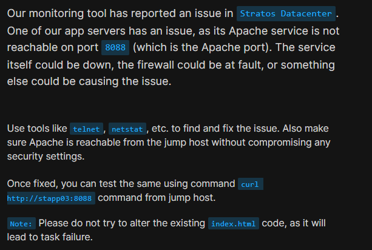
</div>

## **Steps I Followed :**

### **1\. Checked Connectivity from Jump Host**

```bash
telnet stapp01 8088
telnet stapp02 8088
telnet stapp03 8088
```

👉 I started by testing connectivity from the jump host to all app servers.

*   `stapp02` and `stapp03` were reachable
    
*   `stapp01` failed
    
<div style="border:1px solid #ccc; padding:10px; border-radius:10px; box-shadow:2px 2px 8px rgba(0,0,0,0.2); display:inline-block;">
  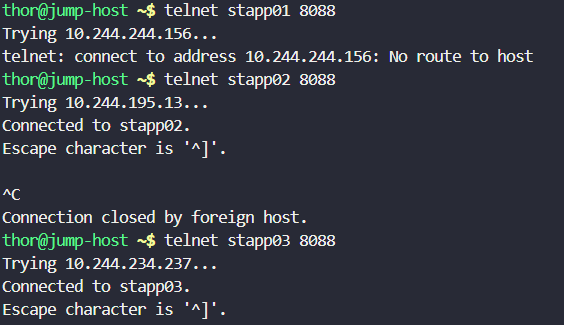
</div>

➡️ This confirmed the issue was specific to **stapp01**, not a global problem.

* * *

### **2\. Logged into the Problem Server**

```bash
ssh tony@stapp01
```
<div style="border:1px solid #ccc; padding:10px; border-radius:10px; box-shadow:2px 2px 8px rgba(0,0,0,0.2); display:inline-block;">
  
</div>

👉 After identifying the problematic server, I logged in to investigate further.

* * *

### **3\. Checked Apache Service Status**

```bash
sudo systemctl status httpd
```
<div style="border:1px solid #ccc; padding:10px; border-radius:10px; box-shadow:2px 2px 8px rgba(0,0,0,0.2); display:inline-block;">
  
</div>
<div style="border:1px solid #ccc; padding:10px; border-radius:10px; box-shadow:2px 2px 8px rgba(0,0,0,0.2); display:inline-block;">
  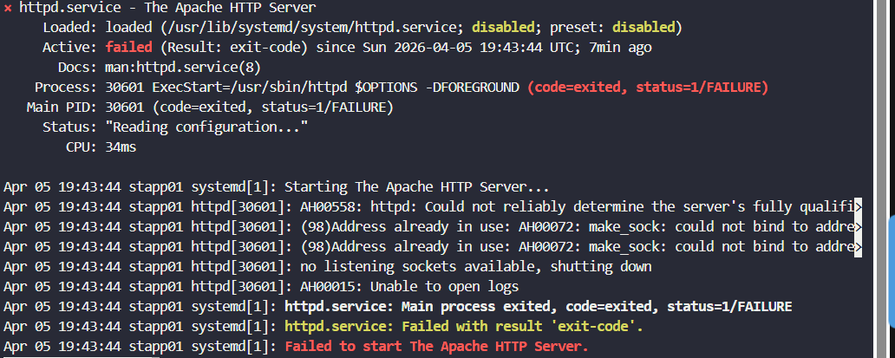
</div>

👉 The Apache service was **not running**. 👉 The error message showed: **"Address already in use"**

➡️ This indicated that another service was already using port **8088**.

* * *

### **4\. Installed netstat Tool**

```bash
sudo yum install -y net-tools
```
<div style="border:1px solid #ccc; padding:10px; border-radius:10px; box-shadow:2px 2px 8px rgba(0,0,0,0.2); display:inline-block;">
  
</div>

👉 The `netstat` command was not available, so I installed `net-tools` to inspect open ports.

* * *

### **5\. Identified Port Conflict**

```bash
sudo netstat -tlnup
```
<div style="border:1px solid #ccc; padding:10px; border-radius:10px; box-shadow:2px 2px 8px rgba(0,0,0,0.2); display:inline-block;">
  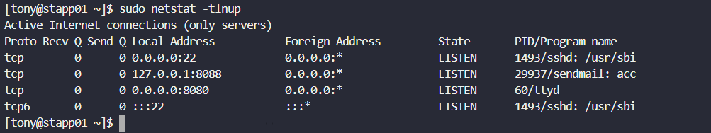
</div>

👉 I checked which service was using port **8088**. 👉 Found that **sendmail** was running on that port.

➡️ This was the root cause — Apache couldn't start because the port was already occupied.

* * *

### **6\. Modified Sendmail Configuration**

```bash
cd /etc/mail
sudo vi sendmail.mc
```
<div style="border:1px solid #ccc; padding:10px; border-radius:10px; box-shadow:2px 2px 8px rgba(0,0,0,0.2); display:inline-block;">
  
</div>
<div style="border:1px solid #ccc; padding:10px; border-radius:10px; box-shadow:2px 2px 8px rgba(0,0,0,0.2); display:inline-block;">
  
</div>

<div style="border:1px solid #ccc; padding:10px; border-radius:10px; box-shadow:2px 2px 8px rgba(0,0,0,0.2); display:inline-block;">
  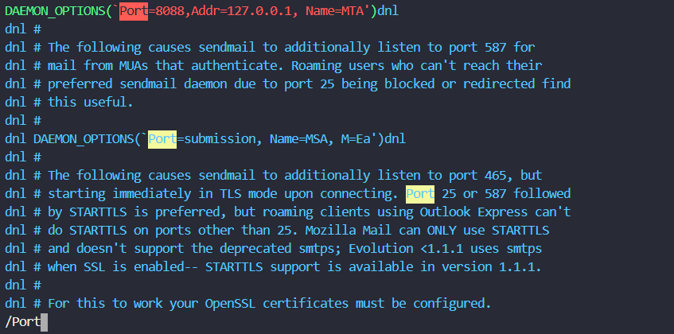
</div>

<div style="border:1px solid #ccc; padding:10px; border-radius:10px; box-shadow:2px 2px 8px rgba(0,0,0,0.2); display:inline-block;">
  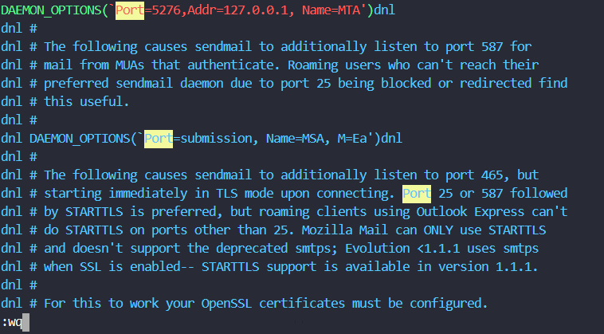
</div>

👉 I edited the sendmail configuration file and changed its port from **8088** to another unused port.

➡️ This ensured there would be no conflict with Apache.

* * *

### **7\. Restarted Sendmail**

```bash
sudo systemctl restart sendmail
```

👉 Restarted the service to apply the configuration changes.

* * *

### **8\. Verified Port Availability**

```bash
sudo netstat -tlnup
```
<div style="border:1px solid #ccc; padding:10px; border-radius:10px; box-shadow:2px 2px 8px rgba(0,0,0,0.2); display:inline-block;">
  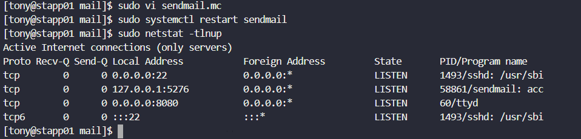
</div>

👉 Checked again to confirm that port **8088** was now free.

* * *

### **9\. Tested Apache Before Fix**

```bash
curl http://localhost:8088
```
<div style="border:1px solid #ccc; padding:10px; border-radius:10px; box-shadow:2px 2px 8px rgba(0,0,0,0.2); display:inline-block;">
  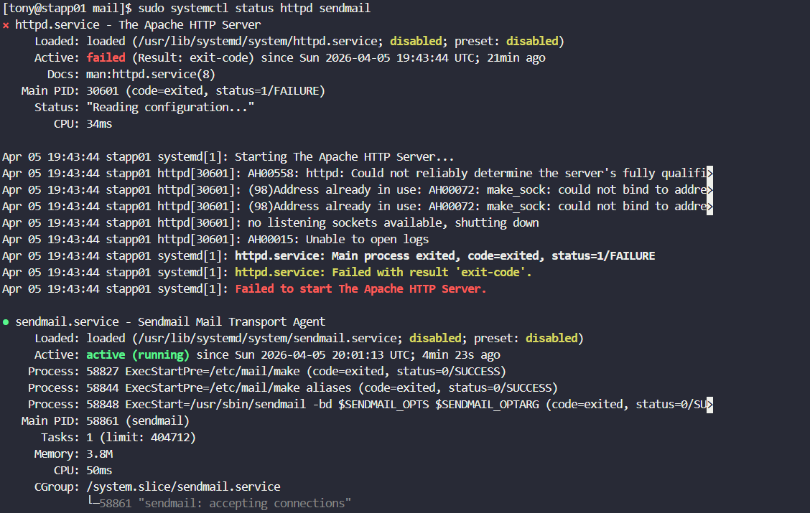
</div>

<div style="border:1px solid #ccc; padding:10px; border-radius:10px; box-shadow:2px 2px 8px rgba(0,0,0,0.2); display:inline-block;">
  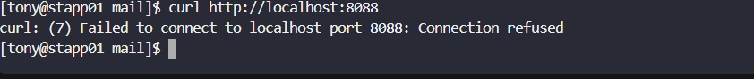
</div>

👉 Apache was still not accessible .

* * *

### **10\. Checked Firewall Rules**

```bash
sudo iptables -L -n
```
<div style="border:1px solid #ccc; padding:10px; border-radius:10px; box-shadow:2px 2px 8px rgba(0,0,0,0.2); display:inline-block;">
  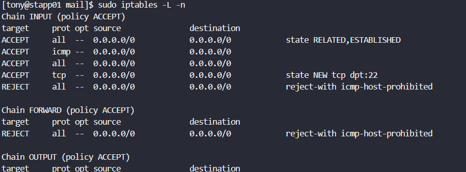
</div>

👉 I inspected firewall rules and noticed that port **8088** was not explicitly allowed.

➡️ Even if Apache runs, firewall could block access.

* * *

### **11\. Allowed Port 8088 in Firewall**

```bash
sudo iptables -I INPUT 4 -p tcp --dport 8088 -j ACCEPT
```
<div style="border:1px solid #ccc; padding:10px; border-radius:10px; box-shadow:2px 2px 8px rgba(0,0,0,0.2); display:inline-block;">
  
</div>
<div style="border:1px solid #ccc; padding:10px; border-radius:10px; box-shadow:2px 2px 8px rgba(0,0,0,0.2); display:inline-block;">
  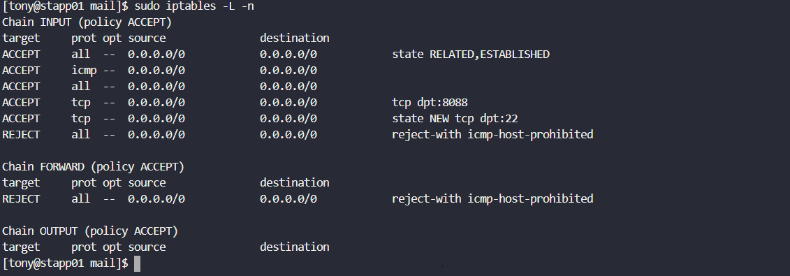
</div>

👉 Added a rule to allow incoming traffic on port **8088**.

* * *

### **12\. Restarted Apache Service**

```bash
sudo systemctl restart httpd
```
<div style="border:1px solid #ccc; padding:10px; border-radius:10px; box-shadow:2px 2px 8px rgba(0,0,0,0.2); display:inline-block;">
  
</div>

👉 Now that:

*   Port conflict was resolved ✅
    
*   Firewall rule added ✅
    

I restarted Apache.

* * *

### **13\. Final Verification**

```bash
curl http://localhost:8088
```
<div style="border:1px solid #ccc; padding:10px; border-radius:10px; box-shadow:2px 2px 8px rgba(0,0,0,0.2); display:inline-block;">
  
</div>

👉 Successfully received a response

➡️ This confirmed Apache is running and accessible locally.

* * *

## **My Understanding**

This task taught me that service failures are often caused by **multiple layered issues** — not just one. Here, both **port conflict** and **firewall rules** had to be resolved to fully fix the problem.

* * *

## **What I Found Interesting**

It was interesting to see how a background service like **sendmail** can unintentionally block a web server. Also, the importance of checking firewall rules after fixing the service was a great real-world lesson.

* * *

### Topics Covered

- ***Linux network troubleshooting and connectivity checks***
- ***Apache service debugging and port conflict resolution***
- ***Service configuration changes (sendmail)***
- ***Firewall management and service validation***


**Previous Task**: [Day 11: Install and Configure Tomcat Server](../Day_11/day_11.md)

**Next Task**: [Day 13: IPtables Installation And Configuration](../Day_13/day_13.md)