# Day 13: IPtables Installation And Configuration

<div style="border:1px solid #ccc; padding:10px; border-radius:10px; box-shadow:2px 2px 8px rgba(0,0,0,0.2); display:inline-block;">
  
</div>

### **Content:**

> Today I worked on securing application servers by configuring firewall rules using IPTables. The objective was to restrict access to the Apache service running on port **6300**, allowing only the Load Balancer server to communicate with it while blocking all other incoming traffic.

> This task gave me practical exposure to implementing network-level security controls in a real DevOps environment.

* * *

### **What I Learned**

Through this task, I understood:

*   How to install and configure IPTables on Linux systems
    
*   How firewall rules control incoming traffic
    
*   Importance of rule order (ACCEPT before REJECT)
    
*   How to allow traffic from a specific IP
    

* * *
<div style="border:1px solid #ccc; padding:10px; border-radius:10px; box-shadow:2px 2px 8px rgba(0,0,0,0.2); display:inline-block;">
  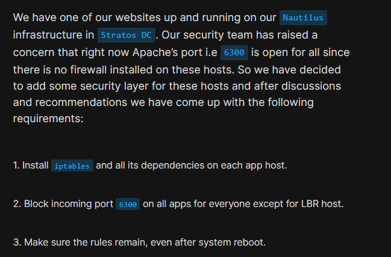
</div>

### **Steps I Followed:**

* * *

### **1\. Connected to Application Server**

```bash
ssh tony@stapp01
```
<div style="border:1px solid #ccc; padding:10px; border-radius:10px; box-shadow:2px 2px 8px rgba(0,0,0,0.2); display:inline-block;">
  
</div>

Logged into the application server where Apache service is running.

* * *

### **2\. Installed IPTables**

```bash
sudo yum install -y iptables iptables-services
```
<div style="border:1px solid #ccc; padding:10px; border-radius:10px; box-shadow:2px 2px 8px rgba(0,0,0,0.2); display:inline-block;">
  
</div>

Installed IPTables and required dependencies.

* * *

### **3\. Verified Existing Rules**

```bash
sudo iptables -L -n -v
```

Checked current firewall rules to ensure a clean starting point.

* * *

### **4\. Identified Load Balancer IP**

Logged into Load Balancer server and checked IP address:

```bash
ssh loki@stlb01
ip addr
```
<div style="border:1px solid #ccc; padding:10px; border-radius:10px; box-shadow:2px 2px 8px rgba(0,0,0,0.2); display:inline-block;">
  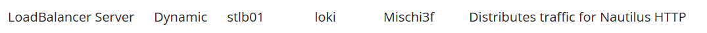
</div>
<div style="border:1px solid #ccc; padding:10px; border-radius:10px; box-shadow:2px 2px 8px rgba(0,0,0,0.2); display:inline-block;">
  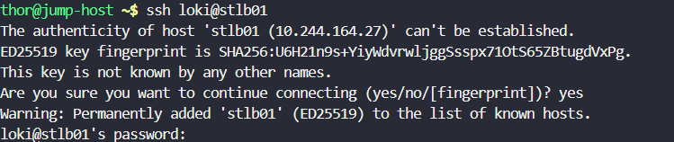
</div>
<div style="border:1px solid #ccc; padding:10px; border-radius:10px; box-shadow:2px 2px 8px rgba(0,0,0,0.2); display:inline-block;">
  
</div>

Identified the IP address as:

```plaintext
10.244.164.27
```

* * *

### **5\. Added Firewall Rules**

Allowed only the Load Balancer to access port 6300:

```bash
sudo iptables -A INPUT -p tcp --dport 6300 -s 10.244.164.27 -j ACCEPT
```
<div style="border:1px solid #ccc; padding:10px; border-radius:10px; box-shadow:2px 2px 8px rgba(0,0,0,0.2); display:inline-block;">
  
</div>


Blocked all other incoming traffic on port 6300:

```bash
sudo iptables -A INPUT -p tcp --dport 6300 -j REJECT
```
<div style="border:1px solid #ccc; padding:10px; border-radius:10px; box-shadow:2px 2px 8px rgba(0,0,0,0.2); display:inline-block;">
  
</div>

* * *

### **6\. Saved Firewall Rules**

```bash
sudo /usr/libexec/iptables/iptables.init save
```
<div style="border:1px solid #ccc; padding:10px; border-radius:10px; box-shadow:2px 2px 8px rgba(0,0,0,0.2); display:inline-block;">
  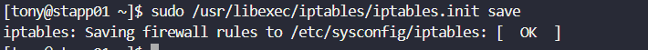
</div>

Saved the rules so they persist after reboot.

* * *

### **7\. Enabled IPTables Service**

```bash
sudo systemctl enable iptables
sudo systemctl start iptables
```

Ensured IPTables runs automatically on system startup.
<div style="border:1px solid #ccc; padding:10px; border-radius:10px; box-shadow:2px 2px 8px rgba(0,0,0,0.2); display:inline-block;">
  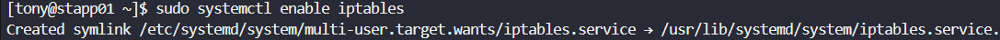
</div>
<div style="border:1px solid #ccc; padding:10px; border-radius:10px; box-shadow:2px 2px 8px rgba(0,0,0,0.2); display:inline-block;">
  
</div>

* * *

### **8\. Verified Rules**

```bash
sudo iptables -L -n -v
```
<div style="border:1px solid #ccc; padding:10px; border-radius:10px; box-shadow:2px 2px 8px rgba(0,0,0,0.2); display:inline-block;">
  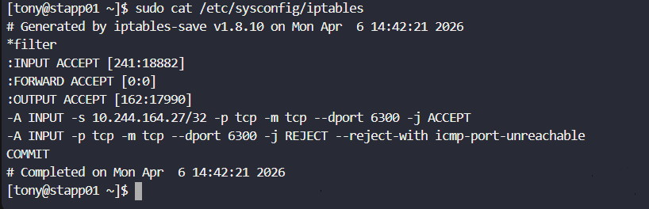
</div>
<div style="border:1px solid #ccc; padding:10px; border-radius:10px; box-shadow:2px 2px 8px rgba(0,0,0,0.2); display:inline-block;">
  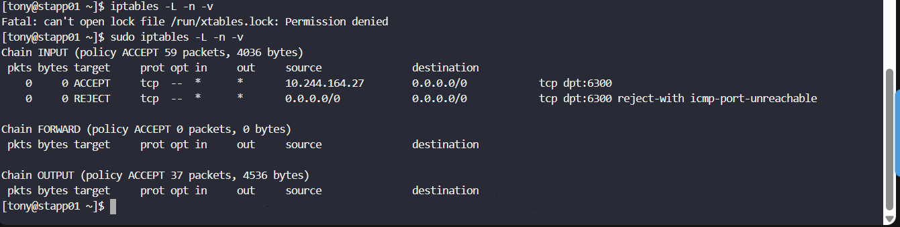
</div>


Confirmed that rules were correctly applied.

* * *

### **9\. Tested Configuration**

From Load Balancer:

```bash
telnet stapp01 6300
```
<div style="border:1px solid #ccc; padding:10px; border-radius:10px; box-shadow:2px 2px 8px rgba(0,0,0,0.2); display:inline-block;">
  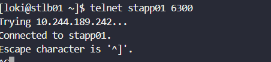
</div>

Connection was successful ✅

From Jump Host:

```bash
telnet stapp01 6300
```
<div style="border:1px solid #ccc; padding:10px; border-radius:10px; box-shadow:2px 2px 8px rgba(0,0,0,0.2); display:inline-block;">
  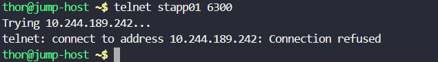
</div>

Connection was refused ❌

* * *

### **10\. Repeated Steps on All App Servers**

Applied the same configuration across all application servers .

<div style="border:1px solid #ccc; padding:10px; border-radius:10px; box-shadow:2px 2px 8px rgba(0,0,0,0.2); display:inline-block;">
  
</div>
<div style="border:1px solid #ccc; padding:10px; border-radius:10px; box-shadow:2px 2px 8px rgba(0,0,0,0.2); display:inline-block;">
  
</div>
<div style="border:1px solid #ccc; padding:10px; border-radius:10px; box-shadow:2px 2px 8px rgba(0,0,0,0.2); display:inline-block;">
  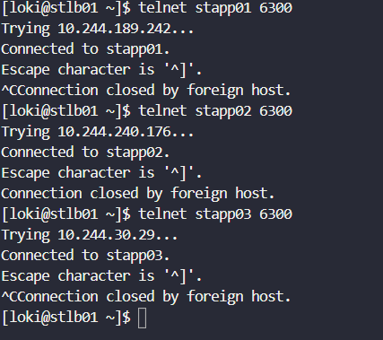
</div>
<div style="border:1px solid #ccc; padding:10px; border-radius:10px; box-shadow:2px 2px 8px rgba(0,0,0,0.2); display:inline-block;">
  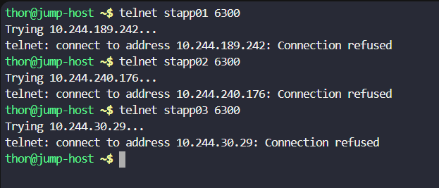
</div>
* * *

### **My Understanding**

This task helped me understand how firewall rules can enforce strict access control at the network level. By allowing only trusted sources and blocking others, we can significantly improve system security.

* * *

### **What I Found Interesting**

It was interesting to see how a simple set of firewall rules can completely control access to a service. Also, identifying the correct IP and understanding why hostnames don’t work in IPTables was a valuable learning experience.

### Topics Covered

- ***Linux firewall configuration using IPTables***
- ***Port-level access control and traffic filtering***
- ***IP-based access restriction (whitelisting)***
- ***Network connectivity testing and validation***


**Previous Task**: [Day 12: Linux Network Services](../Day_12/day_12.md)

**Next Task**: [Day 14: Linux Process Troubleshooting](../Day_14/day_14.md)