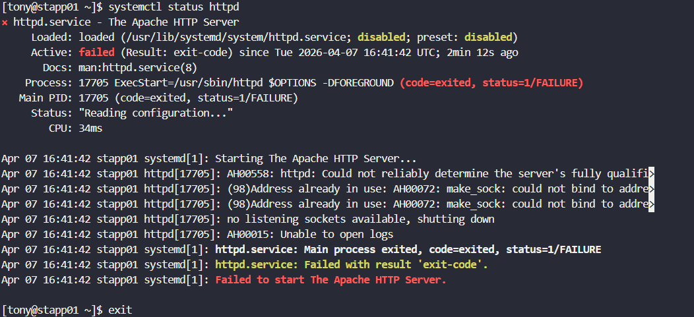

# Day 14: Linux Process Troubleshooting

<div style="border:1px solid #ccc; padding:10px; border-radius:10px; box-shadow:2px 2px 8px rgba(0,0,0,0.2); display:inline-block;">
  
</div>

## **Content:**

> Today I worked on troubleshooting an Apache service failure reported by a monitoring system in a production-like environment. The task was to identify the faulty application server and ensure that the Apache service was running properly on all servers using the required port **8089**.

> During the investigation, I discovered that the issue was caused by a process conflict, where another service was already using the required port. This task gave me practical exposure to real-world Linux process troubleshooting.

* * *

## **What I Learned**

Through this task, I understood:

*   How to check service status using `systemctl`
    
*   How to identify running processes using specific ports
    
*   How to troubleshoot and resolve port conflicts
    
*   Importance of process-level debugging in Linux systems
    

* * *

> The production support team of xFusionCorp Industries has deployed some of the latest monitoring tools to keep an eye on every service, application, etc. running on the systems. One of the monitoring systems reported about Apache service unavailability on one of the app servers in Stratos DC.
>
 >Identify the faulty app host and fix the issue. Make sure Apache service is up and running on all app hosts. They might not have hosted any code yet on these servers, so you don’t need to worry if Apache isn’t serving any pages. Just make sure the service is up and running. Also, make sure Apache is running on port ***`8089`*** on all app servers.


## **Steps I Followed :**

### **1\. Connected to Application Servers**

```bash
ssh tony@stapp01
ssh steve@stapp02
ssh banner@stapp03
```
<div style="border:1px solid #ccc; padding:10px; border-radius:10px; box-shadow:2px 2px 8px rgba(0,0,0,0.2); display:inline-block;">
  
</div>

<div style="border:1px solid #ccc; padding:10px; border-radius:10px; box-shadow:2px 2px 8px rgba(0,0,0,0.2); display:inline-block;">
  
</div>

<div style="border:1px solid #ccc; padding:10px; border-radius:10px; box-shadow:2px 2px 8px rgba(0,0,0,0.2); display:inline-block;">
  
</div>


Logged into all app servers to identify the faulty host.

* * *

### **2\. Checked Apache Service Status**

```bash
systemctl status httpd
```

*   `stapp02` and `stapp03` → Apache was running
    
*   `stapp01` → Apache service failed

<div style="border:1px solid #ccc; padding:10px; border-radius:10px; box-shadow:2px 2px 8px rgba(0,0,0,0.2); display:inline-block;">
  
</div>
<div style="border:1px solid #ccc; padding:10px; border-radius:10px; box-shadow:2px 2px 8px rgba(0,0,0,0.2); display:inline-block;">
  
</div>
<div style="border:1px solid #ccc; padding:10px; border-radius:10px; box-shadow:2px 2px 8px rgba(0,0,0,0.2); display:inline-block;">
  
</div>


* * *

### **3\. Analyzed the Error Logs**

Error observed:

```bash
Address already in use
```

This indicated a port conflict issue.

* * *

### **4\. Checked Which Process is Using Port 8089**

```bash
ss -tulnp | grep 8089
```
<div style="border:1px solid #ccc; padding:10px; border-radius:10px; box-shadow:2px 2px 8px rgba(0,0,0,0.2); display:inline-block;">
  
</div>

Found that:

```bash
sendmail was using port 8089
```

* * *

### **5\. Stopped the Conflicting Process**

```bash
sudo systemctl stop sendmail
```

* * *

### **6\. Disabled the Service**

```bash
sudo systemctl disable sendmail
```

Prevented the service from restarting automatically.
<div style="border:1px solid #ccc; padding:10px; border-radius:10px; box-shadow:2px 2px 8px rgba(0,0,0,0.2); display:inline-block;">
  
</div>

<div style="border:1px solid #ccc; padding:10px; border-radius:10px; box-shadow:2px 2px 8px rgba(0,0,0,0.2); display:inline-block;">
  
</div>
* * *

### **7\. Started Apache Service**

```bash
sudo systemctl start httpd
```


* * *

### **8\. Enabled Apache Service**

```bash
sudo systemctl enable httpd
```
<div style="border:1px solid #ccc; padding:10px; border-radius:10px; box-shadow:2px 2px 8px rgba(0,0,0,0.2); display:inline-block;">
  
</div>

* * *


### 9\. Verified Apache is Running 

```bash
sudo systemctl status httpd
```
<div style="border:1px solid #ccc; padding:10px; border-radius:10px; box-shadow:2px 2px 8px rgba(0,0,0,0.2); display:inline-block;">
  
</div>

Confirmed that Apache is successfully listening on port **8089**.

* * *

## **My Understanding**

This task helped me understand how Linux processes can directly impact service availability. By identifying which process was using a required port, I was able to resolve the issue efficiently and restore the service.

* * *

## **What I Found Interesting**

It was interesting to see how troubleshooting at the process level can quickly reveal the root cause of failures. A simple port conflict from another service like `sendmail` can completely stop a critical service like Apache.

* * *


### Topics Covered

- ***Linux process troubleshooting***
- ***Port conflict identification and resolution***
- ***Service management using systemctl***


**Previous Task**: [Day 13: IPtables Installation And Configuration](../Day_13/day_13.md)

**Next Task**: [Day 15: Setup SSL for Nginx](../Day_15/day_15.md)
