# Day 15: Setup SSL for Nginx

<div style="border:1px solid #ccc; padding:10px; border-radius:10px; box-shadow:2px 2px 8px rgba(0,0,0,0.2); display:inline-block;">
  
</div>

## Content:

> Today I worked on configuring a secure web server using Nginx with SSL. The task involved installing Nginx, setting up a self-signed SSL certificate, configuring HTTPS, and verifying the setup from a remote jump host.

* * *

## What I Learned

Through this task, I understood:

*   How to install and manage Nginx on a Linux server
    
*   Importance of SSL/TLS in secure communication
    
*   Best practices for organizing Nginx configuration files
    
*   Proper handling and permission setting for SSL keys
    

* * *
<div style="border:1px solid #ccc; padding:10px; border-radius:10px; box-shadow:2px 2px 8px rgba(0,0,0,0.2); display:inline-block;">
  
</div>


## Steps I Followed

* * *

### 1\. Connected to App Server

```bash
ssh tony@stapp01
```
<div style="border:1px solid #ccc; padding:10px; border-radius:10px; box-shadow:2px 2px 8px rgba(0,0,0,0.2); display:inline-block;">
  
</div>

👉 First, I logged into the target server where the application needed to be deployed.

* * *

### 2\. Verified Operating System

```bash
cat /etc/os-release
```
<div style="border:1px solid #ccc; padding:10px; border-radius:10px; box-shadow:2px 2px 8px rgba(0,0,0,0.2); display:inline-block;">
  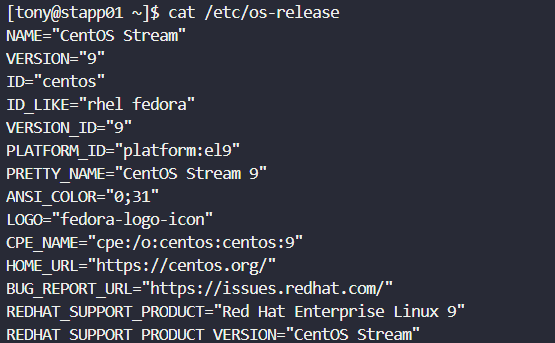
</div>

👉 Confirmed the server is running **CentOS Stream 9**.

➡️ This is important because package managers and commands differ across distributions. For CentOS/RHEL-based systems, we use `dnf`.

* * *

### 3\. Installed Nginx

```bash
sudo dnf install -y nginx
```
<div style="border:1px solid #ccc; padding:10px; border-radius:10px; box-shadow:2px 2px 8px rgba(0,0,0,0.2); display:inline-block;">
  
</div>

👉 Installed the Nginx web server.

**Why this step?** Nginx is required to serve web content and handle HTTPS traffic.

* * *

### 4\. Started and Enabled Nginx

```bash
sudo systemctl start nginx
sudo systemctl enable nginx
```
<div style="border:1px solid #ccc; padding:10px; border-radius:10px; box-shadow:2px 2px 8px rgba(0,0,0,0.2); display:inline-block;">
  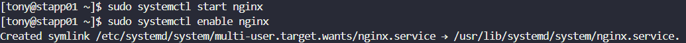
</div>

👉 Started the service and ensured it runs automatically on system boot.

**Explanation:**

*   `start` → runs the service immediately
    
*   `enable` → ensures persistence after reboot
    

* * *

### 5\. Verified Service Status

```bash
sudo systemctl status nginx
```
<div style="border:1px solid #ccc; padding:10px; border-radius:10px; box-shadow:2px 2px 8px rgba(0,0,0,0.2); display:inline-block;">
  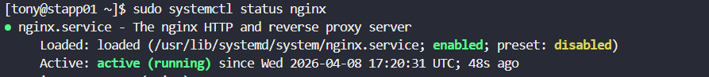
</div>

👉 Confirmed Nginx is running successfully.

**Why?** Always verify service status before proceeding to avoid hidden issues.

* * *

### 6\. Verified SSL Certificate Files

```bash
ls -l /tmp/nautilus.*
```
<div style="border:1px solid #ccc; padding:10px; border-radius:10px; box-shadow:2px 2px 8px rgba(0,0,0,0.2); display:inline-block;">
  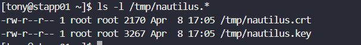
</div>

👉 Checked if the provided certificate and key files exist.

**Files found:**

*   `nautilus.crt` → SSL certificate
    
*   `nautilus.key` → private key
    

* * *

### 7\. Created Secure Directory for SSL

```bash
sudo mkdir -p /etc/nginx/ssl
```


👉 Created a dedicated directory for storing SSL files.

**Why this approach?** Keeping SSL files in `/etc/nginx/ssl`:

*   Improves organization
    
*   Follows industry standards
    
*   Enhances maintainability
    

* * *

### 8\. Moved SSL Files

```bash
sudo mv /tmp/nautilus.crt /etc/nginx/ssl/
sudo mv /tmp/nautilus.key /etc/nginx/ssl/
```
<div style="border:1px solid #ccc; padding:10px; border-radius:10px; box-shadow:2px 2px 8px rgba(0,0,0,0.2); display:inline-block;">
  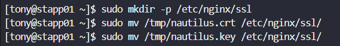
</div>

👉 Relocated SSL files to the proper directory.

* * *

### 9\. Set Correct Permissions

```bash
sudo chmod 600 /etc/nginx/ssl/nautilus.key
sudo chmod 644 /etc/nginx/ssl/nautilus.crt
```
<div style="border:1px solid #ccc; padding:10px; border-radius:10px; box-shadow:2px 2px 8px rgba(0,0,0,0.2); display:inline-block;">
  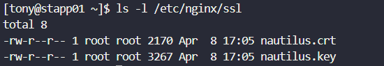
</div>
<div style="border:1px solid #ccc; padding:10px; border-radius:10px; box-shadow:2px 2px 8px rgba(0,0,0,0.2); display:inline-block;">
  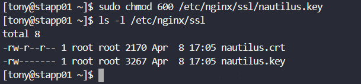
</div>

👉 Secured the files.

**Why important?**

*   Private key must be **restricted (600)** → only root can read/write
    
*   Certificate can be **public (644)**
    

➡️ Incorrect permissions can lead to security vulnerabilities or service failure.

* * *

### 10\. Configured Nginx for HTTPS

Created a new config file:

```bash
sudo vi /etc/nginx/conf.d/ssl.conf
```
<div style="border:1px solid #ccc; padding:10px; border-radius:10px; box-shadow:2px 2px 8px rgba(0,0,0,0.2); display:inline-block;">
  
</div>

Added:

```nginx
server {
    listen 443 ssl;
    server_name stapp01;

    ssl_certificate /etc/nginx/ssl/nautilus.crt;
    ssl_certificate_key /etc/nginx/ssl/nautilus.key;

    root /usr/share/nginx/html;
    index index.html;

    location / {
        try_files $uri $uri/ =404;
    }
}
```
<div style="border:1px solid #ccc; padding:10px; border-radius:10px; box-shadow:2px 2px 8px rgba(0,0,0,0.2); display:inline-block;">
  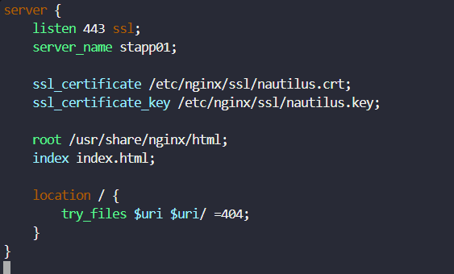
</div>

* * *

### Why create a new config file instead of editing nginx.conf?

Because Nginx uses modular configuration:

```nginx
include /etc/nginx/conf.d/*.conf;
```

👉 This allows:

*   Clean separation of configs
    
*   Easier debugging
    
*   Better scalability
    

➡️ This is the **standard production practice**.

* * *

### 11\. Tested Configuration

```bash
sudo nginx -t
```
<div style="border:1px solid #ccc; padding:10px; border-radius:10px; box-shadow:2px 2px 8px rgba(0,0,0,0.2); display:inline-block;">
  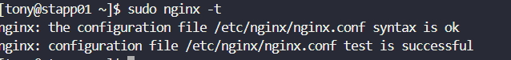
</div>

👉 Validated syntax before applying changes.

**Why?** Prevents breaking the server due to configuration errors.

* * *

### 12\. Restarted Nginx

```bash
sudo systemctl restart nginx
```
<div style="border:1px solid #ccc; padding:10px; border-radius:10px; box-shadow:2px 2px 8px rgba(0,0,0,0.2); display:inline-block;">
  
</div>

👉 Applied the new SSL configuration.

* * *

### 13\. Created Web Page

```bash
echo "Welcome!" | sudo tee /usr/share/nginx/html/index.html
```
<div style="border:1px solid #ccc; padding:10px; border-radius:10px; box-shadow:2px 2px 8px rgba(0,0,0,0.2); display:inline-block;">
  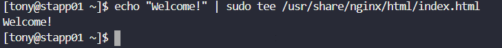
</div>

👉 Created the required index page.

**Explanation:**

*   `tee` is used with sudo because direct redirection (`>`) won’t work with elevated permissions
    

* * *

### 14\. Verified Content

```bash
cat /usr/share/nginx/html/index.html
```
<div style="border:1px solid #ccc; padding:10px; border-radius:10px; box-shadow:2px 2px 8px rgba(0,0,0,0.2); display:inline-block;">
  
</div>

👉 Confirmed correct content is served.

* * *

### 15\. Final Testing from Jump Host

Exited server:

```bash
exit
```

Ran:

```bash
curl -Ik https://stapp01/
```
<div style="border:1px solid #ccc; padding:10px; border-radius:10px; box-shadow:2px 2px 8px rgba(0,0,0,0.2); display:inline-block;">
  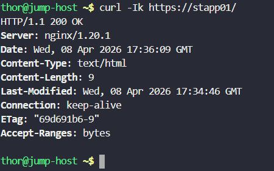
</div>

* * *

### Why use this command?

*   `curl` → tests HTTP/HTTPS requests
    
*   `-I` → fetch headers only
    
*   `-k` → ignore SSL verification (since it's self-signed)
    

* * *

### Final Output

```bash
HTTP/1.1 200 OK
Server: nginx
```

👉 This confirms:

*   HTTPS is working
    
*   Nginx is serving content correctly
    
*   SSL is properly configured
    

* * *

## My Understanding

This task demonstrated how to securely configure a web server using SSL. It also highlighted the importance of:

*   Proper file placement
    
*   Secure permissions
    
*   Modular configuration design
    
*   Testing before deployment
    

* * *

## What I Found Interesting

What stood out to me was how small details—like file permissions or config placement—can make or break the entire setup.

Also, learning why production systems avoid editing main config files directly and instead use modular configs gave me deeper insight into real-world DevOps practices.

* * *

## Conclusion

This was a complete hands-on experience of setting up HTTPS using Nginx. It reflects real production workflows and strengthened my understanding of secure web server deployment.

* * *


### Topics Covered

- ***install and manage Nginx***
- ***Nginx configuration***
- ***ssl***


**Previous Task**: [ Day 14: Linux Process Troubleshooting](../Day_14/day_14.md)

**Next Task**: [Day 16:  Install and Configure NGINX as Load Balancer](../Day_16/day_16.md)
