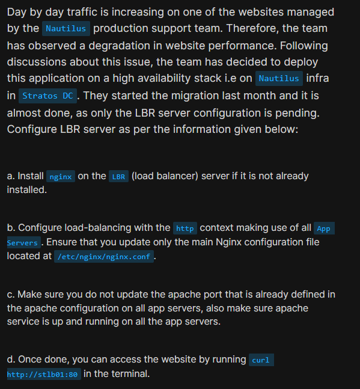
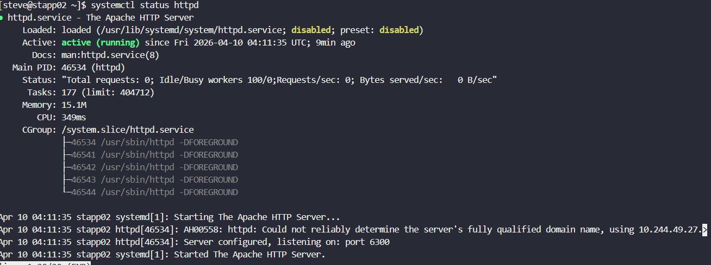
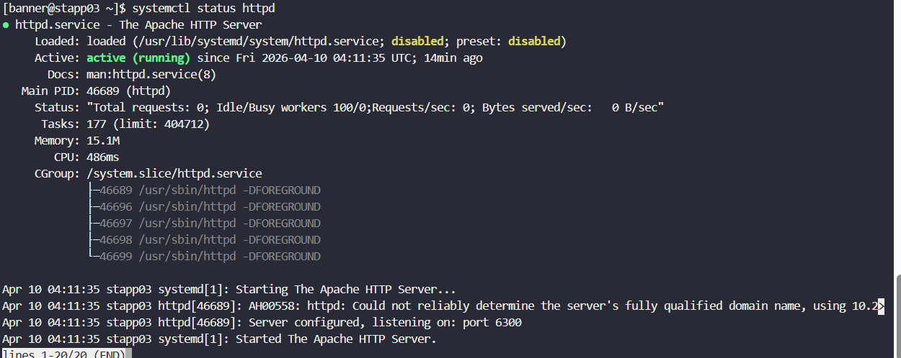
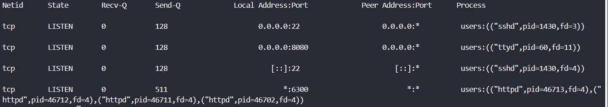
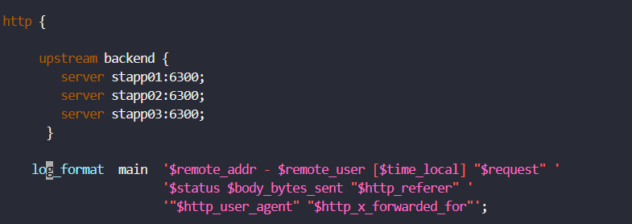
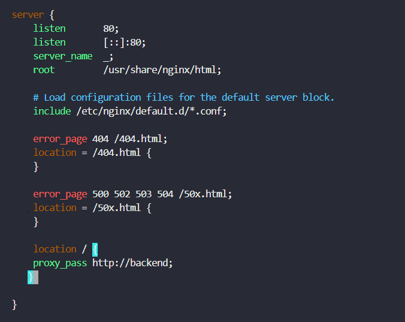
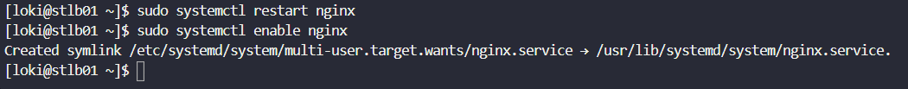

# Day 16: Install and Configure NGINX as Load Balancer

<div style="border:1px solid #ccc; padding:10px; border-radius:10px; box-shadow:2px 2px 8px rgba(0,0,0,0.2); display:inline-block;">
  
</div>

## **Content:**

>Today I worked on configuring a **Load Balancer (LBR)** using Nginx for a production-like environment. The goal was to handle increasing traffic on a website by distributing requests across multiple application servers.

The setup included:

* 3 Application Servers (`stapp01`, `stapp02`, `stapp03`)
* 1 Load Balancer Server (`stlb01`)

The challenge was interesting because the application servers were **not running on the default port (80)**, which required careful observation and correct configuration.

---

## **What I Learned**

Through this task, I understood:

* How **load balancing improves performance and availability**
* How to configure **Nginx as a reverse proxy**
* The importance of **checking backend service ports**
* Why we should **not assume default configurations**

---
<div style="border:1px solid #ccc; padding:10px; border-radius:10px; box-shadow:2px 2px 8px rgba(0,0,0,0.2); display:inline-block;">
  
</div>

## **Steps I Followed:**

---

### **1. Verified Apache Service on App Servers**

```bash
ssh tony@stapp01
ssh steve@stapp02
ssh banner@stapp03

systemctl status httpd
```
<div style="border:1px solid #ccc; padding:10px; border-radius:10px; box-shadow:2px 2px 8px rgba(0,0,0,0.2); display:inline-block;">
  
</div>
<div style="border:1px solid #ccc; padding:10px; border-radius:10px; box-shadow:2px 2px 8px rgba(0,0,0,0.2); display:inline-block;">
  
</div>
<div style="border:1px solid #ccc; padding:10px; border-radius:10px; box-shadow:2px 2px 8px rgba(0,0,0,0.2); display:inline-block;">
  
</div>
<div style="border:1px solid #ccc; padding:10px; border-radius:10px; box-shadow:2px 2px 8px rgba(0,0,0,0.2); display:inline-block;">
  
</div>
<div style="border:1px solid #ccc; padding:10px; border-radius:10px; box-shadow:2px 2px 8px rgba(0,0,0,0.2); display:inline-block;">
  
</div>

<div style="border:1px solid #ccc; padding:10px; border-radius:10px; box-shadow:2px 2px 8px rgba(0,0,0,0.2); display:inline-block;">
  
</div>

👉 I checked whether Apache was running on all application servers.

✅ All services were active and running.

---

### **2. Identified the Running Port**

```bash
sudo ss -tlnp
```
<div style="border:1px solid #ccc; padding:10px; border-radius:10px; box-shadow:2px 2px 8px rgba(0,0,0,0.2); display:inline-block;">
  
</div>
<div style="border:1px solid #ccc; padding:10px; border-radius:10px; box-shadow:2px 2px 8px rgba(0,0,0,0.2); display:inline-block;">
  
</div>

👉 I checked which port Apache was listening on.

➡️ Found that Apache was running on:

```bash
Port 6300
```

⚠️ This was a key finding because load balancer must use this port.

---

### **3. Logged into Load Balancer Server**

```bash
ssh loki@stlb01
```
<div style="border:1px solid #ccc; padding:10px; border-radius:10px; box-shadow:2px 2px 8px rgba(0,0,0,0.2); display:inline-block;">
  
</div>

👉 This is where Nginx needs to be installed and configured.

---

### **4. Installed Nginx**

```bash
sudo yum install -y nginx
```
<div style="border:1px solid #ccc; padding:10px; border-radius:10px; box-shadow:2px 2px 8px rgba(0,0,0,0.2); display:inline-block;">
  
</div>

👉 Installed Nginx (it was already present but got updated).

---

### **5. Edited Nginx Configuration**

```bash
sudo vi /etc/nginx/nginx.conf
```
<div style="border:1px solid #ccc; padding:10px; border-radius:10px; box-shadow:2px 2px 8px rgba(0,0,0,0.2); display:inline-block;">
  
</div>

👉 This is the main configuration file where load balancing is defined.

---

### **6. Configured Upstream Servers**

```nginx
upstream backend {
    server stapp01:6300;
    server stapp02:6300;
    server stapp03:6300;
}
```
<div style="border:1px solid #ccc; padding:10px; border-radius:10px; box-shadow:2px 2px 8px rgba(0,0,0,0.2); display:inline-block;">
  
</div>

👉 Defined a group of backend servers.

➡️ Nginx will distribute traffic among these servers.

---

### **7. Configured Server Block**

```nginx
server {
    listen 80;

    location / {
        proxy_pass http://backend;
    }
}
```
<div style="border:1px solid #ccc; padding:10px; border-radius:10px; box-shadow:2px 2px 8px rgba(0,0,0,0.2); display:inline-block;">
  
</div>

👉 This tells Nginx:

* Listen on port 80
* Forward all requests to backend servers

---

### **8. Tested Configuration**

```bash
sudo nginx -t
```
<div style="border:1px solid #ccc; padding:10px; border-radius:10px; box-shadow:2px 2px 8px rgba(0,0,0,0.2); display:inline-block;">
  
</div>

👉 Ensured there were no syntax errors.

✅ Configuration test was successful.

---

### **9. Restarted and Enabled Nginx**

```bash
sudo systemctl restart nginx
sudo systemctl enable nginx
```
<div style="border:1px solid #ccc; padding:10px; border-radius:10px; box-shadow:2px 2px 8px rgba(0,0,0,0.2); display:inline-block;">
  
</div>

👉 Applied the changes and ensured Nginx starts on boot.

---

### **10. Final Verification**

```bash
curl http://stlb01:80
```
<div style="border:1px solid #ccc; padding:10px; border-radius:10px; box-shadow:2px 2px 8px rgba(0,0,0,0.2); display:inline-block;">
  
</div>

👉 Output:

```bash
Welcome to xFusionCorp Industries!
```

➡️ This confirmed that:

* Load balancer is working
* Requests are reaching backend servers

---

## **My Understanding**

This task taught me that **load balancing is not just about configuration, but also about understanding the environment**.

The most important part was identifying that:

* Apache was running on **port 6300 instead of 80**
* Instead of changing Apache, we adapted Nginx
---

## **What I Found Interesting**

I found it interesting how:

* Nginx can act as a powerful **reverse proxy and load balancer**
* Even with identical backend responses, traffic is actually distributed behind the scenes

---

### Topics Covered

- ***Load Balancing concept***
- ***Nginx***
- ***Service-level debugging***


**Previous Task**: [ Day 15: Setup SSL for Nginx](../Day_15/day_15.md)

**Next Task**: [Day 17: Install and Configure PostgreSQL](../Day_17/day_17.md)