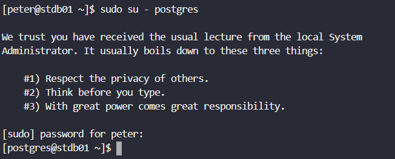
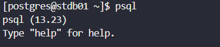
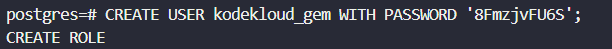
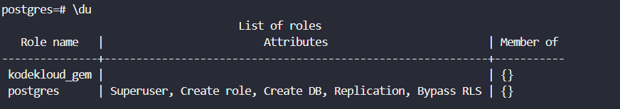
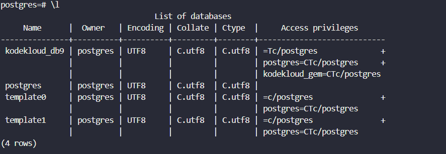

# Day 17: Install and Configure PostgreSQL

<div style="border:1px solid #ccc; padding:10px; border-radius:10px; box-shadow:2px 2px 8px rgba(0,0,0,0.2); display:inline-block;">
  
</div>

### **Content:**

> Today I worked on setting up a PostgreSQL database server as a prerequisite for application deployment. The task involved creating a database user, setting up a database, and assigning the required permissions.

> This task gave me hands-on experience with PostgreSQL administration and reinforced how important proper database configuration is in real-world DevOps environments.

* * *

### **What I Learned**

*   How to create users and databases in PostgreSQL
    
*   How to grant proper access permissions
    
*   Importance of secure and correct database configuration for applications
    

* * *

<div style="border:1px solid #ccc; padding:10px; border-radius:10px; box-shadow:2px 2px 8px rgba(0,0,0,0.2); display:inline-block;">
  
</div>

### **Steps I Followed :**

#### **1\. Connected to Database Server**

```bash
ssh peter@stdb01
```
<div style="border:1px solid #ccc; padding:10px; border-radius:10px; box-shadow:2px 2px 8px rgba(0,0,0,0.2); display:inline-block;">
  
</div>

#### **2\. Switched to PostgreSQL Admin User**

```bash
sudo su - postgres
```
<div style="border:1px solid #ccc; padding:10px; border-radius:10px; box-shadow:2px 2px 8px rgba(0,0,0,0.2); display:inline-block;">
  
</div>
<div style="border:1px solid #ccc; padding:10px; border-radius:10px; box-shadow:2px 2px 8px rgba(0,0,0,0.2); display:inline-block;">
  
</div>

#### **3\. Accessed PostgreSQL**

```bash
psql
```
<div style="border:1px solid #ccc; padding:10px; border-radius:10px; box-shadow:2px 2px 8px rgba(0,0,0,0.2); display:inline-block;">
  
</div>

#### **4\. Created User**

```sql
CREATE USER kodekloud_gem WITH PASSWORD '8FmzjvFU6S';
```
<div style="border:1px solid #ccc; padding:10px; border-radius:10px; box-shadow:2px 2px 8px rgba(0,0,0,0.2); display:inline-block;">
  
</div>

#### **5\. Created Database**

```sql
CREATE DATABASE kodekloud_db9;
```
<div style="border:1px solid #ccc; padding:10px; border-radius:10px; box-shadow:2px 2px 8px rgba(0,0,0,0.2); display:inline-block;">
  
</div>

#### **6\. Granted Privileges**

```sql
GRANT ALL PRIVILEGES ON DATABASE kodekloud_db9 TO kodekloud_gem;
```
<div style="border:1px solid #ccc; padding:10px; border-radius:10px; box-shadow:2px 2px 8px rgba(0,0,0,0.2); display:inline-block;">
  
</div>

#### **7\. Verified Setup**

```sql
\du
\l
```
<div style="border:1px solid #ccc; padding:10px; border-radius:10px; box-shadow:2px 2px 8px rgba(0,0,0,0.2); display:inline-block;">
  
</div>

<div style="border:1px solid #ccc; padding:10px; border-radius:10px; box-shadow:2px 2px 8px rgba(0,0,0,0.2); display:inline-block;">
  
</div>

* * *

### **My Understanding**

This task showed how essential database setup is for application readiness. Proper user roles and permissions ensure both security and functionality.

* * *

### **What I Found Interesting**

I found it interesting how a few simple commands can fully prepare a database environment for an application.

* * *

### Topics Covered

- ***PostgreSQL User & Database Management***
- ***Access Control & Privilege Assignment***
- ***Basic Database Administration (psql)***


**Previous Task**: [ Day 16: Install and Configure NGINX as Load Balancer](../Day_16/day_16.md)

**Next Task**: [Day 18: Install and Configure DB Server](../Day_18/day_18.md)