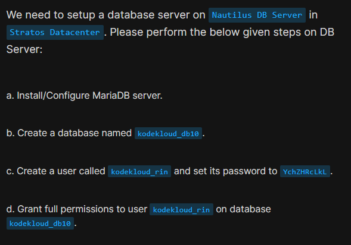
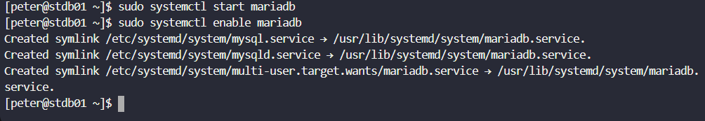
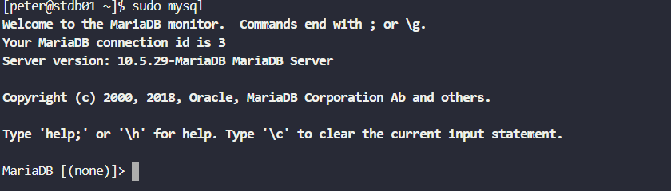
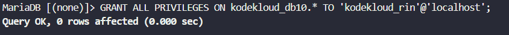
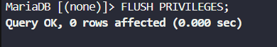
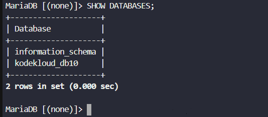

# Day 18: Install and Configure DB Server

<div style="border:1px solid #ccc; padding:10px; border-radius:10px; box-shadow:2px 2px 8px rgba(0,0,0,0.2); display:inline-block;">
  
</div>

### **Content:**

> Today I worked on setting up a MariaDB database server, which is an essential step in preparing backend infrastructure for applications. The task involved installing the database server, creating a database, adding a user, and assigning the required permissions so applications can securely interact with it.

* * *

### **What I Learned**

*   How to install and manage MariaDB on a Linux server
    
*   How to create databases and users in MariaDB
    
*   How to grant and manage user privileges
    
*   How to verify database access to ensure everything works correctly
    

* * *

<div style="border:1px solid #ccc; padding:10px; border-radius:10px; box-shadow:2px 2px 8px rgba(0,0,0,0.2); display:inline-block;">
  
</div>

### **Steps I Followed :**

#### **1\. Connected to Database Server**

```bash
ssh peter@stdb01
```
<div style="border:1px solid #ccc; padding:10px; border-radius:10px; box-shadow:2px 2px 8px rgba(0,0,0,0.2); display:inline-block;">
  
</div>

This command is used to securely connect to the remote database server using SSH.

* * *

#### **2\. Installed MariaDB Server**

```bash
sudo dnf install mariadb-server
```
<div style="border:1px solid #ccc; padding:10px; border-radius:10px; box-shadow:2px 2px 8px rgba(0,0,0,0.2); display:inline-block;">
  
</div>

`dnf` is the package manager for CentOS/RHEL systems. This command installs MariaDB along with all required dependencies.

* * *

#### **3\. Started and Enabled MariaDB Service**

```bash
sudo systemctl start mariadb
sudo systemctl enable mariadb
```
<div style="border:1px solid #ccc; padding:10px; border-radius:10px; box-shadow:2px 2px 8px rgba(0,0,0,0.2); display:inline-block;">
  
</div>

*   `start` → immediately starts the MariaDB service
    
*   `enable` → ensures the service starts automatically on system reboot
    

* * *

#### **4\. Accessed MariaDB**

```bash
sudo mysql
```
<div style="border:1px solid #ccc; padding:10px; border-radius:10px; box-shadow:2px 2px 8px rgba(0,0,0,0.2); display:inline-block;">
  
</div>

This logs into the MariaDB shell as the root user without requiring a password (default behavior in many Linux setups).

* * *

#### **5\. Created Database**

```sql
CREATE DATABASE kodekloud_db10;
```
<div style="border:1px solid #ccc; padding:10px; border-radius:10px; box-shadow:2px 2px 8px rgba(0,0,0,0.2); display:inline-block;">
  
</div>

This creates a new database where application data will be stored.

* * *

#### **6\. Created User**

```sql
CREATE USER 'kodekloud_rin'@'localhost' IDENTIFIED BY 'YchZHRcLkL';
```
<div style="border:1px solid #ccc; padding:10px; border-radius:10px; box-shadow:2px 2px 8px rgba(0,0,0,0.2); display:inline-block;">
  
</div>

*   Creates a new database user
    
*   `'localhost'` means the user can connect only from the same server
    
*   `IDENTIFIED BY` sets the password for authentication
    

* * *

#### **7\. Granted Privileges**

```sql
GRANT ALL PRIVILEGES ON kodekloud_db10.* TO 'kodekloud_rin'@'localhost';
```
<div style="border:1px solid #ccc; padding:10px; border-radius:10px; box-shadow:2px 2px 8px rgba(0,0,0,0.2); display:inline-block;">
  
</div>

This gives the user full access (read, write, modify, delete, etc.) to the specific database `kodekloud_db10`.

* * *

#### **8\. Applied Changes**

```sql
FLUSH PRIVILEGES;
```
<div style="border:1px solid #ccc; padding:10px; border-radius:10px; box-shadow:2px 2px 8px rgba(0,0,0,0.2); display:inline-block;">
  
</div>

This reloads the privilege tables. While modern MariaDB applies changes automatically, this command ensures all permission updates are enforced immediately.

* * *

#### **9\. Verified Setup**

```bash
mysql -u kodekloud_rin -p
```
<div style="border:1px solid #ccc; padding:10px; border-radius:10px; box-shadow:2px 2px 8px rgba(0,0,0,0.2); display:inline-block;">
  
</div>

<div style="border:1px solid #ccc; padding:10px; border-radius:10px; box-shadow:2px 2px 8px rgba(0,0,0,0.2); display:inline-block;">
  
</div>

Login using the new user credentials.

```sql
SHOW DATABASES;
```
<div style="border:1px solid #ccc; padding:10px; border-radius:10px; box-shadow:2px 2px 8px rgba(0,0,0,0.2); display:inline-block;">
  
</div>

This confirms whether the user can see and access the assigned database.

* * *

### **My Understanding**

This task helped me understand how important database setup is before deploying any application. Creating dedicated users and assigning limited but necessary permissions improves both security and maintainability. It also ensures that applications interact only with the resources they are supposed to.

* * *

### **What I Found Interesting**

I found it interesting how a complete database setup—from installation to user access—can be done with just a few commands. Understanding what each command does made the process much clearer and gave me more confidence in handling real-world database configurations.

### Topics Covered

- ***MariaDB Installation & Service Management***
- ***Database and User Creation***
- ***Basic Database Administration (MariaDB CLI)***


**Previous Task**: [ Day 17: Install and Configure PostgreSQL](../Day_17/day_17.md)

**Next Task**: [Day 19: Install and Configure Web Application](../Day_19/day_19.md)