# Day 19: Install and Configure Web Application

<div style="border:1px solid #ccc; padding:10px; border-radius:10px; box-shadow:2px 2px 8px rgba(0,0,0,0.2); display:inline-block;">
  
</div>

## **Content:**

> Today I worked on setting up a web server using Apache (httpd) and configuring it to host multiple static websites on a custom port. This task focused on preparing the infrastructure before application deployment by installing the web server, configuring it, deploying website files, and ensuring they are accessible via specific URLs.

* * *

## **What I Learned**

*   How to install and manage Apache (httpd) on a Linux server
    
*   How to change the default port of Apache
    
*   How to deploy multiple websites on a single server
    
*   How to use **Alias** to map URLs to directories
    

* * *

<div style="border:1px solid #ccc; padding:10px; border-radius:10px; box-shadow:2px 2px 8px rgba(0,0,0,0.2); display:inline-block;">
  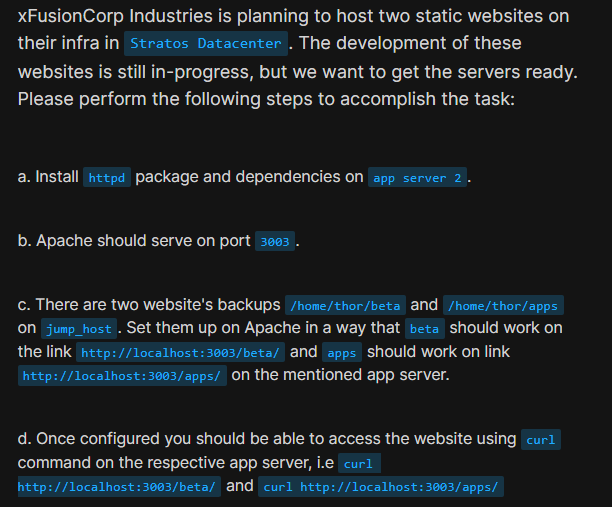
</div>

## **Steps I Followed :**

### **1\. Connected to Application Server**

```bash
ssh steve@stapp02
```
<div style="border:1px solid #ccc; padding:10px; border-radius:10px; box-shadow:2px 2px 8px rgba(0,0,0,0.2); display:inline-block;">
  
</div>

This command is used to securely connect to the remote application server where Apache will be installed.

* * *

### **2\. Installed Apache Web Server**

```bash
sudo dnf install httpd
```
<div style="border:1px solid #ccc; padding:10px; border-radius:10px; box-shadow:2px 2px 8px rgba(0,0,0,0.2); display:inline-block;">
  
</div>

This installs the Apache HTTP server along with all required dependencies.

* * *

### **3\. Started and Enabled Apache Service**

```bash
sudo systemctl start httpd
sudo systemctl enable httpd
```
<div style="border:1px solid #ccc; padding:10px; border-radius:10px; box-shadow:2px 2px 8px rgba(0,0,0,0.2); display:inline-block;">
  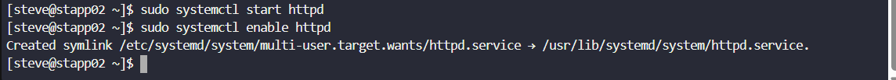
</div>

*   `start` → starts the Apache service immediately
    
*   `enable` → ensures Apache starts automatically on reboot
    
<div style="border:1px solid #ccc; padding:10px; border-radius:10px; box-shadow:2px 2px 8px rgba(0,0,0,0.2); display:inline-block;">
  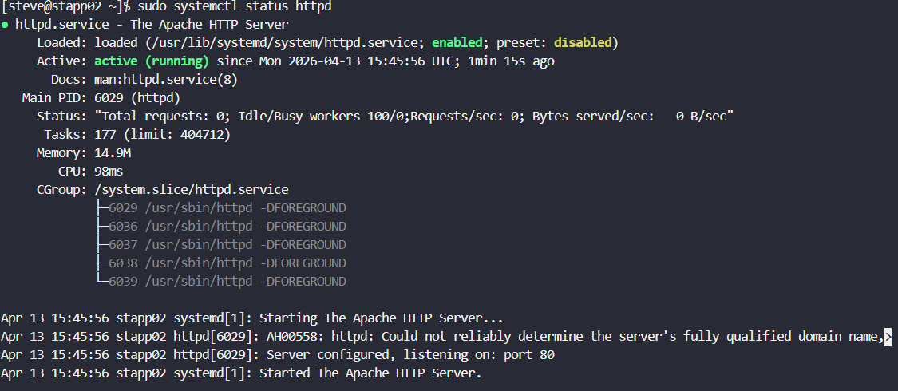
</div>

* * *

### **4\. Configured Apache to Run on Custom Port**

Edited the Apache configuration file:

```bash
sudo vi /etc/httpd/conf/httpd.conf
```
<div style="border:1px solid #ccc; padding:10px; border-radius:10px; box-shadow:2px 2px 8px rgba(0,0,0,0.2); display:inline-block;">
  
</div>

Changed:

```apache
Listen 80
```

to:

```apache
Listen 3003
```
<div style="border:1px solid #ccc; padding:10px; border-radius:10px; box-shadow:2px 2px 8px rgba(0,0,0,0.2); display:inline-block;">
  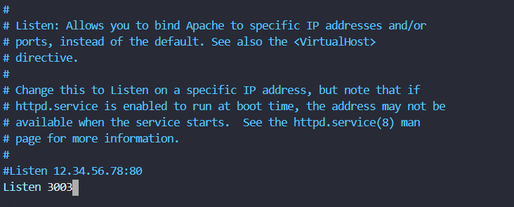
</div>

This allows Apache to serve content on port **3003** instead of the default port 80.

Now restart and observe the lsitening port

```bash
sudo systemctl restart httpd
```
<div style="border:1px solid #ccc; padding:10px; border-radius:10px; box-shadow:2px 2px 8px rgba(0,0,0,0.2); display:inline-block;">
  
</div>

```bash
sudo systemctl status httpd
```
<div style="border:1px solid #ccc; padding:10px; border-radius:10px; box-shadow:2px 2px 8px rgba(0,0,0,0.2); display:inline-block;">
  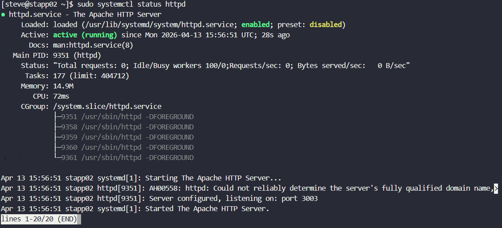
</div>

* * *

### **5\. Copied Website Files from Jump Host**

```bash
scp -r thor@jump-host:/home/thor/beta /tmp/
scp -r thor@jump-host:/home/thor/apps /tmp/
```
<div style="border:1px solid #ccc; padding:10px; border-radius:10px; box-shadow:2px 2px 8px rgba(0,0,0,0.2); display:inline-block;">
  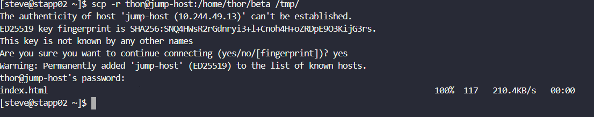
</div>

<div style="border:1px solid #ccc; padding:10px; border-radius:10px; box-shadow:2px 2px 8px rgba(0,0,0,0.2); display:inline-block;">
  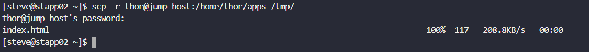
</div>

This copies the website backups from the jump host to the application server.

* * *

### **6\. Moved Files to Web Directory**

```bash
sudo mv /tmp/beta /var/www/html/
sudo mv /tmp/apps /var/www/html/
```
<div style="border:1px solid #ccc; padding:10px; border-radius:10px; box-shadow:2px 2px 8px rgba(0,0,0,0.2); display:inline-block;">
  
</div>

Apache serves content from `/var/www/html`, so both websites were placed here.

* * *

### **7\. Set Correct Permissions**

```bash
sudo chown -R apache:apache /var/www/html/beta
sudo chown -R apache:apache /var/www/html/apps
```
<div style="border:1px solid #ccc; padding:10px; border-radius:10px; box-shadow:2px 2px 8px rgba(0,0,0,0.2); display:inline-block;">
  
</div>

This ensures Apache has proper access to serve the files.

* * *

### **8\. Configured URL Mapping Using Alias**

Edited Apache config again:

```bash
sudo vi /etc/httpd/conf/httpd.conf
```
<div style="border:1px solid #ccc; padding:10px; border-radius:10px; box-shadow:2px 2px 8px rgba(0,0,0,0.2); display:inline-block;">
  
</div>

Added inside `<IfModule alias_module>`:

```apache
Alias /beta /var/www/html/beta
Alias /apps /var/www/html/apps
```
<div style="border:1px solid #ccc; padding:10px; border-radius:10px; box-shadow:2px 2px 8px rgba(0,0,0,0.2); display:inline-block;">
  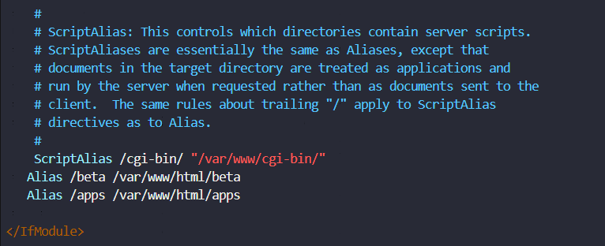
</div>

Added directory permissions:

```apache
<Directory /var/www/html/beta>
    Require all granted
</Directory>

<Directory /var/www/html/apps>
    Require all granted
</Directory>
```
<div style="border:1px solid #ccc; padding:10px; border-radius:10px; box-shadow:2px 2px 8px rgba(0,0,0,0.2); display:inline-block;">
  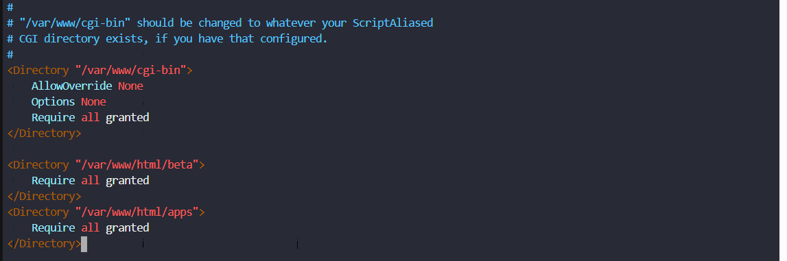
</div>

This maps:

*   `/beta` → beta website
    
*   `/apps` → apps website
    

* * *

### **9\. Restarted Apache Service**

```bash
sudo systemctl restart httpd
```
<div style="border:1px solid #ccc; padding:10px; border-radius:10px; box-shadow:2px 2px 8px rgba(0,0,0,0.2); display:inline-block;">
  
</div>

This applies all configuration changes.

* * *

### **10\. Verified Setup**

```bash
curl http://localhost:3003/beta/
curl http://localhost:3003/apps/
```
<div style="border:1px solid #ccc; padding:10px; border-radius:10px; box-shadow:2px 2px 8px rgba(0,0,0,0.2); display:inline-block;">
  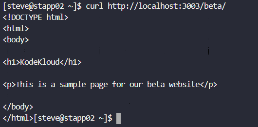
</div>

<div style="border:1px solid #ccc; padding:10px; border-radius:10px; box-shadow:2px 2px 8px rgba(0,0,0,0.2); display:inline-block;">
  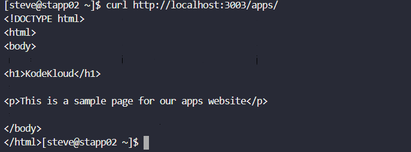
</div>

Both commands returned HTML content, confirming the websites are accessible.

* * *

## **My Understanding**

This task helped me understand how a web server works as a bridge between users and application content. Configuring Apache to run on a custom port showed how flexible server setups can be. Using **Alias** made it clear how multiple applications can be hosted on a single server without needing separate configurations for each.

* * *

## **What I Found Interesting**

I found it interesting how easily multiple websites can be hosted on a single server using simple configurations. The concept of mapping URLs to directories using Alias was especially useful and gave me a deeper understanding of how web servers handle requests internally.

* * *

### Topics Covered

- ***Apache Installation & Service Management***
- ***Custom Port Configuration***
- ***Website Deployment***
- ***URL Mapping using Alias***
- ***Testing with curl***


**Previous Task**: [ Day 18: Install and Configure DB Server](../Day_18/day_18.md)

**Next Task**: [Day 20: Configure Nginx + PHP-FPM Using Unix Sock](../Day_20/day_20.md)
