# Day 20: Configure Nginx + PHP-FPM Using Unix Sock

<div style="border:1px solid #ccc; padding:10px; border-radius:10px; box-shadow:2px 2px 8px rgba(0,0,0,0.2); display:inline-block;">
  
</div>

### **Content:**

> Today I worked on setting up a PHP application stack using **Nginx** and **PHP-FPM** on a CentOS server. The goal was to configure Nginx to serve PHP files by integrating it with PHP-FPM using a Unix socket.

> This task reflects real-world DevOps practices where proper service integration and configuration are critical for application deployment.

* * *

### **What I Learned**

*   How to configure Nginx for PHP applications
    
*   How PHP-FPM processes dynamic content
    
*   Why Unix sockets are preferred over TCP for local communication
    
*   Importance of correct permissions and service alignment
    

* * *
<div style="border:1px solid #ccc; padding:10px; border-radius:10px; box-shadow:2px 2px 8px rgba(0,0,0,0.2); display:inline-block;">
  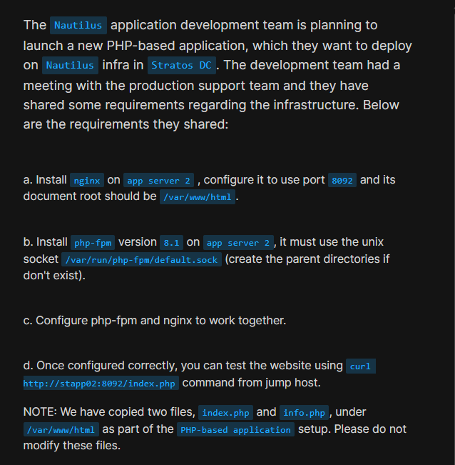
</div>

### **Steps I Followed :**

* * *

#### **1\. Connected to Application Server**

```bash
ssh steve@stapp02
```
<div style="border:1px solid #ccc; padding:10px; border-radius:10px; box-shadow:2px 2px 8px rgba(0,0,0,0.2); display:inline-block;">
  
</div>

**Why?** To perform configuration directly on the target application server.

* * *

#### **2\. Installed Nginx**

```bash
sudo yum install nginx -y
```
<div style="border:1px solid #ccc; padding:10px; border-radius:10px; box-shadow:2px 2px 8px rgba(0,0,0,0.2); display:inline-block;">
  
</div>

**Why?** Nginx acts as the frontend web server handling HTTP requests.

* * *

#### **3\. Configured Nginx (Port & Document Root)**

Opened config file:

```bash
sudo vi /etc/nginx/nginx.conf
```
<div style="border:1px solid #ccc; padding:10px; border-radius:10px; box-shadow:2px 2px 8px rgba(0,0,0,0.2); display:inline-block;">
  
</div>

<div style="border:1px solid #ccc; padding:10px; border-radius:10px; box-shadow:2px 2px 8px rgba(0,0,0,0.2); display:inline-block;">
  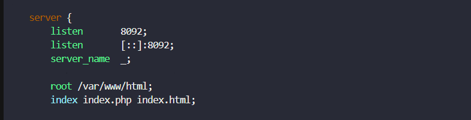
</div>

Updated server block:

*   Port: `8092`
    
*   Root: `/var/www/html`
    
*   Index: `index.php index.html`
    

**Why?** To meet application requirements and point to correct file location.

* * *

#### **4\. Restarted and Verified Nginx**

```bash
sudo systemctl restart nginx
sudo systemctl status nginx
```
<div style="border:1px solid #ccc; padding:10px; border-radius:10px; box-shadow:2px 2px 8px rgba(0,0,0,0.2); display:inline-block;">
  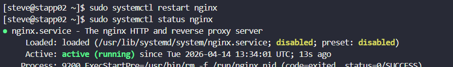
</div>

* * *

#### **5\. Verified Operating System**

```bash
cat /etc/os-release
```
<div style="border:1px solid #ccc; padding:10px; border-radius:10px; box-shadow:2px 2px 8px rgba(0,0,0,0.2); display:inline-block;">
  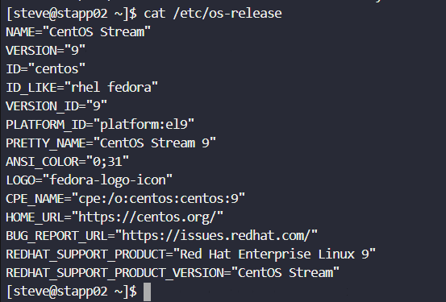
</div>

**Output:**

```bash
NAME="CentOS Stream"
VERSION="9"
```

**Why?** To confirm compatibility before installing PHP 8.1, since package availability depends on OS version.

* * *

#### **6\. Installed PHP 8.1 and PHP-FPM**

```bash
sudo dnf install -y epel-release
sudo dnf install -y https://rpms.remirepo.net/enterprise/remi-release-9.rpm
sudo dnf module reset php -y
sudo dnf module enable php:remi-8.1 -y
sudo dnf install php php-fpm php-cli -y
```
<div style="border:1px solid #ccc; padding:10px; border-radius:10px; box-shadow:2px 2px 8px rgba(0,0,0,0.2); display:inline-block;">
  
</div>
<div style="border:1px solid #ccc; padding:10px; border-radius:10px; box-shadow:2px 2px 8px rgba(0,0,0,0.2); display:inline-block;">
  
</div>
<div style="border:1px solid #ccc; padding:10px; border-radius:10px; box-shadow:2px 2px 8px rgba(0,0,0,0.2); display:inline-block;">
  
</div>
<div style="border:1px solid #ccc; padding:10px; border-radius:10px; box-shadow:2px 2px 8px rgba(0,0,0,0.2); display:inline-block;">
  
</div>
<div style="border:1px solid #ccc; padding:10px; border-radius:10px; box-shadow:2px 2px 8px rgba(0,0,0,0.2); display:inline-block;">
  
</div>
<div style="border:1px solid #ccc; padding:10px; border-radius:10px; box-shadow:2px 2px 8px rgba(0,0,0,0.2); display:inline-block;">
  
</div>
<div style="border:1px solid #ccc; padding:10px; border-radius:10px; box-shadow:2px 2px 8px rgba(0,0,0,0.2); display:inline-block;">
  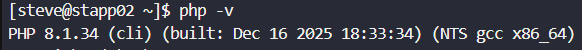
</div>

**Why?** Default repos don’t provide required PHP version, so Remi repo is used.

* * *

#### **7\. Configured PHP-FPM (User, Group & Socket)**

Opened file:

```bash
sudo vi /etc/php-fpm.d/www.conf
```
<div style="border:1px solid #ccc; padding:10px; border-radius:10px; box-shadow:2px 2px 8px rgba(0,0,0,0.2); display:inline-block;">
  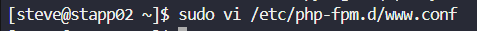
</div>
<div style="border:1px solid #ccc; padding:10px; border-radius:10px; box-shadow:2px 2px 8px rgba(0,0,0,0.2); display:inline-block;">
  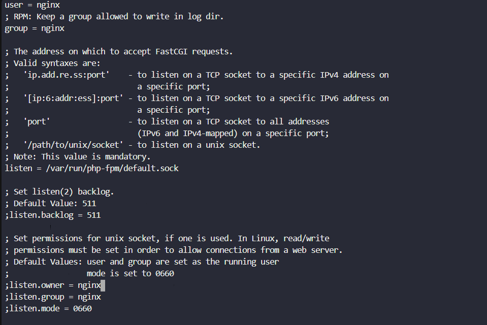
</div>

Updated configuration:

```ini
user = nginx
group = nginx

listen = /var/run/php-fpm/default.sock
```

**Why?**

*   `nginx` user ensures both services run under same context
    
*   Unix socket improves performance for local communication
    

* * *

#### **8\. Configured Nginx to Work with PHP-FPM**

Opened file:

```bash
sudo vi /etc/nginx/nginx.conf
```
<div style="border:1px solid #ccc; padding:10px; border-radius:10px; box-shadow:2px 2px 8px rgba(0,0,0,0.2); display:inline-block;">
  
</div>

Added:

<div style="border:1px solid #ccc; padding:10px; border-radius:10px; box-shadow:2px 2px 8px rgba(0,0,0,0.2); display:inline-block;">
  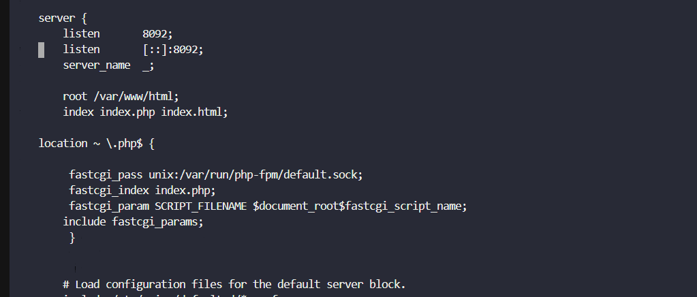
</div>

```nginx
location ~ \.php$ {
    fastcgi_pass unix:/var/run/php-fpm/default.sock;
    fastcgi_index index.php;
    fastcgi_param SCRIPT_FILENAME $document_root$fastcgi_script_name;
    include fastcgi_params;
}
```

**Why?** Nginx cannot process PHP directly, so it forwards requests to PHP-FPM.

* * *

#### **9\. Restarted Services After Integration**

```bash
sudo systemctl restart php-fpm
sudo systemctl restart nginx
```
<div style="border:1px solid #ccc; padding:10px; border-radius:10px; box-shadow:2px 2px 8px rgba(0,0,0,0.2); display:inline-block;">
  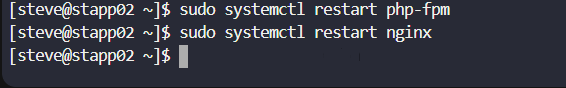
</div>

**Why?** To apply updated configurations.

* * *

#### **10\. Verified Nginx Configuration Syntax**

```bash
sudo nginx -t
```
<div style="border:1px solid #ccc; padding:10px; border-radius:10px; box-shadow:2px 2px 8px rgba(0,0,0,0.2); display:inline-block;">
  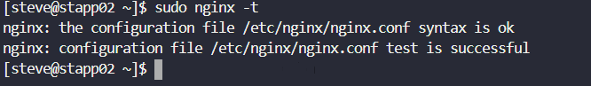
</div>

**Output:**

```bash
nginx: the configuration file /etc/nginx/nginx.conf syntax is ok
nginx: configuration file /etc/nginx/nginx.conf test is successful
```

**Why?** To ensure there are no syntax errors before serving traffic.

* * *

#### **11\. Fixed Socket Permissions**

Before:

```bash
ls -l /var/run/php-fpm/default.sock
srw-rw----+ 1 root root 0 Apr 14 13:51 /var/run/php-fpm/default.sock
```
<div style="border:1px solid #ccc; padding:10px; border-radius:10px; box-shadow:2px 2px 8px rgba(0,0,0,0.2); display:inline-block;">
  
</div>

Changed:

```bash
sudo chown -R nginx:nginx /var/run/php-fpm/default.sock
```
<div style="border:1px solid #ccc; padding:10px; border-radius:10px; box-shadow:2px 2px 8px rgba(0,0,0,0.2); display:inline-block;">
  
</div>

After:

```bash
ls -l /var/run/php-fpm/default.sock
srw-rw----+ 1 nginx nginx 0 Apr 14 13:51 /var/run/php-fpm/default.sock
```
<div style="border:1px solid #ccc; padding:10px; border-radius:10px; box-shadow:2px 2px 8px rgba(0,0,0,0.2); display:inline-block;">
  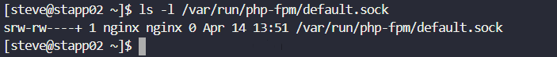
</div>

**Why?** Nginx must have permission to access the PHP-FPM socket.

* * *

#### **12\. Tested the Application**

From jump host:

```bash
curl http://stapp02:8092/index.php
```
<div style="border:1px solid #ccc; padding:10px; border-radius:10px; box-shadow:2px 2px 8px rgba(0,0,0,0.2); display:inline-block;">
  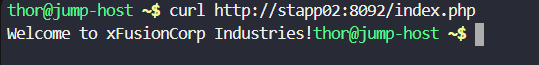
</div>

**Output:**

```bash
Welcome to xFusionCorp Industries!
```

**Why?** To verify complete integration of Nginx and PHP-FPM.

* * *

### **My Understanding**

This task demonstrated how multiple services must work together seamlessly. Nginx handles incoming requests, while PHP-FPM processes backend logic. Proper configuration, permissions, and validation steps are critical to ensure everything works smoothly.

* * *

### **What I Found Interesting**

I found it interesting that even though the setup looks simple, small details like OS verification, socket permissions, and service user alignment play a huge role in making the system work correctly.

* * *


### Topics Covered

- ***Nginx Installation & Configuration***
- ***PHP-FPM Setup (PHP 8.1)***
- ***Unix Socket Configuration***
- ***Nginx + PHP-FPM Integration***
- ***Service Management & Testing***


**Previous Task**: [Day 19: Install and Configure Web Application ](../Day_19/day_19.md)

**Next Task**: [Day 21: Set Up Git Repository on Storage Server](../Day_21/day_21.md)
