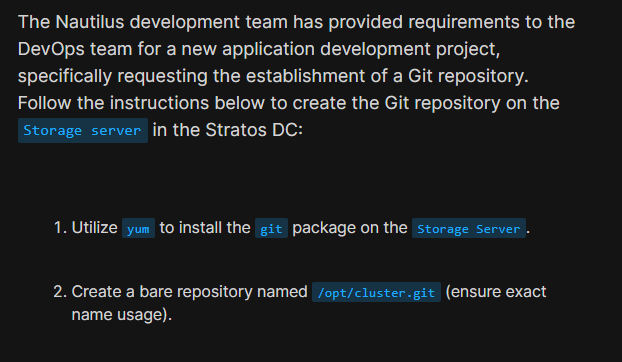
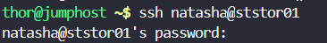
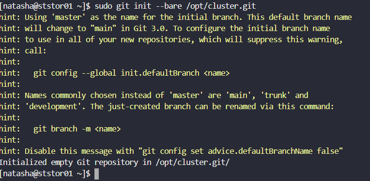

# Day 21: Set Up Git Repository on Storage Server

<div style="border:1px solid #ccc; padding:10px; border-radius:10px; box-shadow:2px 2px 8px rgba(0,0,0,0.2); display:inline-block;">
  
</div>

**Content:**

> Today I worked on setting up a Git repository on the storage server as requested by the Nautilus development team. This task was important to enable version control and collaboration for the upcoming application development project.

* * *

### **What I Learned**

*   How to install Git using `yum` on a CentOS-based system
    
*   Difference between a normal repository and a **bare repository**
    

* * *

<div style="border:1px solid #ccc; padding:10px; border-radius:10px; box-shadow:2px 2px 8px rgba(0,0,0,0.2); display:inline-block;">
  
</div>

### **Steps I Followed :**

**1\. Connected to Storage Server**

```bash
ssh natasha@ststor01
```
<div style="border:1px solid #ccc; padding:10px; border-radius:10px; box-shadow:2px 2px 8px rgba(0,0,0,0.2); display:inline-block;">
  
</div>


**2\. Updated System Packages**

```bash
sudo yum update -y
```
<div style="border:1px solid #ccc; padding:10px; border-radius:10px; box-shadow:2px 2px 8px rgba(0,0,0,0.2); display:inline-block;">
  
</div>


**3\. Installed Git**

```bash
sudo yum install -y git
```
<div style="border:1px solid #ccc; padding:10px; border-radius:10px; box-shadow:2px 2px 8px rgba(0,0,0,0.2); display:inline-block;">
  
</div>


**4\. Created Bare Git Repository**

```bash
sudo git init --bare /opt/cluster.git
```
<div style="border:1px solid #ccc; padding:10px; border-radius:10px; box-shadow:2px 2px 8px rgba(0,0,0,0.2); display:inline-block;">
  
</div>

* * *

### **My Understanding**

This task helped me understand how a centralized Git repository is created for teams to push and pull code. A bare repository is essential in such scenarios because it doesn’t contain a working directory and is ideal for sharing code across multiple developers.

* * *

### **What I Found Interesting**

I found it interesting that creating a central Git repository is very simple, yet it plays a crucial role in enabling collaboration and version control in real-world DevOps workflows.

### Topics Covered

- ***Git***


**Previous Task**: [Day 20: Configure Nginx + PHP-FPM Using Unix Sock ](../Day_20/day_20.md)

**Next Task**: [Day 22: Clone Git Repository on Storage Server](../Day_22/day_22.md)
