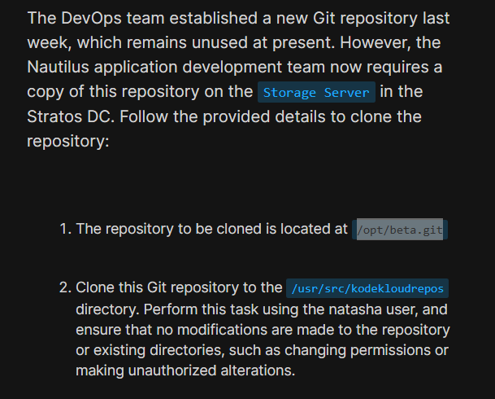

# Day 22: Clone Git Repository on Storage Server

<div style="border:1px solid #ccc; padding:10px; border-radius:10px; box-shadow:2px 2px 8px rgba(0,0,0,0.2); display:inline-block;">
  
</div>

**Content:**

>Today I worked on cloning an existing Git repository on the storage server for the Nautilus application development team. This task ensures that developers have access to the repository locally on the server for further development activities.

---

### **What I Learned**

* How to clone a Git repository from a local path
* Understanding how an empty repository behaves after cloning

---

<div style="border:1px solid #ccc; padding:10px; border-radius:10px; box-shadow:2px 2px 8px rgba(0,0,0,0.2); display:inline-block;">
  
</div>

### **Steps I Followed :**

**1. Connected to Storage Server**

```
ssh natasha@ststor01
```
<div style="border:1px solid #ccc; padding:10px; border-radius:10px; box-shadow:2px 2px 8px rgba(0,0,0,0.2); display:inline-block;">
  
</div>

**2. Navigated to Target Directory**

```
cd /usr/src/kodekloudrepos
```
<div style="border:1px solid #ccc; padding:10px; border-radius:10px; box-shadow:2px 2px 8px rgba(0,0,0,0.2); display:inline-block;">
  
</div>

**3. Cloned the Repository**

```
git clone /opt/news.git
```
<div style="border:1px solid #ccc; padding:10px; border-radius:10px; box-shadow:2px 2px 8px rgba(0,0,0,0.2); display:inline-block;">
  
</div>

---

### **My Understanding**

This task helped me understand how teams can create working copies of a centralized repository. Cloning from a local repository path is similar to cloning from remote sources like GitHub, except it happens within the same server environment.

---

### **What I Found Interesting**

I found it interesting that Git treats local and remote repositories in a very similar way. Even an empty repository can be cloned successfully, which shows how flexible Git is in handling different development setups.

---

### Topics Covered

- ***Git***


**Previous Task**: [Day 21: Set Up Git Repository on Storage Server ](../Day_21/day_21.md)

**Next Task**: [Day 23: Fork a Git Repository](../Day_23/day_23.md)
