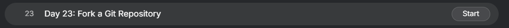
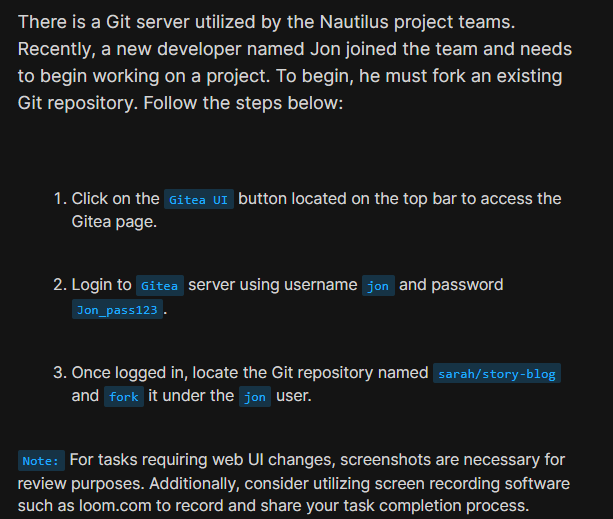
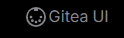
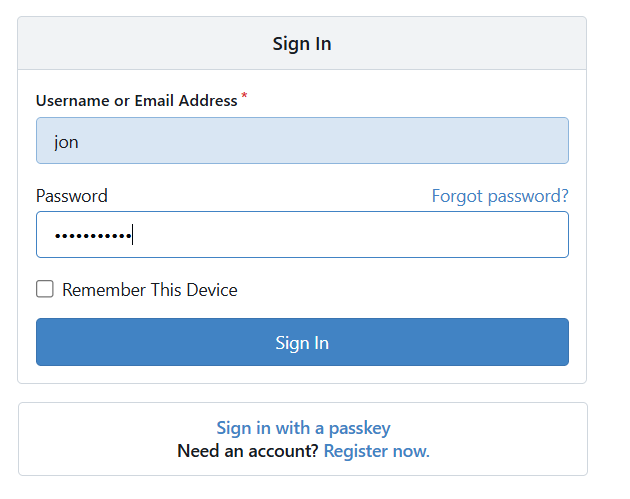
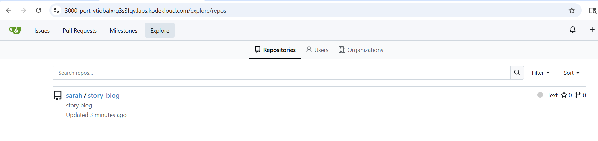
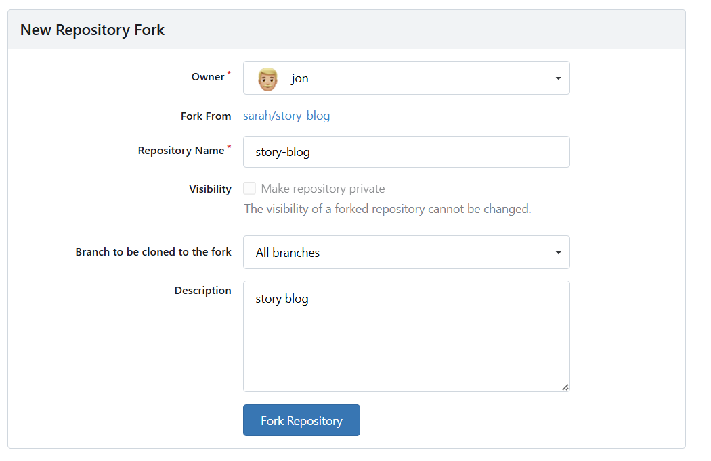
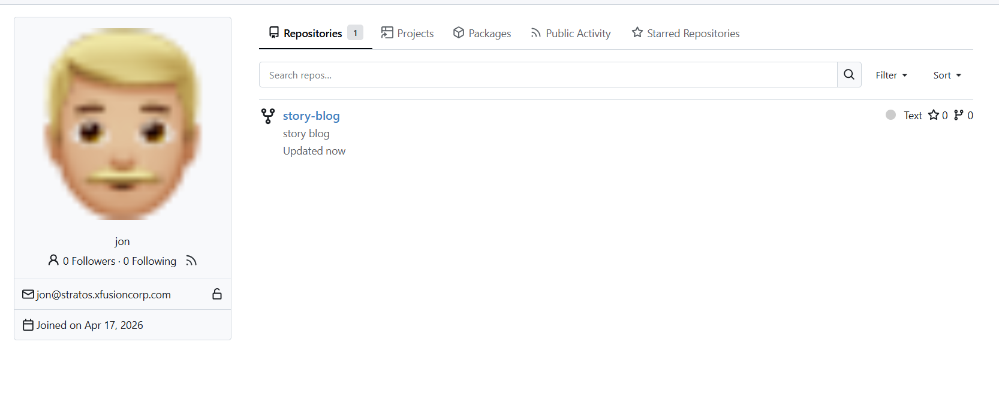

# Day 23: Fork a Git Repository

  

### Content:

> Today I worked on forking an existing Git repository using the Gitea web interface for the Nautilus project team. This task helps developers create their own copy of a repository so they can work independently without affecting the original project.

* * *

### What I Learned

*   How to fork a repository using a Git web UI (Gitea)
    
*   The difference between a forked repository and the original repository
    

* * *

  

### Steps I Followed:

1.  **Accessed Gitea UI** Clicked on the Gitea button from the top bar to open the web interface
    

  

2.  **Logged into Gitea** Used the following credentials:
    

*   Username: `jon`
    
*   Password: `Jon_pass123`
    

  

3.  **Located the Repository** Navigated to the **Explore** section and searched for the repository `sarah/story-blog`
    

  

4.  **Forked the Repository** Opened the repository and clicked the **Fork** button (top right corner)
    

  

5.  **Verified the Fork** Checked Jon’s profile and confirmed that the forked repository `jon/story-blog` appeared under his repositories
    

  

* * *

### My Understanding

This task helped me understand how forking works as a way to duplicate a repository under a different user account. It allows developers to experiment, make changes, and contribute without directly modifying the original repository.

* * *

### What I Found Interesting

I found it interesting that forking creates a complete copy of the repository while still maintaining a connection to the original project. This makes collaboration easier, especially in team environments and open-source projects.

* * *

### Topics Covered

- ***Git***

**Previous Task**: [Day 22: Clone Git Repository on Storage Server ](../Day_22/day_22.md)

**Next Task**: [Day 24: Git Create Branches](../Day_24/day_24.md)