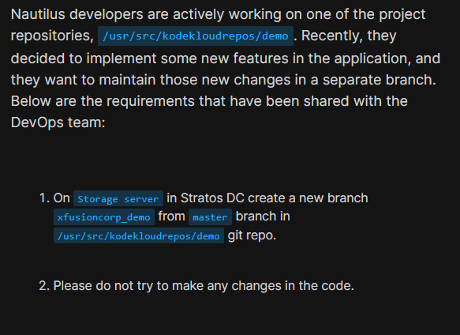
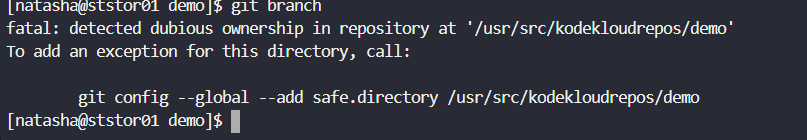
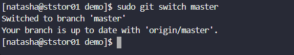
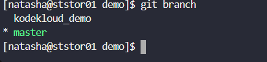
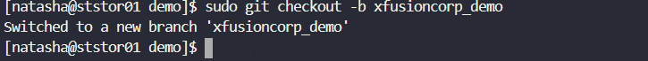
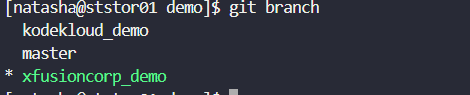

# Day 24: Git Create Branches

<div style="border:1px solid #ccc; padding:10px; border-radius:10px; box-shadow:2px 2px 8px rgba(0,0,0,0.2); display:inline-block;">
  
</div>

### Content:

> Today I worked on creating a new Git branch on the storage server as requested by the Nautilus development team. The goal was to isolate new feature development by creating a separate branch from the master branch in the existing repository.

* * *

### 🔹 What I Learned

*   Importance of marking a repository as a safe directory
    
*   How to switch branches and create a new branch from an existing one
    
*   Difference between `git switch` and `git checkout`
    

* * *

<div style="border:1px solid #ccc; padding:10px; border-radius:10px; box-shadow:2px 2px 8px rgba(0,0,0,0.2); display:inline-block;">
  
</div>

### 🔹 Steps I Followed

**1\. Connected to Storage Server**

```bash
ssh natasha@ststor01
```
<div style="border:1px solid #ccc; padding:10px; border-radius:10px; box-shadow:2px 2px 8px rgba(0,0,0,0.2); display:inline-block;">
  
</div>

**2\. Navigated to Repository**

```bash
cd /usr/src/kodekloudrepos/demo
```
<div style="border:1px solid #ccc; padding:10px; border-radius:10px; box-shadow:2px 2px 8px rgba(0,0,0,0.2); display:inline-block;">
  
</div>

**3\. Fixed Git Ownership Issue**

```bash
git config --global --add safe.directory /usr/src/kodekloudrepos/demo
```
<div style="border:1px solid #ccc; padding:10px; border-radius:10px; box-shadow:2px 2px 8px rgba(0,0,0,0.2); display:inline-block;">
  
</div>
<div style="border:1px solid #ccc; padding:10px; border-radius:10px; box-shadow:2px 2px 8px rgba(0,0,0,0.2); display:inline-block;">
  
</div>

**4\. Checked Existing Branches**

```bash
git branch
```
<div style="border:1px solid #ccc; padding:10px; border-radius:10px; box-shadow:2px 2px 8px rgba(0,0,0,0.2); display:inline-block;">
  
</div>

**5\. Switched to Master Branch**

```bash
sudo git switch master
```
<div style="border:1px solid #ccc; padding:10px; border-radius:10px; box-shadow:2px 2px 8px rgba(0,0,0,0.2); display:inline-block;">
  
</div>

**6\. Created New Branch from Master**

```bash
sudo git checkout -b xfusioncorp_demo
```
<div style="border:1px solid #ccc; padding:10px; border-radius:10px; box-shadow:2px 2px 8px rgba(0,0,0,0.2); display:inline-block;">
  
</div>
<div style="border:1px solid #ccc; padding:10px; border-radius:10px; box-shadow:2px 2px 8px rgba(0,0,0,0.2); display:inline-block;">
  
</div>

**7\. Verified Branch Creation**

```bash
git branch
```
<div style="border:1px solid #ccc; padding:10px; border-radius:10px; box-shadow:2px 2px 8px rgba(0,0,0,0.2); display:inline-block;">
  
</div>

* * *

### 🔹 My Understanding

This task helped me understand how branching works in Git for managing parallel development. Creating a separate branch ensures that new features can be developed independently without affecting the stable master branch. I also learned how Git enforces security through ownership checks and how to resolve them properly.

* * *

### 🔹 What I Found Interesting

I found it interesting that Git prevents access to repositories with mismatched ownership for security reasons. Also, creating and switching branches is very quick and powerful, making it easy for teams to work on multiple features simultaneously without conflicts.

### Topics Covered

- ***Git***


**Previous Task**: [Day 23: Fork a Git Repository ](../Day_23/day_23.md)

**Next Task**: [Day 25: Git Merge Branches](../Day_25/day_25.md)