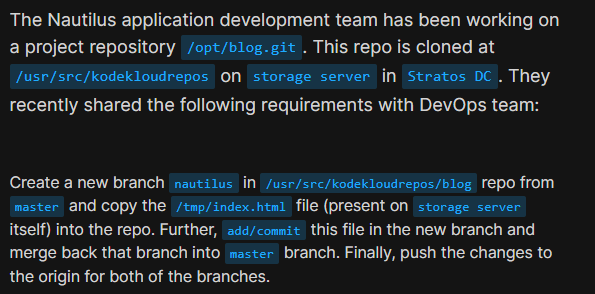
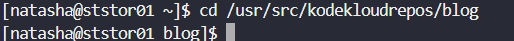
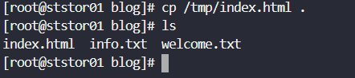
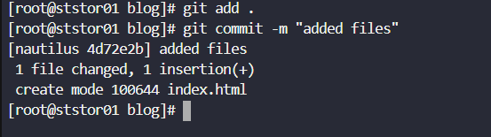
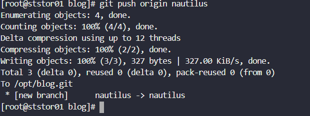
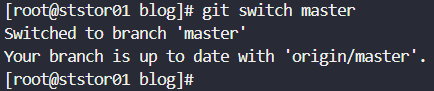
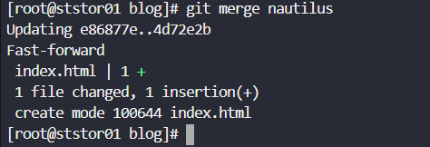
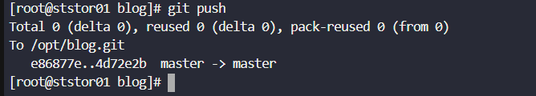

# Day 25: Git Merge Branches

<div style="border:1px solid #ccc; padding:10px; border-radius:10px; box-shadow:2px 2px 8px rgba(0,0,0,0.2); display:inline-block;">
  
</div>


### **Content:**

>Today I worked on creating and merging Git branches on the storage server as per the Nautilus development team’s requirement. The task involved creating a new branch, adding a file, committing changes, and merging them back into the main branch.

---

### 🔹 **What I Learned**

* How to create a new branch from the master branch
* How to add and commit new files in a branch
* The process of merging branches in Git

---

<div style="border:1px solid #ccc; padding:10px; border-radius:10px; box-shadow:2px 2px 8px rgba(0,0,0,0.2); display:inline-block;">
  
</div>

### 🔹 **Steps I Followed**

#### **1. Connected to Storage Server**

```
ssh natasha@ststor01
```
<div style="border:1px solid #ccc; padding:10px; border-radius:10px; box-shadow:2px 2px 8px rgba(0,0,0,0.2); display:inline-block;">
  
</div>

#### **2. Navigated to Repository**

```
cd /usr/src/kodekloudrepos/blog
```
<div style="border:1px solid #ccc; padding:10px; border-radius:10px; box-shadow:2px 2px 8px rgba(0,0,0,0.2); display:inline-block;">
  
</div>

#### **3. Switched to Root User**

```
sudo su
```
<div style="border:1px solid #ccc; padding:10px; border-radius:10px; box-shadow:2px 2px 8px rgba(0,0,0,0.2); display:inline-block;">
  
</div>

#### **4. Checked Current Branch**

```
git branch
```
<div style="border:1px solid #ccc; padding:10px; border-radius:10px; box-shadow:2px 2px 8px rgba(0,0,0,0.2); display:inline-block;">
  
</div>

#### **5. Created New Branch from Master**

```
git checkout -b nautilus
```
<div style="border:1px solid #ccc; padding:10px; border-radius:10px; box-shadow:2px 2px 8px rgba(0,0,0,0.2); display:inline-block;">
  
</div>

#### **6. Copied File into Repository**

```
cp /tmp/index.html .
```
<div style="border:1px solid #ccc; padding:10px; border-radius:10px; box-shadow:2px 2px 8px rgba(0,0,0,0.2); display:inline-block;">
  
</div>

#### **7. Added and Committed Changes**

```
git add index.html
git commit -m "added index.html file"
```
<div style="border:1px solid #ccc; padding:10px; border-radius:10px; box-shadow:2px 2px 8px rgba(0,0,0,0.2); display:inline-block;">
  
</div>

#### **8. Pushed New Branch to Origin**

```
git push origin nautilus
```
<div style="border:1px solid #ccc; padding:10px; border-radius:10px; box-shadow:2px 2px 8px rgba(0,0,0,0.2); display:inline-block;">
  
</div>

#### **9. Switched Back to Master**

```
git switch master
```
<div style="border:1px solid #ccc; padding:10px; border-radius:10px; box-shadow:2px 2px 8px rgba(0,0,0,0.2); display:inline-block;">
  
</div>

#### **10. Merged Nautilus Branch into Master**

```
git merge nautilus
```
<div style="border:1px solid #ccc; padding:10px; border-radius:10px; box-shadow:2px 2px 8px rgba(0,0,0,0.2); display:inline-block;">
  
</div>

#### **11. Pushed Updated Master Branch**

```
git push origin master
```
<div style="border:1px solid #ccc; padding:10px; border-radius:10px; box-shadow:2px 2px 8px rgba(0,0,0,0.2); display:inline-block;">
  
</div>

---

### 🔹 **My Understanding**

This task helped me understand how teams manage feature development using branches and then integrate those changes into the main branch. By working on a separate branch (`nautilus`), we avoid affecting the stable codebase until the changes are ready. Merging ensures that all updates are consolidated properly.

---

### 🔹 **What I Found Interesting**

I found the **fast-forward merge** interesting, where Git directly moves the master pointer forward without creating a new merge commit. It shows how efficient Git can be when there are no conflicting changes between branches. Also, pushing both branches ensures proper synchronization with the remote repository.

---
### Topics Covered

- ***Git***
- ***Git branch***


**Previous Task**: [Day 24: Git Create Branches ](../Day_24/day_24.md)

**Next Task**: [Day 26: Git Manage Remotes](../Day_26/day_26.md)