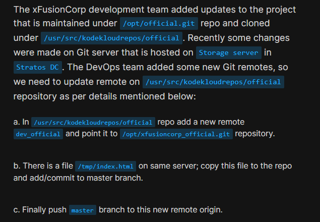
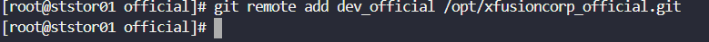
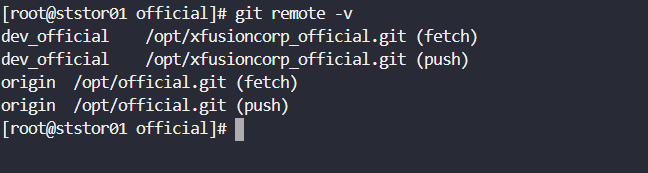
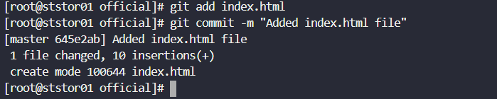
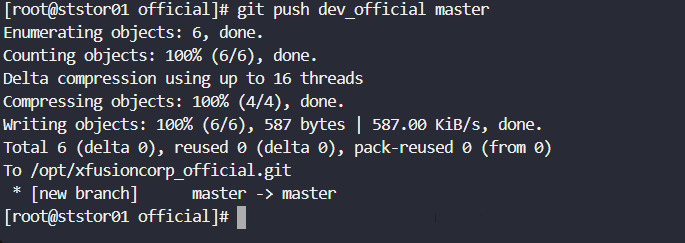

# Day 26: Git Manage Remotes

<div style="border:1px solid #ccc; padding:10px; border-radius:10px; box-shadow:2px 2px 8px rgba(0,0,0,0.2); display:inline-block;">
  
</div>

### **Content:**

>Today I worked on managing Git remotes and pushing changes to a newly added remote repository as per the xFusionCorp development team’s requirement. The task involved adding a new remote, copying a file into the repository, committing changes, and pushing them to the new remote.

---

### 🔹 **What I Learned**

* How to add a new remote repository in Git
* How to verify configured remotes
* How to push code to a specific remote (not just origin)

---

<div style="border:1px solid #ccc; padding:10px; border-radius:10px; box-shadow:2px 2px 8px rgba(0,0,0,0.2); display:inline-block;">
  
</div>

### 🔹 **Steps I Followed**

**1. Connected to Storage Server**

```bash
ssh natasha@ststor01
```
<div style="border:1px solid #ccc; padding:10px; border-radius:10px; box-shadow:2px 2px 8px rgba(0,0,0,0.2); display:inline-block;">
  
</div>


**2. Navigated to Repository**

```bash
cd /usr/src/kodekloudrepos/official
```
<div style="border:1px solid #ccc; padding:10px; border-radius:10px; box-shadow:2px 2px 8px rgba(0,0,0,0.2); display:inline-block;">
  
</div>


**3. Switched to Root User**

```bash
sudo su
```

**4. Added New Remote**

```bash
git remote add dev_official /opt/xfusioncorp_official.git
```
<div style="border:1px solid #ccc; padding:10px; border-radius:10px; box-shadow:2px 2px 8px rgba(0,0,0,0.2); display:inline-block;">
  
</div>


**5. Verified Remotes**

```bash
git remote -v
```
<div style="border:1px solid #ccc; padding:10px; border-radius:10px; box-shadow:2px 2px 8px rgba(0,0,0,0.2); display:inline-block;">
  
</div>


**6. Copied File into Repository**

```bash
cp /tmp/index.html .
```
<div style="border:1px solid #ccc; padding:10px; border-radius:10px; box-shadow:2px 2px 8px rgba(0,0,0,0.2); display:inline-block;">
  
</div>


**7. Checked Current Branch**

```bash
git branch
```
<div style="border:1px solid #ccc; padding:10px; border-radius:10px; box-shadow:2px 2px 8px rgba(0,0,0,0.2); display:inline-block;">
  
</div>

**8. Added and Committed Changes**

```bash
git add index.html
git commit -m "Added index.html file"
```
<div style="border:1px solid #ccc; padding:10px; border-radius:10px; box-shadow:2px 2px 8px rgba(0,0,0,0.2); display:inline-block;">
  
</div>

**9. Pushed Master Branch to New Remote**

```bash
git push dev_official master
```
<div style="border:1px solid #ccc; padding:10px; border-radius:10px; box-shadow:2px 2px 8px rgba(0,0,0,0.2); display:inline-block;">
  
</div>


---

### 🔹 **My Understanding**

This task helped me understand how Git supports working with multiple remotes in a single repository. Instead of pushing changes only to the default origin, we can configure additional remotes like `dev_official` and push code to different repositories as needed. 

---


### 🔹 **What I Found Interesting**

I found it interesting that Git allows multiple remotes to coexist, and we can selectively push branches to any of them. The flexibility of naming remotes (like `dev_official`) makes it easier to manage different environments or teams. It shows how powerful Git is for distributed development workflows.

---

### Topics Covered

- ***Git***
- ***Git branch***
- ***Git remote***


**Previous Task**: [Day 25: Git Merge Branches ](../Day_25/day_25.md)

**Next Task**: [Day 27: Git Revert Some Changes ](../Day_27/day_27.md)