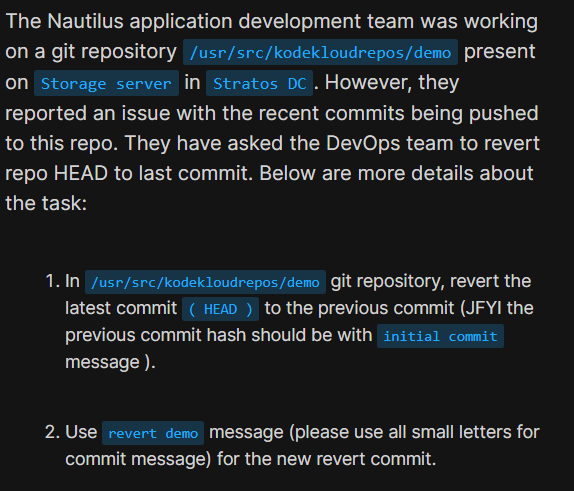
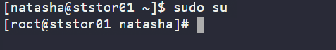
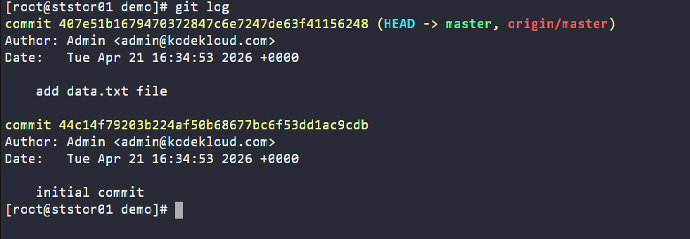
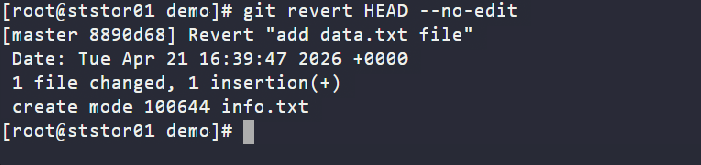
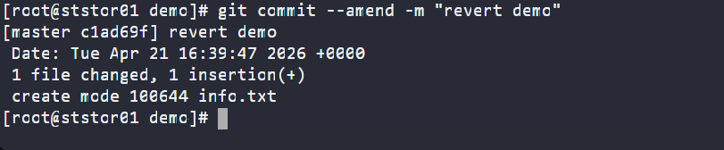
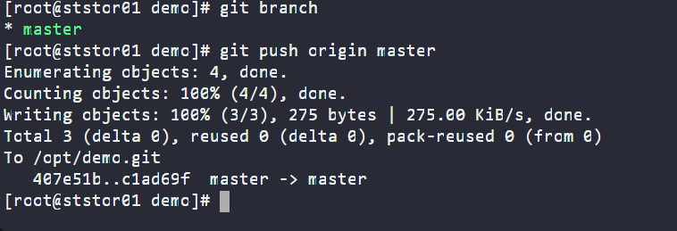

# Day 27: Git Revert Some Changes

<div style="border:1px solid #ccc; padding:10px; border-radius:10px; box-shadow:2px 2px 8px rgba(0,0,0,0.2); display:inline-block;">
  
</div>

### Content:

> Today I worked on reverting changes in a Git repository as requested by the xFusionCorp development team. The task involved undoing the latest commit without deleting history, ensuring the repository safely returned to its previous stable state.

* * *

### 🔹 What I Learned

*   How to safely undo changes by creating a new commit
    
*   How to modify commit messages using `--amend`
    
*   Importance of preserving commit history in shared repositories
    

* * *

<div style="border:1px solid #ccc; padding:10px; border-radius:10px; box-shadow:2px 2px 8px rgba(0,0,0,0.2); display:inline-block;">
  
</div>

### 🔹 Steps I Followed

**1\. Connected to Storage Server**

```plaintext
ssh natasha@ststor01
```
<div style="border:1px solid #ccc; padding:10px; border-radius:10px; box-shadow:2px 2px 8px rgba(0,0,0,0.2); display:inline-block;">
  
</div>

**2\. Switched to Root User**

```plaintext
sudo su
```
<div style="border:1px solid #ccc; padding:10px; border-radius:10px; box-shadow:2px 2px 8px rgba(0,0,0,0.2); display:inline-block;">
  
</div>

**3\. Navigated to Repository**

```plaintext
cd /usr/src/kodekloudrepos/demo
```
<div style="border:1px solid #ccc; padding:10px; border-radius:10px; box-shadow:2px 2px 8px rgba(0,0,0,0.2); display:inline-block;">
  
</div>


**4\. Checked Commit History**

```plaintext
git log
```
<div style="border:1px solid #ccc; padding:10px; border-radius:10px; box-shadow:2px 2px 8px rgba(0,0,0,0.2); display:inline-block;">
  
</div>

**5\. Reverted Latest Commit (HEAD)**

```plaintext
git revert HEAD --no-edit
```
<div style="border:1px solid #ccc; padding:10px; border-radius:10px; box-shadow:2px 2px 8px rgba(0,0,0,0.2); display:inline-block;">
  
</div>

**6\. Updated Commit Message as Required**

```plaintext
git commit --amend -m "revert demo"
```
<div style="border:1px solid #ccc; padding:10px; border-radius:10px; box-shadow:2px 2px 8px rgba(0,0,0,0.2); display:inline-block;">
  
</div>

**7\. Verified Current Branch**

```plaintext
git branch
```

**8\. Pushed Changes to Remote Repository**

```plaintext
git push origin master
```
<div style="border:1px solid #ccc; padding:10px; border-radius:10px; box-shadow:2px 2px 8px rgba(0,0,0,0.2); display:inline-block;">
  
</div>

* * *

### 🔹 My Understanding

This task helped me understand how to safely undo a commit using `git revert` instead of removing it from history. Unlike reset, revert creates a new commit that reverses previous changes, which is crucial when working in shared repositories.

* * *

### 🔹 What I Found Interesting

I found it interesting that even though we “undo” a commit, Git doesn’t actually delete it. Instead, it maintains a complete history by adding a new commit that reverses the changes. This makes collaboration safer and avoids breaking work for others.

* * *

### Topics Covered

- ***Git***
- ***Git branch***
- ***Git revert***


**Previous Task**: [Day 26: Git Manage Remotes ](../Day_26/day_26.md)

**Next Task**: [Day 28: Git Cherry Pick ](../Day_28/day_28.md)