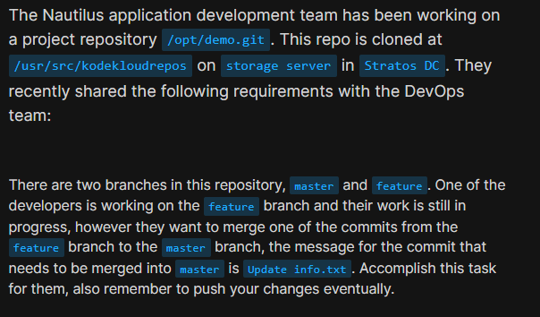
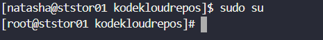
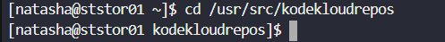
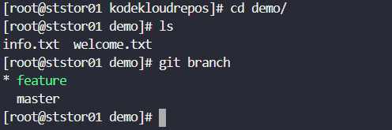
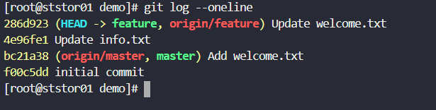
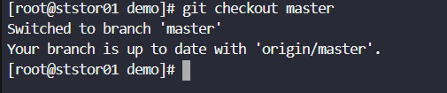
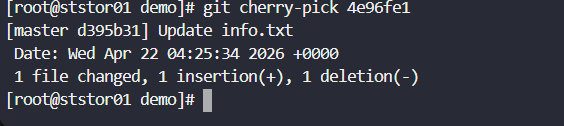
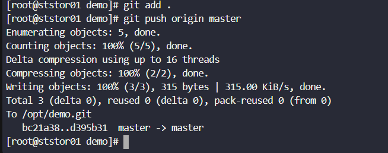

# Day 28: Git Cherry Pick

<div style="border:1px solid #ccc; padding:10px; border-radius:10px; box-shadow:2px 2px 8px rgba(0,0,0,0.2); display:inline-block;">
  
</div>

### **Content:**

> Today I worked on applying a specific commit from one branch to another in a Git repository, as requested by the xFusionCorp development team. The task required moving only a single commit from the `feature` branch to the `master` branch without merging the entire branch.

* * *

### 🔹 **What I Learned**

*   How to copy a specific commit from one branch to another using `git cherry-pick`
    
*   Difference between `merge` and `cherry-pick`
    
*   Importance of selective commits in real-world deployments
    

* * *

<div style="border:1px solid #ccc; padding:10px; border-radius:10px; box-shadow:2px 2px 8px rgba(0,0,0,0.2); display:inline-block;">
  
</div>

### 🔹 **Steps I Followed**

**1\. Connected to Storage Server**

```bash
ssh natasha@ststor01
```
<div style="border:1px solid #ccc; padding:10px; border-radius:10px; box-shadow:2px 2px 8px rgba(0,0,0,0.2); display:inline-block;">
  
</div>

**2\. Switched to Root User**

```bash
sudo su
```
<div style="border:1px solid #ccc; padding:10px; border-radius:10px; box-shadow:2px 2px 8px rgba(0,0,0,0.2); display:inline-block;">
  
</div>

**3\. Navigated to Repository**

```bash
cd /usr/src/kodekloudrepos/demo
```
<div style="border:1px solid #ccc; padding:10px; border-radius:10px; box-shadow:2px 2px 8px rgba(0,0,0,0.2); display:inline-block;">
  
</div>

**4\. Checked Available Branches**

```bash
git branch
```
<div style="border:1px solid #ccc; padding:10px; border-radius:10px; box-shadow:2px 2px 8px rgba(0,0,0,0.2); display:inline-block;">
  
</div>

**5\. Viewed Commit History to Identify Required Commit**

```bash
git log --oneline
```

Output:

```bash
286d923 (HEAD -> feature, origin/feature) Update welcome.txt
4e96fe1 Update info.txt
bc21a38 (origin/master, master) Add welcome.txt
f00c5dd initial commit
```
<div style="border:1px solid #ccc; padding:10px; border-radius:10px; box-shadow:2px 2px 8px rgba(0,0,0,0.2); display:inline-block;">
  
</div>

➡️ Identified commit 4e96fe1 with message "Update info.txt"

**6\. Switched to Master Branch**

```bash
git checkout master
```
<div style="border:1px solid #ccc; padding:10px; border-radius:10px; box-shadow:2px 2px 8px rgba(0,0,0,0.2); display:inline-block;">
  
</div>

**7\. Cherry-picked Required Commit**

```bash
git cherry-pick 4e96fe1
```
<div style="border:1px solid #ccc; padding:10px; border-radius:10px; box-shadow:2px 2px 8px rgba(0,0,0,0.2); display:inline-block;">
  
</div>

**8\. (Optional) Staged Changes**

```bash
git add .
```

**9\. Pushed Changes to Remote Repository**

```bash
git push origin master
```
<div style="border:1px solid #ccc; padding:10px; border-radius:10px; box-shadow:2px 2px 8px rgba(0,0,0,0.2); display:inline-block;">
  
</div>

* * *

### 🔹 **My Understanding**

This task helped me understand how to selectively apply a commit from one branch to another without merging the entire branch. The `git cherry-pick` command is very useful when only a specific fix or feature needs to be moved to another branch while keeping other changes separate.

* * *

### 🔹 **What I Found Interesting**

I found it interesting that Git allows picking individual commits instead of forcing a full merge. This gives developers more control, especially when working with incomplete features but needing urgent fixes in production.

* * *

### Topics Covered

- ***Git***
- ***Git branch***
- ***Git cherry-pick***


**Previous Task**: [Day 27: Git Revert Some Changes ](../Day_27/day_27.md)

**Next Task**: [Day 29: Manage Git Pull Requests ](../Day_29/day_29.md)