# Day 29: Manage Git Pull Requests

<div style="border:1px solid #ccc; padding:10px; border-radius:10px; box-shadow:2px 2px 8px rgba(0,0,0,0.2); display:inline-block;">
  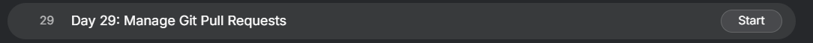
</div>

**Content:**

> Today I worked on implementing a proper Git workflow to prevent direct changes to the `master` branch in a shared repository. The goal was to ensure that all changes go through a review process using Pull Requests before being merged, following best practices for collaborative development.

* * *

<div style="border:1px solid #ccc; padding:10px; border-radius:10px; box-shadow:2px 2px 8px rgba(0,0,0,0.2); display:inline-block;">
  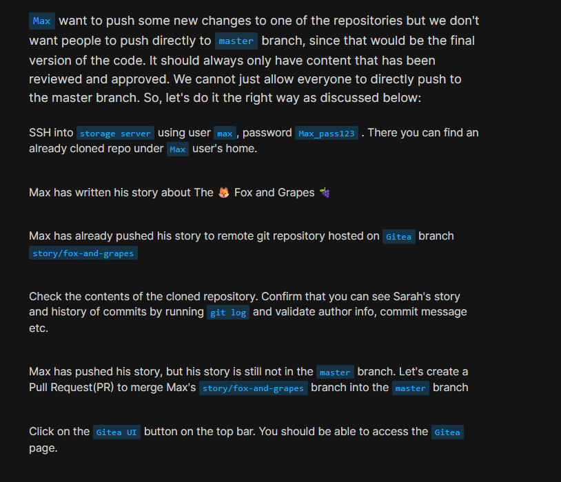
</div>
<div style="border:1px solid #ccc; padding:10px; border-radius:10px; box-shadow:2px 2px 8px rgba(0,0,0,0.2); display:inline-block;">
  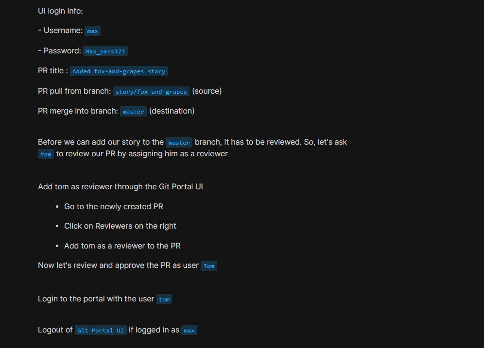
</div>
<div style="border:1px solid #ccc; padding:10px; border-radius:10px; box-shadow:2px 2px 8px rgba(0,0,0,0.2); display:inline-block;">
  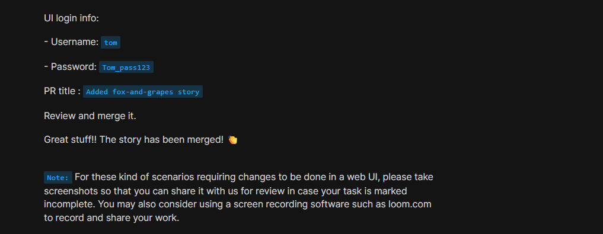
</div>

🔹 **What I Learned**

*   How to enforce controlled collaboration using Pull Requests (PRs)
    
*   Importance of code reviews before merging into the main branch
    
*   How to assign reviewers and approve changes in a Git UI (Gitea)
    
*   Validating commit history and author information using `git log`
    

* * *

🔹 **Steps I Followed**

1.  **Connected to Storage Server**
    

```bash
ssh max@ststor01
```
<div style="border:1px solid #ccc; padding:10px; border-radius:10px; box-shadow:2px 2px 8px rgba(0,0,0,0.2); display:inline-block;">
  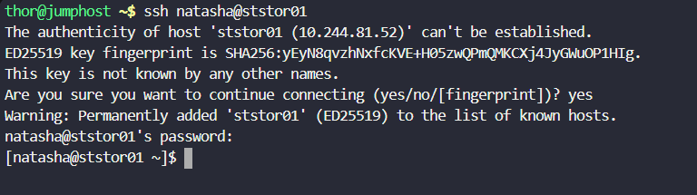
</div>

2.  **Navigated to the Repository**
    

```bash
cd ~/story-blog
```

3.  **Checked Available Branches**
    

```bash
git branch
```
<div style="border:1px solid #ccc; padding:10px; border-radius:10px; box-shadow:2px 2px 8px rgba(0,0,0,0.2); display:inline-block;">
  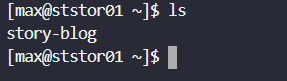
</div>

<div style="border:1px solid #ccc; padding:10px; border-radius:10px; box-shadow:2px 2px 8px rgba(0,0,0,0.2); display:inline-block;">
  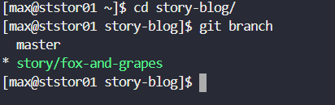
</div>

4.  **Verified Commit History**
    

```bash
git log
```
<div style="border:1px solid #ccc; padding:10px; border-radius:10px; box-shadow:2px 2px 8px rgba(0,0,0,0.2); display:inline-block;">
  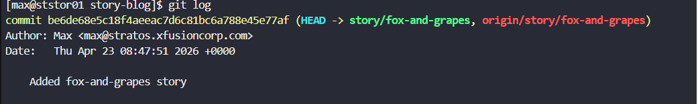
</div>

*   Confirmed Max’s commit: *“Added fox-and-grapes story”*
    
*   Verified Sarah’s previous commits and merge history
    

5.  **Accessed Gitea Web UI**
    
    <div style="border:1px solid #ccc; padding:10px; border-radius:10px; box-shadow:2px 2px 8px rgba(0,0,0,0.2); display:inline-block;">
  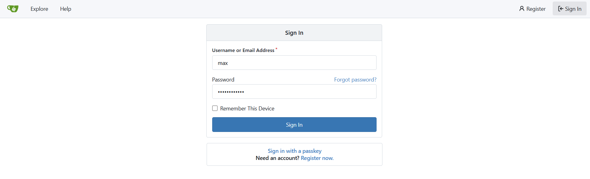
</div>

*   Logged in as: `max / Max_pass123`
    

6.  **Created a Pull Request**
    

*   **Title:** Added fox-and-grapes story
    
*   **Source Branch:** `story/fox-and-grapes`
    
*   **Destination Branch:** `master`
    
<div style="border:1px solid #ccc; padding:10px; border-radius:10px; box-shadow:2px 2px 8px rgba(0,0,0,0.2); display:inline-block;">
  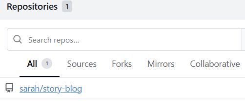
</div>

<div style="border:1px solid #ccc; padding:10px; border-radius:10px; box-shadow:2px 2px 8px rgba(0,0,0,0.2); display:inline-block;">
  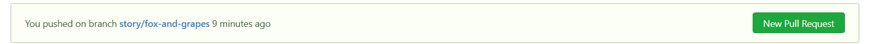
</div>

<div style="border:1px solid #ccc; padding:10px; border-radius:10px; box-shadow:2px 2px 8px rgba(0,0,0,0.2); display:inline-block;">
  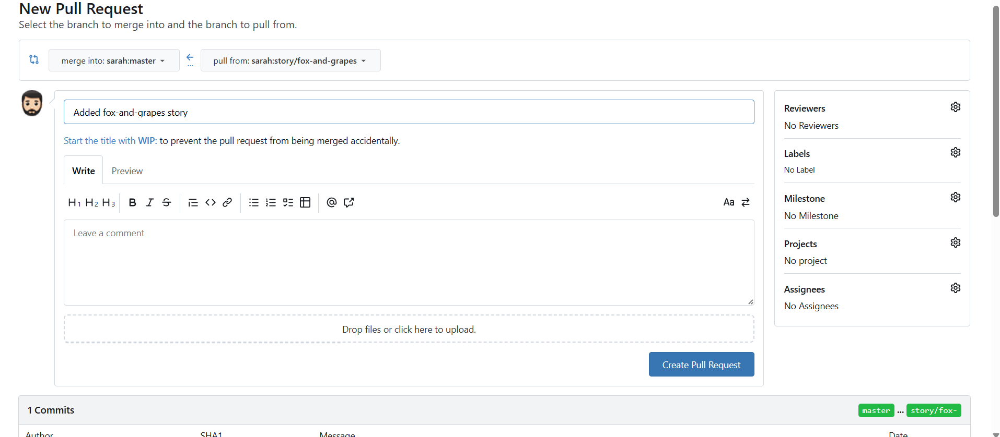
</div>

<div style="border:1px solid #ccc; padding:10px; border-radius:10px; box-shadow:2px 2px 8px rgba(0,0,0,0.2); display:inline-block;">
  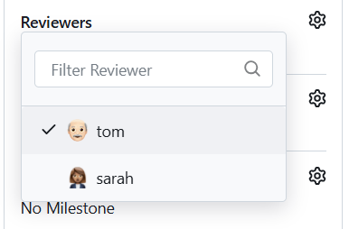
</div>

<div style="border:1px solid #ccc; padding:10px; border-radius:10px; box-shadow:2px 2px 8px rgba(0,0,0,0.2); display:inline-block;">
  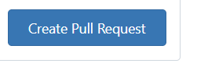
</div>

<div style="border:1px solid #ccc; padding:10px; border-radius:10px; box-shadow:2px 2px 8px rgba(0,0,0,0.2); display:inline-block;">
  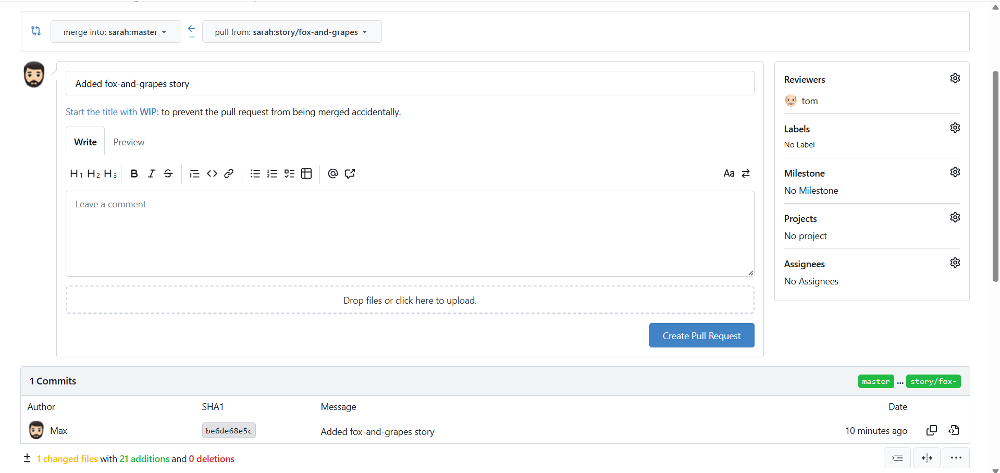
</div>


7.  **Assigned Reviewer**
    

*   Added **Tom** as reviewer via the Reviewers section
    

8.  **Reviewed and Merged PR as Tom**
    

*   Logged out from Max
<div style="border:1px solid #ccc; padding:10px; border-radius:10px; box-shadow:2px 2px 8px rgba(0,0,0,0.2); display:inline-block;">
  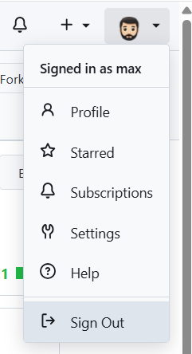
</div>
    
*   Logged in as: `tom / Tom_pass123`

<div style="border:1px solid #ccc; padding:10px; border-radius:10px; box-shadow:2px 2px 8px rgba(0,0,0,0.2); display:inline-block;">
  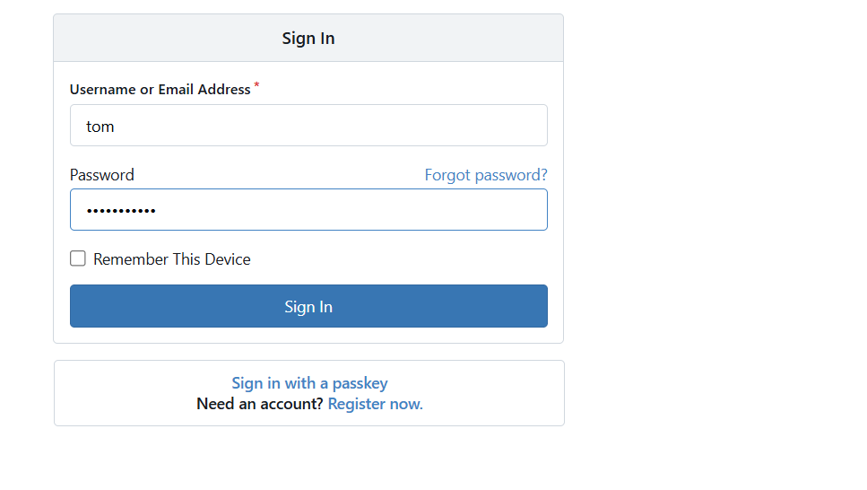
</div>

*   Opened the PR
    
<div style="border:1px solid #ccc; padding:10px; border-radius:10px; box-shadow:2px 2px 8px rgba(0,0,0,0.2); display:inline-block;">
  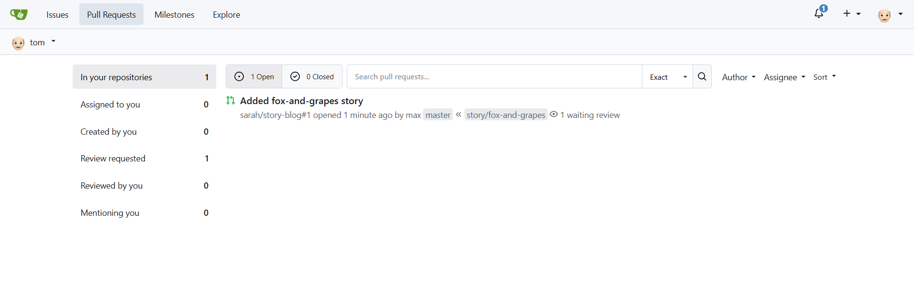
</div>

*   Reviewed changes
<div style="border:1px solid #ccc; padding:10px; border-radius:10px; box-shadow:2px 2px 8px rgba(0,0,0,0.2); display:inline-block;">
  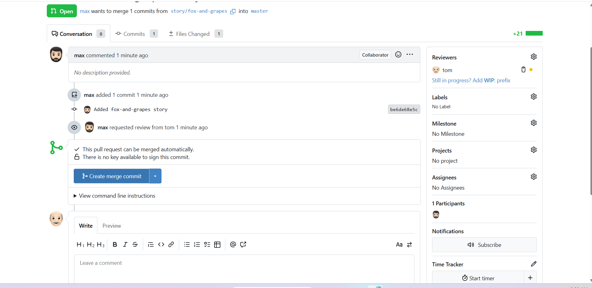
</div>
    
*   Approved and merged into `master`
    
<div style="border:1px solid #ccc; padding:10px; border-radius:10px; box-shadow:2px 2px 8px rgba(0,0,0,0.2); display:inline-block;">
  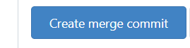
</div>

9.  **Verified Changes**
    

*   Confirmed the story was successfully merged into the `master` branch
    

<div style="border:1px solid #ccc; padding:10px; border-radius:10px; box-shadow:2px 2px 8px rgba(0,0,0,0.2); display:inline-block;">
  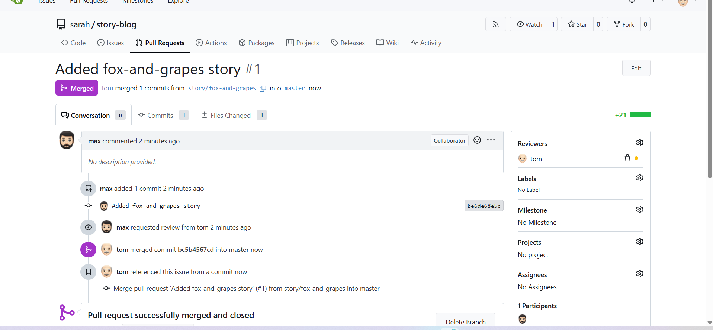
</div>
<div style="border:1px solid #ccc; padding:10px; border-radius:10px; box-shadow:2px 2px 8px rgba(0,0,0,0.2); display:inline-block;">
  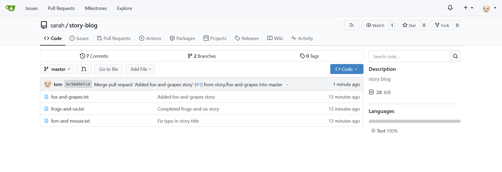
</div>

* * *

🔹 **My Understanding** This task helped me understand the importance of protecting the `master` branch in a collaborative environment. Instead of allowing direct commits, using Pull Requests ensures that every change is reviewed, validated, and approved before becoming part of the main codebase.

* * *

🔹 **What I Found Interesting** I found it interesting how Git platforms like Gitea enforce structured collaboration. Even for a simple story update, the PR workflow adds a layer of accountability and quality control, which is critical in real-world production environments.


### Topics Covered

- ***Git***
- ***Git Pulll Request***
- ***Git branch***


**Previous Task**: [Day 28: Git Cherry Pick ](../Day_28/day_28.md)

**Next Task**: [Day 30: Git hard reset ](../Day_30/day_30.md)