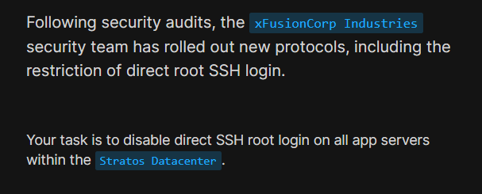
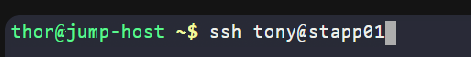
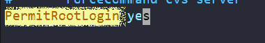
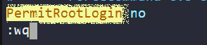
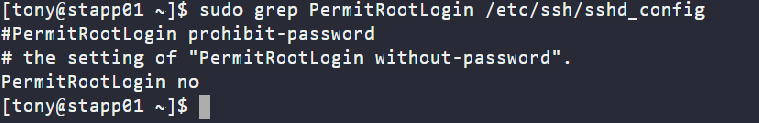
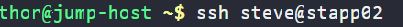

# Day 3: Secure Root SSH Access | 100 Days of DevOps

<div style="border:1px solid #ccc; padding:10px; border-radius:10px; box-shadow:2px 2px 8px rgba(0,0,0,0.2); display:inline-block;">
  
</div>

## Content:

> Today I worked on **Secure Root SSH Access** on multiple app servers as part of my DevOps journey.
> 
> This is an important security practice followed in production environments to prevent unauthorized access.

* * *

## What I Learned

*   How to disable root login via SSH
    
*   Importance of secure remote access
    
*   Managing SSH configuration across multiple servers
    
<div style="border:1px solid #ccc; padding:10px; border-radius:10px; box-shadow:2px 2px 8px rgba(0,0,0,0.2); display:inline-block;">
  
</div>

## Steps I Followed

### 1\. Connect to App Servers

From the jump host, I connected to each server one by one:

```plaintext
 ssh tony@stapp01 
```
<div style="border:1px solid #ccc; padding:10px; border-radius:10px; box-shadow:2px 2px 8px rgba(0,0,0,0.2); display:inline-block;">
  
</div>

Then entered the password.

### 2\. Edit SSH Configuration

Opened the SSH configuration file:

```plaintext
sudo vi /etc/ssh/sshd_config
```
<div style="border:1px solid #ccc; padding:10px; border-radius:10px; box-shadow:2px 2px 8px rgba(0,0,0,0.2); display:inline-block;">
  
</div>

Searched for the setting:

```plaintext
/PermitRootLogin
```
<div style="border:1px solid #ccc; padding:10px; border-radius:10px; box-shadow:2px 2px 8px rgba(0,0,0,0.2); display:inline-block;">
  
</div>

Then modified it:

> PermitRootLogin no

<div style="border:1px solid #ccc; padding:10px; border-radius:10px; box-shadow:2px 2px 8px rgba(0,0,0,0.2); display:inline-block;">
  
</div>

## Explanation:

*   `PermitRootLogin yes` → allows root login (not secure ❌)
    
*   `PermitRootLogin no` → disables root login (secure ✅)
    
*   Removing `#` ensures the setting is active
    

### 3\. Restart SSH Service

After saving the file:

```plaintext
sudo systemctl restart sshd
```
<div style="border:1px solid #ccc; padding:10px; border-radius:10px; box-shadow:2px 2px 8px rgba(0,0,0,0.2); display:inline-block;">
  
</div>

### 4\. Verify Configuration

Checked the updated setting:

```plaintext
grep PermitRootLogin /etc/ssh/sshd_config
```

## Expected output:

```plaintext
PermitRootLogin no
```

<div style="border:1px solid #ccc; padding:10px; border-radius:10px; box-shadow:2px 2px 8px rgba(0,0,0,0.2); display:inline-block;">
  
</div>
<div style="border:1px solid #ccc; padding:10px; border-radius:10px; box-shadow:2px 2px 8px rgba(0,0,0,0.2); display:inline-block;">
  
</div>

### 🔁 Repeated Same Steps For:

*   **stapp02**
    

```plaintext
ssh steve@stapp02
```
<div style="border:1px solid #ccc; padding:10px; border-radius:10px; box-shadow:2px 2px 8px rgba(0,0,0,0.2); display:inline-block;">
  
</div>

*   **stapp03**
    

```plaintext
ssh banner@stapp03
```
<div style="border:1px solid #ccc; padding:10px; border-radius:10px; box-shadow:2px 2px 8px rgba(0,0,0,0.2); display:inline-block;">
  
</div>

Performed the same configuration changes on both servers.

## My Understanding

### Purpose of Disabling Root SSH Login

Disabling direct root login is a critical security measure in Linux systems.

Instead of logging in as root, users should:

*   Log in using a normal user account
    
*   Use `sudo` for administrative tasks
    

### Common Benefits:

🔐 Prevents brute-force attacks on root account  
👨‍💻 Encourages use of least privilege principle  
🛡️ Adds an extra layer of authentication  
📊 Improves audit tracking (who did what)  
🚫 Reduces risk of accidental system damage

* * *

### Topics Covered

- ***SSH Configuration***
- ***SSH Security practices***

**Previous Task**: [Day 2: Temporary User Setup with Expiry Date](../Day_2/day_2.md)

**Next Task**: [Day 4: Script Execution Permissions](../Day_4/day_4.md)

