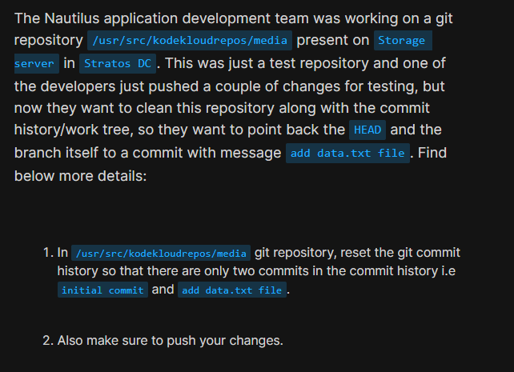
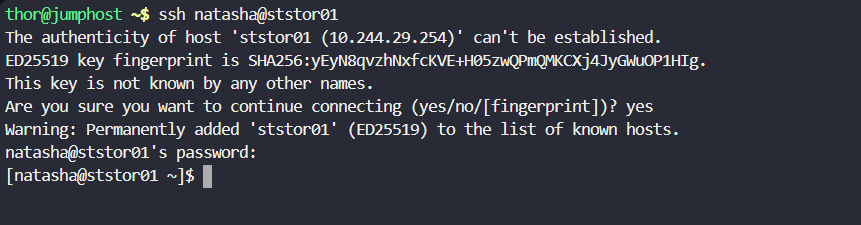
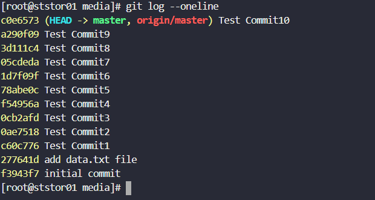
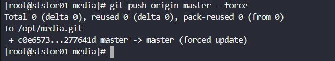

# Day 30: Git Hard Reset 

<div style="border:1px solid #ccc; padding:10px; border-radius:10px; box-shadow:2px 2px 8px rgba(0,0,0,0.2); display:inline-block;">
  
</div>

**Content:**
>Today I worked on cleaning up a Git repository by rewriting its commit history using a hard reset. The goal was to remove unnecessary test commits and retain only the essential commits, ensuring a clean and minimal commit history.

---

🔹 **What I Learned**

* How to use `git reset --hard` to move HEAD to a specific commit
* Why force pushing (`--force`) is required after rewriting history
* Risks involved in rewriting commit history and when it is acceptable

---

<div style="border:1px solid #ccc; padding:10px; border-radius:10px; box-shadow:2px 2px 8px rgba(0,0,0,0.2); display:inline-block;">
  
</div>

## Steps I Followed

### 1\. Connected to Storage Server

``` bash
ssh natasha@ststor01
```
<div style="border:1px solid #ccc; padding:10px; border-radius:10px; box-shadow:2px 2px 8px rgba(0,0,0,0.2); display:inline-block;">
  
</div>

### 2\. Navigated to the Repository

``` bash
cd /usr/src/kodekloudrepos/media
```
<div style="border:1px solid #ccc; padding:10px; border-radius:10px; box-shadow:2px 2px 8px rgba(0,0,0,0.2); display:inline-block;">
  
</div>

### 3\.Switched to Root User
``` bash
sudo su
```
<div style="border:1px solid #ccc; padding:10px; border-radius:10px; box-shadow:2px 2px 8px rgba(0,0,0,0.2); display:inline-block;">
  
</div>

### 4\.Checked Commit History
``` bash
git log --oneline
```
Observed multiple unwanted test commits after the required commit:

* Target commit: *add data.txt file*
* Oldest commit: *initial commit*

<div style="border:1px solid #ccc; padding:10px; border-radius:10px; box-shadow:2px 2px 8px rgba(0,0,0,0.2); display:inline-block;">
  
</div>


### 5\. Reset Commit History

Used hard reset to move HEAD to the required commit:
``` bash
git reset --hard 277641d
``` 
<div style="border:1px solid #ccc; padding:10px; border-radius:10px; box-shadow:2px 2px 8px rgba(0,0,0,0.2); display:inline-block;">
  
</div>

### 6\. Pushed Changes to Remote Repository

Since history was rewritten locally, forced update was required:
``` bash
git push origin master --force
``` 
<div style="border:1px solid #ccc; padding:10px; border-radius:10px; box-shadow:2px 2px 8px rgba(0,0,0,0.2); display:inline-block;">
  
</div>

### 7\. Verified Final Commit History
``` bash
git log --oneline
``` 

<div style="border:1px solid #ccc; padding:10px; border-radius:10px; box-shadow:2px 2px 8px rgba(0,0,0,0.2); display:inline-block;">
  
</div>

Confirmed only two commits remain:

* add data.txt file
* initial commit

---

🔹 **My Understanding**

This task helped me understand how Git history can be rewritten to remove unwanted commits. A hard reset completely discards changes after a specific commit, making the repository clean. However, since this changes commit history, a force push is required to sync with the remote repository.

---

🔹 **What I Found Interesting**

I found it interesting how powerful Git is when it comes to history manipulation. With just one command, we can clean an entire commit history. At the same time, it highlighted the importance of using such commands carefully, especially in shared repositories, as they can overwrite others’ work if not handled properly.


### Topics Covered

- ***Git***
- ***Git reset***
- ***Git branch***


**Previous Task**: [Day 29: Manage Git Pull Requests ](../Day_29/day_29.md)

**Next Task**: [Day 31: Git Stash ](../Day_31/day_31.md)