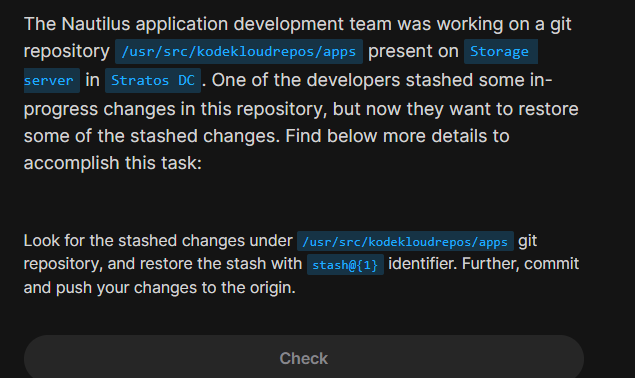
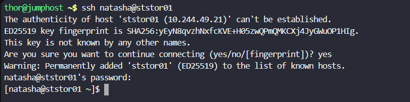
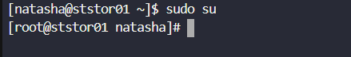
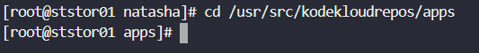
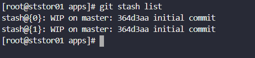
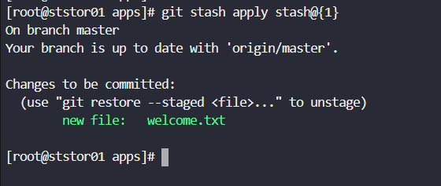
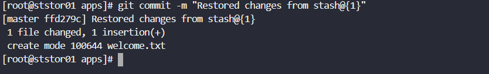
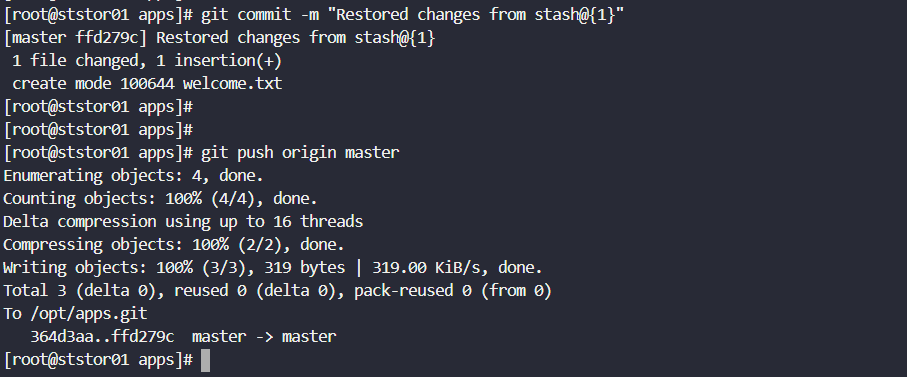

# Day 31: Git Stash 

<div style="border:1px solid #ccc; padding:10px; border-radius:10px; box-shadow:2px 2px 8px rgba(0,0,0,0.2); display:inline-block;">
  
</div>

### **Content:**

>Today I worked on restoring stashed changes in a Git repository and pushing them to the remote repository. The task involved identifying a specific stash entry, applying it, and then committing and pushing those changes.

---

### 🔹 **What I Learned**

* How to view stashed changes using `git stash list`
* Difference between `git stash apply` and `git stash pop`
* How to restore a specific stash using its identifier

---
<div style="border:1px solid #ccc; padding:10px; border-radius:10px; box-shadow:2px 2px 8px rgba(0,0,0,0.2); display:inline-block;">
  
</div>

### **Steps I Followed**

#### **1. Connected to Storage Server**

```bash
ssh natasha@ststor01
```
<div style="border:1px solid #ccc; padding:10px; border-radius:10px; box-shadow:2px 2px 8px rgba(0,0,0,0.2); display:inline-block;">
  
</div>

---

#### **2. Switched to Root User**

```bash
sudo su
```
<div style="border:1px solid #ccc; padding:10px; border-radius:10px; box-shadow:2px 2px 8px rgba(0,0,0,0.2); display:inline-block;">
  
</div>

---

#### **3. Navigated to the Repository**

```bash
cd /usr/src/kodekloudrepos/apps
```
<div style="border:1px solid #ccc; padding:10px; border-radius:10px; box-shadow:2px 2px 8px rgba(0,0,0,0.2); display:inline-block;">
  
</div>

---

#### **4. Checked Available Stashes**

```bash
git stash list
```

Observed multiple stash entries:

```
stash@{0}
stash@{1}
```
<div style="border:1px solid #ccc; padding:10px; border-radius:10px; box-shadow:2px 2px 8px rgba(0,0,0,0.2); display:inline-block;">
  
</div>

---

#### **5. Applied the Required Stash**

```bash
git stash apply stash@{1}
```
<div style="border:1px solid #ccc; padding:10px; border-radius:10px; box-shadow:2px 2px 8px rgba(0,0,0,0.2); display:inline-block;">
  
</div>

This restored the changes (a new file `welcome.txt`) and staged them automatically.

---

#### **6. Verified Changes**

```bash
git status
```

Confirmed that `welcome.txt` was ready to be committed.

---

#### **7. Committed the Changes**

```bash
git commit -m "Restored changes from stash@{1}"
```
<div style="border:1px solid #ccc; padding:10px; border-radius:10px; box-shadow:2px 2px 8px rgba(0,0,0,0.2); display:inline-block;">
  
</div>

---

#### **8. Pushed Changes to Remote Repository**

```bash
git push origin master
```
<div style="border:1px solid #ccc; padding:10px; border-radius:10px; box-shadow:2px 2px 8px rgba(0,0,0,0.2); display:inline-block;">
  
</div>

---

#### **9. Verified Push**

The push was successful and changes were reflected in the remote repository.

---

### 🔹 **My Understanding**

This task helped me understand how Git stash works as a temporary storage for uncommitted changes. I learned how to retrieve specific stashed work without disturbing others and properly integrate it back into the repository workflow.

---

### 🔹 **What I Found Interesting**

I found it interesting that Git allows multiple stashes and lets us restore any specific one using an identifier. It’s a very useful feature when working on multiple tasks simultaneously, as it helps keep work organized without committing incomplete changes.

---


### Topics Covered

- ***Git***
- ***Git stash***


**Previous Task**: [Day 30: Git Hard Reset ](../Day_30/day_30.md)

**Next Task**: [Day 32: Git Rebase ](../Day_32/day_32.md)