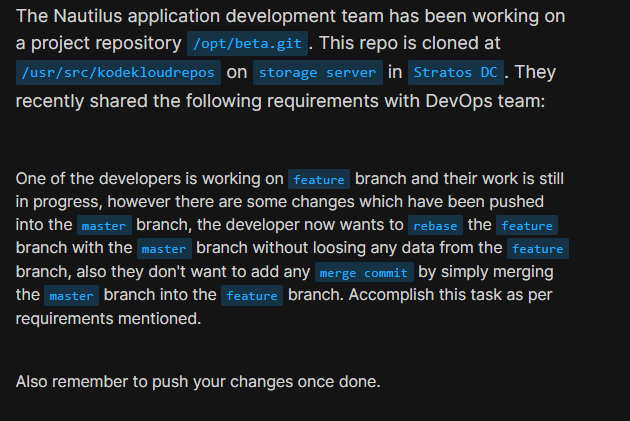
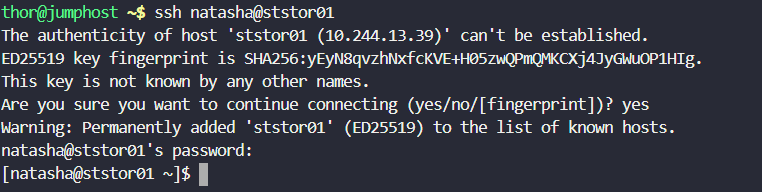
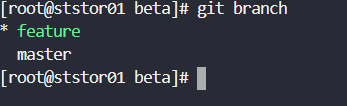
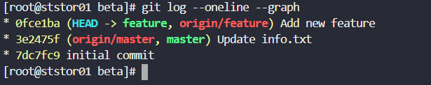
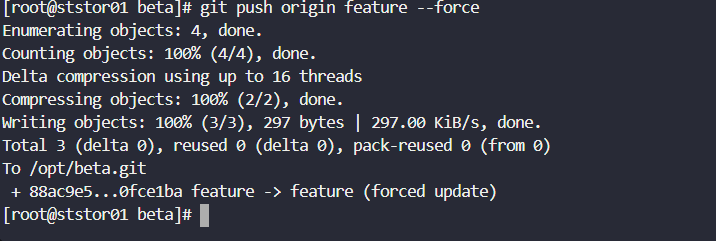
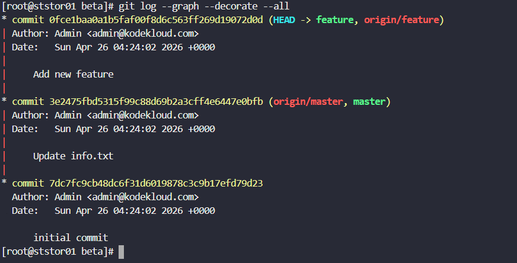

# Day 32: Git Rebase

<div style="border:1px solid #ccc; padding:10px; border-radius:10px; box-shadow:2px 2px 8px rgba(0,0,0,0.2); display:inline-block;">
  
</div>

### **Content:**

>Today I worked on rebasing a feature branch with the master branch in a Git repository. The objective was to integrate the latest changes from the master branch into the feature branch **without creating a merge commit** and while preserving all feature work.

---

### 🔹 **What I Learned**

* What `git rebase` does and how it differs from merge
* How to reapply feature branch commits on top of another branch
* Why rebasing keeps a **clean and linear commit history**
* When to use `git push --force` after rewriting history

---

<div style="border:1px solid #ccc; padding:10px; border-radius:10px; box-shadow:2px 2px 8px rgba(0,0,0,0.2); display:inline-block;">
  
</div>

### **Steps I Followed**

#### **1. Connected to Storage Server**

```bash
ssh natasha@ststor01
```
<div style="border:1px solid #ccc; padding:10px; border-radius:10px; box-shadow:2px 2px 8px rgba(0,0,0,0.2); display:inline-block;">
  
</div>

#### **2. Switched to Root User**

```bash
sudo su
```
<div style="border:1px solid #ccc; padding:10px; border-radius:10px; box-shadow:2px 2px 8px rgba(0,0,0,0.2); display:inline-block;">
  
</div>

#### **3. Navigated to the Repository**

```bash
cd /usr/src/kodekloudrepos/beta
```
<div style="border:1px solid #ccc; padding:10px; border-radius:10px; box-shadow:2px 2px 8px rgba(0,0,0,0.2); display:inline-block;">
  
</div>

#### **4. Checked Current Branches**

```bash
git branch
```
<div style="border:1px solid #ccc; padding:10px; border-radius:10px; box-shadow:2px 2px 8px rgba(0,0,0,0.2); display:inline-block;">
  
</div>

Observed:

* `feature` (current branch)
* `master`

---

#### **5. Rebased Feature Branch with Master**

```bash
git rebase master
```
<div style="border:1px solid #ccc; padding:10px; border-radius:10px; box-shadow:2px 2px 8px rgba(0,0,0,0.2); display:inline-block;">
  
</div>

This successfully replayed the feature branch commits on top of the latest master branch.

---

#### **6. Verified Commit History**

```bash
git log --oneline --graph
```
<div style="border:1px solid #ccc; padding:10px; border-radius:10px; box-shadow:2px 2px 8px rgba(0,0,0,0.2); display:inline-block;">
  
</div>

Confirmed:

* Feature commit is on top of master
* No merge commits were created
* History is linear

---

#### **7. Pushed Changes to Remote Repository**

```bash
git push origin feature --force
```
<div style="border:1px solid #ccc; padding:10px; border-radius:10px; box-shadow:2px 2px 8px rgba(0,0,0,0.2); display:inline-block;">
  
</div>

Force push was required because rebase rewrites commit history.

---

#### **8. Verified Final History**

```bash
git log --graph --decorate --all
```
<div style="border:1px solid #ccc; padding:10px; border-radius:10px; box-shadow:2px 2px 8px rgba(0,0,0,0.2); display:inline-block;">
  
</div>

Confirmed clean structure:

* `master` → base commits
* `feature` → rebased commit on top

---

### 🔹 **My Understanding**

This task helped me understand how rebasing works by **moving feature branch commits onto the latest base branch** instead of merging. It ensures a clean project history, making it easier to read and maintain. I also learned that force pushing is necessary after a rebase since commit history changes.

---

### 🔹 **What I Found Interesting**

I found it interesting that rebasing rewrites commit history in such a clean way, making it look like the feature work was built directly on top of the latest code. Compared to merging, it avoids unnecessary merge commits and keeps the repository history simple and organized.

---
### Topics Covered

- ***Git***
- ***Git rebase***


**Previous Task**: [Day 31: Git Stash  ](../Day_31/day_31.md)

**Next Task**: [Day 33: Resolve Git Merge Conflicts ](../Day_33/day_33.md)