# Day 33: Resolve Git Merge Conflicts

<div style="border:1px solid #ccc; padding:10px; border-radius:10px; box-shadow:2px 2px 8px rgba(0,0,0,0.2); display:inline-block;">
  
</div>

## **Content:**

> Today I worked on resolving a Git merge conflict while pushing changes to a shared repository. The task involved synchronizing local and remote changes, fixing a conflict in a file, and ensuring data consistency before successfully pushing updates.

* * *

## 🔹 **What I Learned**

*   Why merge conflicts occur in Git (when multiple users modify the same file)
    
*   How to resolve conflicts manually using conflict markers
    
*   The importance of pulling latest changes before pushing
    
*   How to combine changes from local and remote repositories
    
*   How to fix content issues (like typos) during conflict resolution
    

* * *
<div style="border:1px solid #ccc; padding:10px; border-radius:10px; box-shadow:2px 2px 8px rgba(0,0,0,0.2); display:inline-block;">
  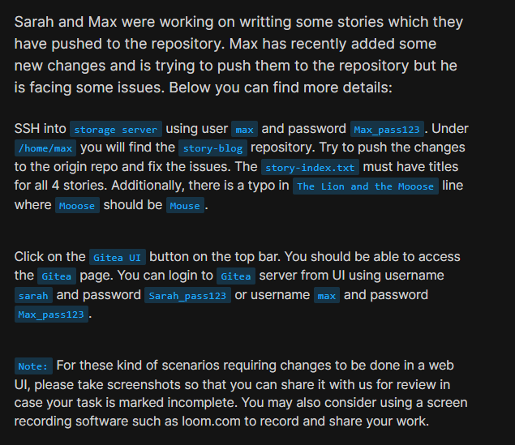
</div>

## **Steps I Followed**

### **1\. Connected to Storage Server**

```bash
ssh max@ststor01
```
<div style="border:1px solid #ccc; padding:10px; border-radius:10px; box-shadow:2px 2px 8px rgba(0,0,0,0.2); display:inline-block;">
  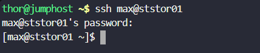
</div>

* * *

### **2\. Navigated to the Repository**

```bash
cd /home/max
ls
cd story-blog/
ls
```
<div style="border:1px solid #ccc; padding:10px; border-radius:10px; box-shadow:2px 2px 8px rgba(0,0,0,0.2); display:inline-block;">
  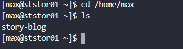
</div>

<div style="border:1px solid #ccc; padding:10px; border-radius:10px; box-shadow:2px 2px 8px rgba(0,0,0,0.2); display:inline-block;">
  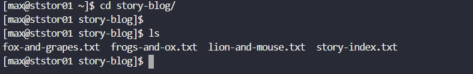
</div>


* * *

### **3\. Checked Git Status**

```bash
git status
```
<div style="border:1px solid #ccc; padding:10px; border-radius:10px; box-shadow:2px 2px 8px rgba(0,0,0,0.2); display:inline-block;">
  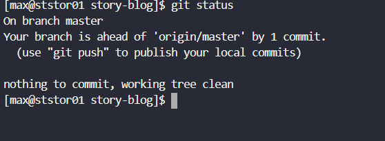
</div>


**Observed:**

*   Branch was ahead of `origin/master` by 1 commit
    
*   Working tree was clean
    

* * *

### **4\. Attempted to Push Changes**

```bash
git push origin master
```
<div style="border:1px solid #ccc; padding:10px; border-radius:10px; box-shadow:2px 2px 8px rgba(0,0,0,0.2); display:inline-block;">
  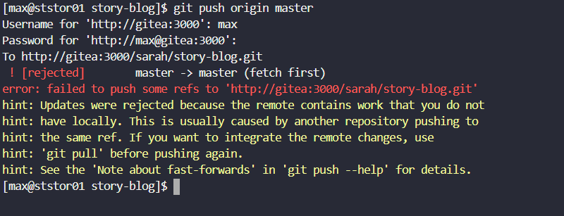
</div>

❌ Push failed because the remote repository had new changes

* * *

### **5\. Pulled Latest Changes from Remote**

```bash
git pull origin master
```
<div style="border:1px solid #ccc; padding:10px; border-radius:10px; box-shadow:2px 2px 8px rgba(0,0,0,0.2); display:inline-block;">
  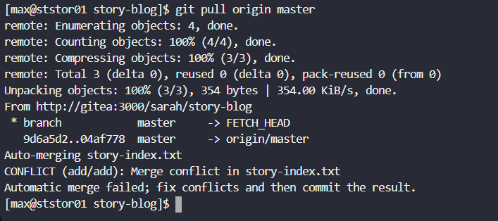
</div>


**Observed:**

*   Merge conflict occurred in `story-index.txt`
    

* * *

### **6\. Checked Conflict Status**

```bash
git status
```
<div style="border:1px solid #ccc; padding:10px; border-radius:10px; box-shadow:2px 2px 8px rgba(0,0,0,0.2); display:inline-block;">
  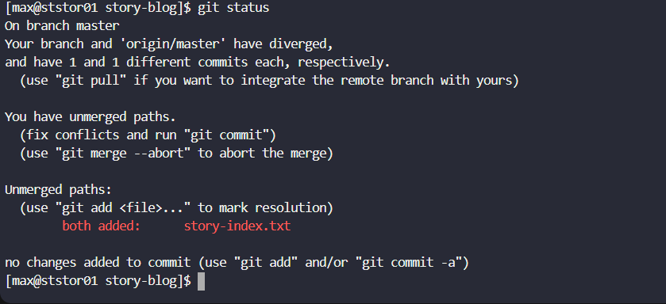
</div>

**Observed:**

*   Branches had diverged
    
*   `story-index.txt` showed as unmerged
    

* * *

### **7\. Resolved Merge Conflict**

```bash
vi story-index.txt
```
<div style="border:1px solid #ccc; padding:10px; border-radius:10px; box-shadow:2px 2px 8px rgba(0,0,0,0.2); display:inline-block;">
  
</div>

**Issue Found:**

*   Conflict markers present (`<<<<<<<`, `=======`, `>>>>>>>`)
    
*   Typo: **"Mooose" → "Mouse"**
    
*   Missing one story entry in remote version
    
<div style="border:1px solid #ccc; padding:10px; border-radius:10px; box-shadow:2px 2px 8px rgba(0,0,0,0.2); display:inline-block;">
  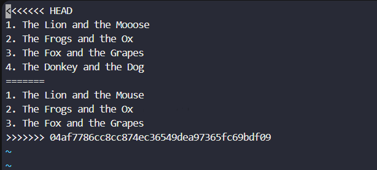
</div>


**Final Correct Content:**

```text
1. The Lion and the Mouse
2. The Frogs and the Ox
3. The Fox and the Grapes
4. The Donkey and the Dog
```
<div style="border:1px solid #ccc; padding:10px; border-radius:10px; box-shadow:2px 2px 8px rgba(0,0,0,0.2); display:inline-block;">
  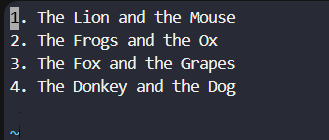
</div>

* * *

### **8\. Staged the Resolved File**

```bash
git add story-index.txt
```


* * *

### **9\. Committed the Changes**

```bash
git commit -m "Resolved merge conflict in story-index and fixed typo"
```
<div style="border:1px solid #ccc; padding:10px; border-radius:10px; box-shadow:2px 2px 8px rgba(0,0,0,0.2); display:inline-block;">
  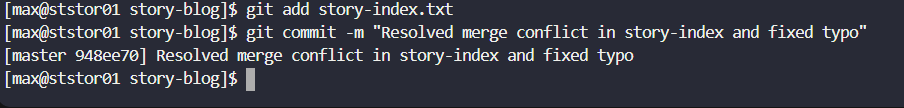
</div>

* * *

### **10\. Pushed Changes Successfully**

```bash
git push origin master
```
<div style="border:1px solid #ccc; padding:10px; border-radius:10px; box-shadow:2px 2px 8px rgba(0,0,0,0.2); display:inline-block;">
  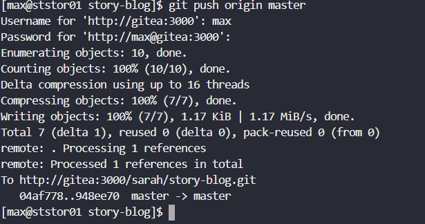
</div>

✅ Push completed without errors

* * *

## 🔹 **My Understanding**

This task helped me understand how Git handles conflicts when multiple contributors modify the same file. Instead of automatically merging, Git requires manual intervention to ensure correctness. I learned how to carefully review both versions, resolve conflicts, and maintain data integrity before committing.

* * *

## 🔹 **What I Found Interesting**

I found it interesting how Git clearly marks conflicting sections, making it easier to identify differences. Resolving conflicts manually gave me better control over the final content, and it reinforced the importance of collaboration and synchronization in version control.

* * *

### Topics Covered

- ***Git***
- ***Git merge conflicts***


**Previous Task**: [Day 32: Git Rebase  ](../Day_32/day_32.md)

**Next Task**: [Day 34: Git Hook ](../Day_34/day_34.md)