# Day 34: Git Hook

<div style="border:1px solid #ccc; padding:10px; border-radius:10px; box-shadow:2px 2px 8px rgba(0,0,0,0.2); display:inline-block;">
  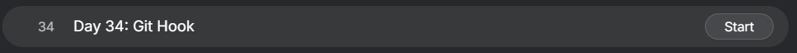
</div>

### **Content:**

>Today I worked on implementing a **Git hook** to automate release tagging in a repository. The task involved merging branches, creating a `post-update` hook in a bare repository, and ensuring that a release tag is automatically generated whenever changes are pushed to the master branch.

---

### 🔹 **What I Learned**

* What Git hooks are and how they automate workflows
* How the `post-update` hook works after a push
* How to dynamically generate tags using the system date
* How to test hooks by triggering them with a push

---
<div style="border:1px solid #ccc; padding:10px; border-radius:10px; box-shadow:2px 2px 8px rgba(0,0,0,0.2); display:inline-block;">
  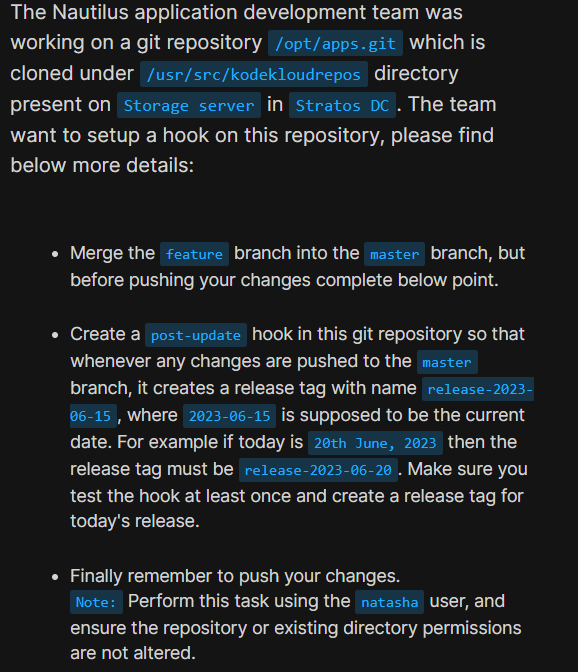
</div>

### **Steps I Followed**

#### **1. Connected to Storage Server**

```bash
ssh natasha@ststor01
sudo su
```
<div style="border:1px solid #ccc; padding:10px; border-radius:10px; box-shadow:2px 2px 8px rgba(0,0,0,0.2); display:inline-block;">
  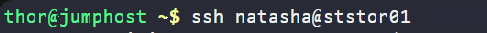
</div>
---
<div style="border:1px solid #ccc; padding:10px; border-radius:10px; box-shadow:2px 2px 8px rgba(0,0,0,0.2); display:inline-block;">
  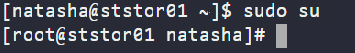
</div>

#### **2. Navigated to the Repository**

```bash
cd /usr/src/kodekloudrepos
ls
cd apps
```
<div style="border:1px solid #ccc; padding:10px; border-radius:10px; box-shadow:2px 2px 8px rgba(0,0,0,0.2); display:inline-block;">
  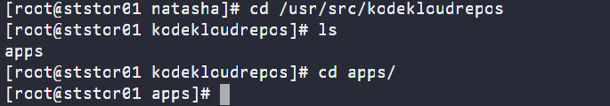
</div>
---

#### **3. Checked Available Branches**

```bash
git branch
```
<div style="border:1px solid #ccc; padding:10px; border-radius:10px; box-shadow:2px 2px 8px rgba(0,0,0,0.2); display:inline-block;">
  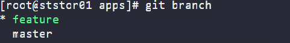
</div>

Observed:

* `feature`
* `master`

---

#### **4. Switched to Master Branch**

```bash
git switch master
```
<div style="border:1px solid #ccc; padding:10px; border-radius:10px; box-shadow:2px 2px 8px rgba(0,0,0,0.2); display:inline-block;">
  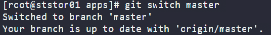
</div>
---

#### **5. Merged Feature Branch**

```bash
git merge feature
```
<div style="border:1px solid #ccc; padding:10px; border-radius:10px; box-shadow:2px 2px 8px rgba(0,0,0,0.2); display:inline-block;">
  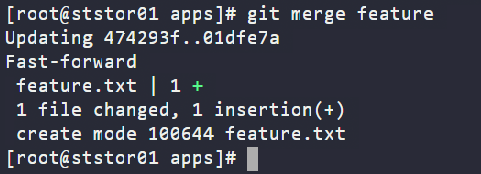
</div>

Observed:

* Fast-forward merge completed
* `feature.txt` added to master

---

#### **6. Created Git Hook (post-update)**

```bash
vi /opt/apps.git/hooks/post-update
```
<div style="border:1px solid #ccc; padding:10px; border-radius:10px; box-shadow:2px 2px 8px rgba(0,0,0,0.2); display:inline-block;">
  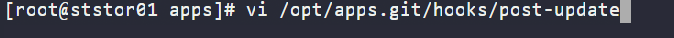
</div>

Added script:

```bash
#!/bin/bash

cd /opt/apps.git || exit

tag="release-$(date +%F)"

/usr/bin/git tag $tag
/usr/bin/git push origin $tag
```
<div style="border:1px solid #ccc; padding:10px; border-radius:10px; box-shadow:2px 2px 8px rgba(0,0,0,0.2); display:inline-block;">
  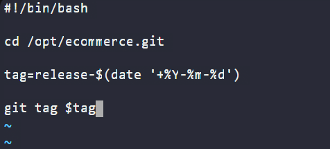
</div>

---

#### **7. Made Hook Executable**

```bash
chmod +x /opt/apps.git/hooks/post-update
```
<div style="border:1px solid #ccc; padding:10px; border-radius:10px; box-shadow:2px 2px 8px rgba(0,0,0,0.2); display:inline-block;">
  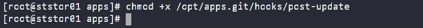
</div>
---

#### **8. Pushed Changes to Trigger Hook**

```bash
git push
```
<div style="border:1px solid #ccc; padding:10px; border-radius:10px; box-shadow:2px 2px 8px rgba(0,0,0,0.2); display:inline-block;">
  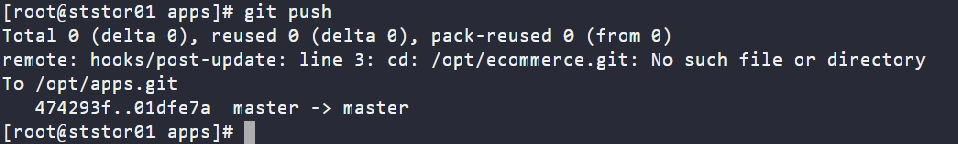
</div>

Observed:

* Push to master completed
* Hook executed automatically

---

#### **9. Verified Tag Creation**

```bash
git fetch --tags
git tag
```
<div style="border:1px solid #ccc; padding:10px; border-radius:10px; box-shadow:2px 2px 8px rgba(0,0,0,0.2); display:inline-block;">
  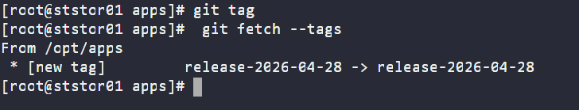
</div>

Observed:

* Tag created successfully:

  ```
  release-2026-04-28
  ```

---

### 🔹 **My Understanding**

This task helped me understand how Git hooks can automate repetitive tasks like release tagging. By using a `post-update` hook in the bare repository, I was able to ensure that every push to the master branch automatically generates a release tag with the current date. This reduces manual effort and enforces consistency in versioning.

---

### 🔹 **What I Found Interesting**

I found it interesting how Git hooks run on the server-side repository and can control workflows after events like push. Automating tag creation using a simple script and system date felt powerful, and it showed how DevOps practices can streamline release management.

---

### Topics Covered

- ***Git***
- ***Git hook***


**Previous Task**: [Day 33: Resolve Git Merge Conflicts  ](../Day_32/day_32.md)

**Next Task**: [Day 35: Install Docker Packages and Start Docker Service ](../Day_34/day_34.md)