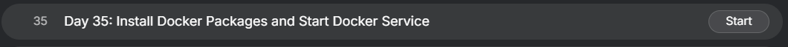
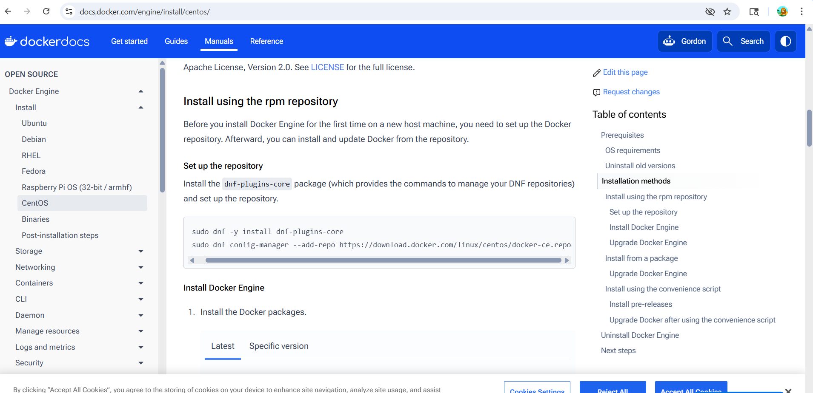
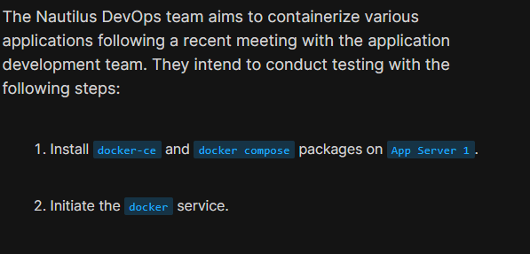
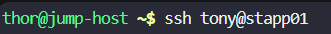
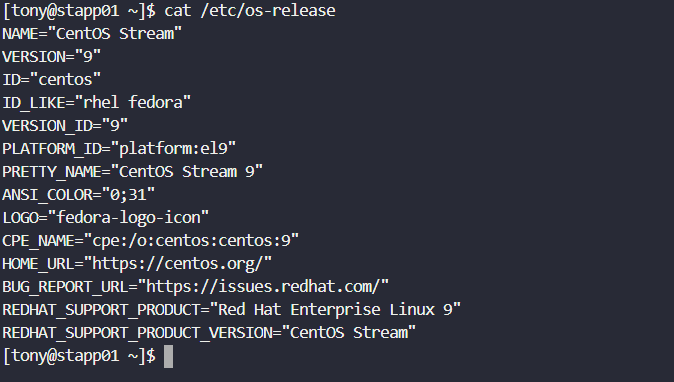
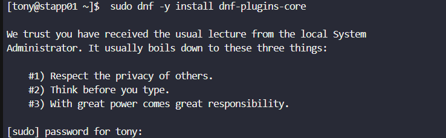
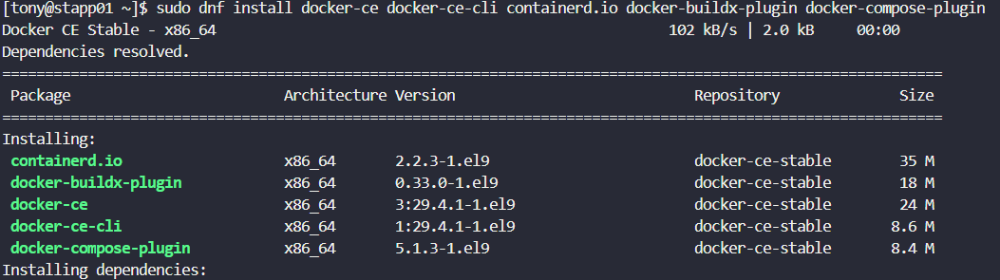
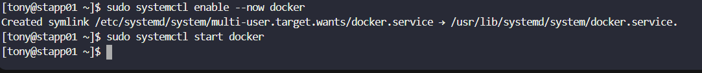

# Day 35: Install Docker Packages and Start Docker Service

<div style="border:1px solid #ccc; padding:10px; border-radius:10px; box-shadow:2px 2px 8px rgba(0,0,0,0.2); display:inline-block;">
  
</div>

### **Content:**

>Today I worked on installing and configuring Docker on an application server. This task is part of preparing the environment for containerizing applications. I followed the official Docker documentation to ensure the installation was done using the recommended approach.

---

### 🔹 **What I Learned**

* How to install Docker on **CentOS Stream 9**
* Importance of using the official Docker repository
* Components of Docker (Engine, CLI, containerd, plugins)
* Best practices by referring to official documentation

---

### **Reference Used**

* Followed the official guide from Docker Documentation
  [Install Docker Engine on CentOS](https://docs.docker.com/engine/install/centos/)

<div style="border:1px solid #ccc; padding:10px; border-radius:10px; box-shadow:2px 2px 8px rgba(0,0,0,0.2); display:inline-block;">
  
</div>


---
<div style="border:1px solid #ccc; padding:10px; border-radius:10px; box-shadow:2px 2px 8px rgba(0,0,0,0.2); display:inline-block;">
  
</div>

### **Steps I Followed**

#### **1. Connected to App Server**

```bash
ssh tony@stapp01
```
<div style="border:1px solid #ccc; padding:10px; border-radius:10px; box-shadow:2px 2px 8px rgba(0,0,0,0.2); display:inline-block;">
  
</div>

---

#### **2. Verified Operating System**

```bash
cat /etc/os-release
```
<div style="border:1px solid #ccc; padding:10px; border-radius:10px; box-shadow:2px 2px 8px rgba(0,0,0,0.2); display:inline-block;">
  
</div>

**Observed:**

* OS: CentOS Stream 9

---

#### **3. Installed Required DNF Plugins**

```bash
sudo dnf -y install dnf-plugins-core
```
<div style="border:1px solid #ccc; padding:10px; border-radius:10px; box-shadow:2px 2px 8px rgba(0,0,0,0.2); display:inline-block;">
  
</div>

**Observed:**

* Package installed/upgraded successfully

---

#### **4. Added Official Docker Repository**

```bash
sudo dnf config-manager --add-repo https://download.docker.com/linux/centos/docker-ce.repo
```
<div style="border:1px solid #ccc; padding:10px; border-radius:10px; box-shadow:2px 2px 8px rgba(0,0,0,0.2); display:inline-block;">
  
</div>

**Observed:**

* Docker repository added successfully

---

#### **5. Installed Docker Engine and Related Packages**

```bash
sudo dnf install -y docker-ce docker-ce-cli containerd.io docker-buildx-plugin docker-compose-plugin
```
<div style="border:1px solid #ccc; padding:10px; border-radius:10px; box-shadow:2px 2px 8px rgba(0,0,0,0.2); display:inline-block;">
  
</div>

**Observed:**

* Installed packages:

  * docker-ce
  * docker-ce-cli
  * containerd.io
  * docker-buildx-plugin
  * docker-compose-plugin
* All dependencies resolved successfully

---

#### **6. Enabled and Started Docker Service**

```bash
sudo systemctl enable --now docker
```

**Observed:**

* Docker service enabled
---

#### **7. Docker service started successfully**

```bash
sudo systemctl start docker
```
<div style="border:1px solid #ccc; padding:10px; border-radius:10px; box-shadow:2px 2px 8px rgba(0,0,0,0.2); display:inline-block;">
  
</div>

---

### 🔹 **My Understanding**

This task helped me understand the correct way to install Docker using the official repository instead of relying on default OS packages. Referring to the official Docker documentation ensured that I followed best practices and installed the latest stable version.

---

### 🔹 **What I Found Interesting**

I found it interesting that Docker installation involves multiple components working together rather than a single package. Also, following the official documentation made the process more structured and reliable.

---

### Topics Covered

- ***docker-installation***
- ***docker packages***


**Previous Task**: [Day 34: Git Hook  ](../Day_34/day_34.md)

**Next Task**: [Day 36: Deploy Nginx Container on Application Server ](../Day_36/day_36.md)