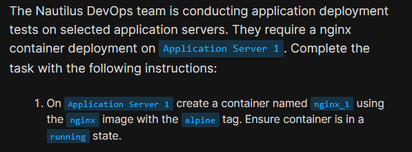
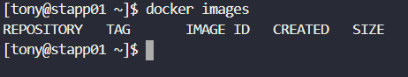
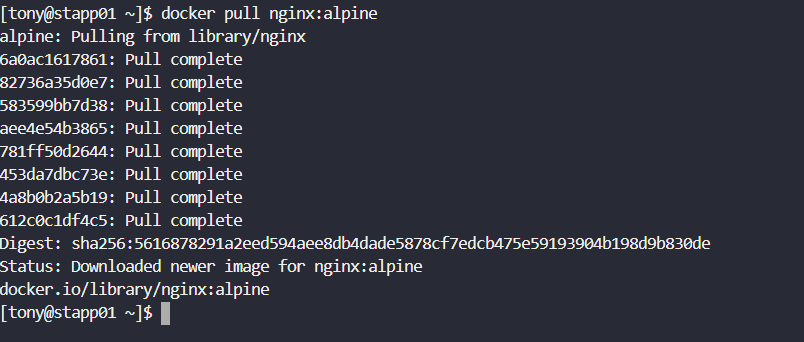
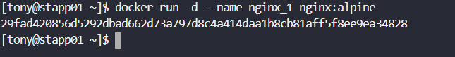
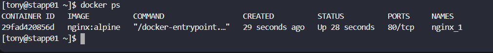

# Day 36: Deploy Nginx Container on Application Server

<div style="border:1px solid #ccc; padding:10px; border-radius:10px; box-shadow:2px 2px 8px rgba(0,0,0,0.2); display:inline-block;">
  
</div>

### Content:

> Today I worked on deploying an Nginx container on an application server as part of container-based application deployment testing. This task focused on pulling an image from Docker Hub and running a container using that image.

* * *

### 🔹 What I Learned

*   How to pull images from Docker Hub
    
*   How to run a container in detached mode
    
*   Importance of lightweight images like Alpine
    
*   Basic Docker container lifecycle commands
    

* * *

<div style="border:1px solid #ccc; padding:10px; border-radius:10px; box-shadow:2px 2px 8px rgba(0,0,0,0.2); display:inline-block;">
  
</div>


### 🔹 Steps I Followed

#### 1\. Connected to Application Server

```bash
ssh tony@stapp01
```
<div style="border:1px solid #ccc; padding:10px; border-radius:10px; box-shadow:2px 2px 8px rgba(0,0,0,0.2); display:inline-block;">
  
</div>


* * *

#### 2\. Verified Available Docker Images

```bash
docker images
```
<div style="border:1px solid #ccc; padding:10px; border-radius:10px; box-shadow:2px 2px 8px rgba(0,0,0,0.2); display:inline-block;">
  
</div>

**Observed:** No images were available locally.

* * *

#### 3\. Pulled Nginx Alpine Image

```bash
docker pull nginx:alpine
```
<div style="border:1px solid #ccc; padding:10px; border-radius:10px; box-shadow:2px 2px 8px rgba(0,0,0,0.2); display:inline-block;">
  
</div>

**Observed:**

*   Image downloaded successfully
    
*   Lightweight Alpine-based image pulled
    

* * *

#### 4\. Created and Started Container

```bash
docker run -d --name nginx_1 nginx:alpine
```
<div style="border:1px solid #ccc; padding:10px; border-radius:10px; box-shadow:2px 2px 8px rgba(0,0,0,0.2); display:inline-block;">
  
</div>


**Observed:**

*   Container created successfully
    
*   Running in detached mode
    

* * *

#### 5\. Verified Running Container

```bash
docker ps
```
<div style="border:1px solid #ccc; padding:10px; border-radius:10px; box-shadow:2px 2px 8px rgba(0,0,0,0.2); display:inline-block;">
  
</div>


**Observed:**

*   Container `nginx_1` is in **Up (running)** state
    
*   Using image `nginx:alpine`
    
*   Default port `80/tcp` exposed
    

* * *

### 🔹 My Understanding

This task helped me understand how to deploy a containerized application using Docker. Pulling an image and running it as a container is a fundamental step in containerization. Using the Alpine version of Nginx ensures minimal resource usage while maintaining functionality.

* * *

### 🔹 What I Found Interesting

I found it interesting how quickly a fully functional web server like Nginx can be deployed using just a single command. The efficiency and simplicity of Docker containers make application deployment much faster compared to traditional methods.

* * *


### Topics Covered

- ***docker-pull***
- ***docker run***


**Previous Task**: [Day 35: Install Docker Packages and Start Docker Service ](../Day_35/day_35.md)

**Next Task**: [Day 37: Copy File to Docker Container ](../Day_37/day_37.md)
