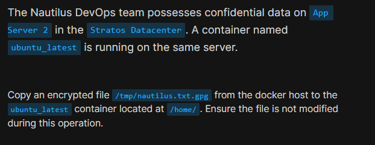

# Day 37: Copy File to Docker Container

<div style="border:1px solid #ccc; padding:10px; border-radius:10px; box-shadow:2px 2px 8px rgba(0,0,0,0.2); display:inline-block;">
  
</div>

### **Content:**

> Today I worked on securely copying an encrypted file from a Docker host system into a running container on an application server. This task focused on file transfer between host and container without altering the file, which is important when dealing with sensitive data.

* * *

### 🔹 **What I Learned**

*   How to copy files from host to Docker container
    
*   Usage of `docker cp` command
    
*   How to verify running containers before performing operations
    

* * *
<div style="border:1px solid #ccc; padding:10px; border-radius:10px; box-shadow:2px 2px 8px rgba(0,0,0,0.2); display:inline-block;">
  
</div>

### 🔹 **Steps I Followed**

#### **1\. Connected to Application Server**

```bash
ssh steve@stapp02
```
<div style="border:1px solid #ccc; padding:10px; border-radius:10px; box-shadow:2px 2px 8px rgba(0,0,0,0.2); display:inline-block;">
  
</div>

#### **2\. Verified Running Containers**

```bash
docker ps
```
<div style="border:1px solid #ccc; padding:10px; border-radius:10px; box-shadow:2px 2px 8px rgba(0,0,0,0.2); display:inline-block;">
  
</div>

**Observed:**

*   Container `ubuntu_latest` is running
    
*   Based on Ubuntu image
    

* * *

#### **3\. Copied File from Host to Container**

```bash
docker cp /tmp/nautilus.txt.gpg ubuntu_latest:/home/
```
<div style="border:1px solid #ccc; padding:10px; border-radius:10px; box-shadow:2px 2px 8px rgba(0,0,0,0.2); display:inline-block;">
  
</div>

**Observed:**

*   File copied successfully
    
*   File size (~2KB) remained unchanged
    
*   No errors during transfer
    

* * *

### 🔹 **My Understanding**

This task helped me understand how to securely transfer files between a Docker host and a container. The `docker cp` command is very useful for managing files without needing to enter the container. Ensuring that the file remains unmodified is especially important when dealing with encrypted or sensitive data.

* * *

### 🔹 **What I Found Interesting**

I found it interesting how Docker provides a simple yet powerful command to copy files directly into containers without needing additional tools like SCP inside the container. It makes managing container data much more efficient and secure.

* * *

### Topics Covered

- ***docker-copy***
- ***docker ps***


**Previous Task**: [Day 36: Deploy Nginx Container on Application Server ](../Day_36/day_36.md)

**Next Task**: [Day 38: Pull Docker Image ](../Day_38/day_38.md)