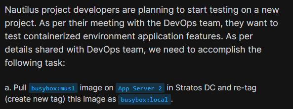
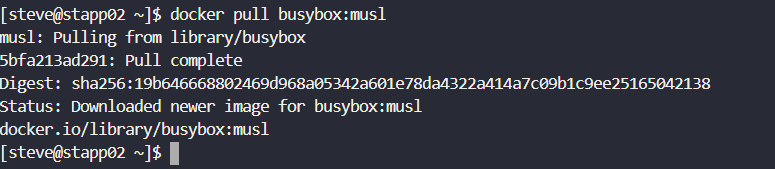
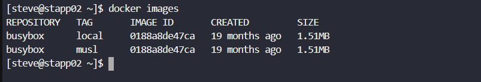

# Day 38: Pull Docker Image

<div style="border:1px solid #ccc; padding:10px; border-radius:10px; box-shadow:2px 2px 8px rgba(0,0,0,0.2); display:inline-block;">
  
</div>

### **Content:**

> Today I worked on pulling a Docker image from Docker Hub and creating a new tag for it on an application server. This task focused on image management, specifically downloading and re-tagging images for local use in a containerized environment.

* * *

### 🔹 **What I Learned**

*   How to pull images from Docker Hub
    
*   How to create a new tag for an existing Docker image
    
*   Importance of tagging images for environment-specific usage
    
*   How to verify images using Docker commands
    

* * *
<div style="border:1px solid #ccc; padding:10px; border-radius:10px; box-shadow:2px 2px 8px rgba(0,0,0,0.2); display:inline-block;">
  
</div>

### 🔹 **Steps I Followed**

#### 1\. Connected to Application Server

```bash
ssh steve@stapp02
```

* * *

#### 2\. Pulled the Required Docker Image

```bash
docker pull busybox:musl
```
<div style="border:1px solid #ccc; padding:10px; border-radius:10px; box-shadow:2px 2px 8px rgba(0,0,0,0.2); display:inline-block;">
  
</div>

**Observed:**

*   Image downloaded successfully
    
*   Status showed *Downloaded newer image*
    
*   Image source: Docker Hub
    

* * *

#### 3\. Tagged the Image with a New Name

```bash
docker tag busybox:musl busybox:local
```
<div style="border:1px solid #ccc; padding:10px; border-radius:10px; box-shadow:2px 2px 8px rgba(0,0,0,0.2); display:inline-block;">
  
</div>

**Observed:**

*   New tag created without errors
    

* * *

#### 4\. Verified the Images

```bash
docker images
```
<div style="border:1px solid #ccc; padding:10px; border-radius:10px; box-shadow:2px 2px 8px rgba(0,0,0,0.2); display:inline-block;">
  
</div>

**Observed:**

*   Both `musl` and `local` tags are available
    
*   Both tags share the same IMAGE ID
    
*   Confirms successful tagging
    

* * *

### 🔹 **My Understanding**

This task helped me understand how Docker images can be reused efficiently by assigning multiple tags. Tagging is useful when we want to maintain different versions or labels (like local, dev, prod) without duplicating the image. It also avoids re-downloading the same image multiple times.

* * *

### 🔹 **What I Found Interesting**

I found it interesting that tagging does not create a new image but simply creates another reference to the same image ID. This makes Docker very efficient in terms of storage and image management.

* * *

### Topics Covered

- ***docker-tag***
- ***docker pull***


**Previous Task**: [Day 37: Copy File to Docker Container ](../Day_37/day_37.md)

**Next Task**: [Day 39: Create a Docker Image From Container ](../Day_39/day_39.md)