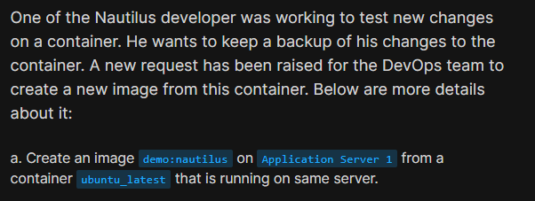

# Day 39: Create a Docker Image From Container

<div style="border:1px solid #ccc; padding:10px; border-radius:10px; box-shadow:2px 2px 8px rgba(0,0,0,0.2); display:inline-block;">
  
</div>

**Content:**
>Today I worked on creating a Docker image from a running container on an application server. This task focused on capturing the current state of a container and saving it as a reusable image, which is useful for backups, debugging, or replicating environments.

---

### 🔹 What I Learned

* How to create a Docker image from a running container
* Use of `docker commit` for saving container state

---
<div style="border:1px solid #ccc; padding:10px; border-radius:10px; box-shadow:2px 2px 8px rgba(0,0,0,0.2); display:inline-block;">
  
</div>

### 🔹 Steps I Followed

**1. Connected to Application Server**

```bash
ssh tony@stapp01
```
<div style="border:1px solid #ccc; padding:10px; border-radius:10px; box-shadow:2px 2px 8px rgba(0,0,0,0.2); display:inline-block;">
  
</div>
---

**2. Verified Running Container**

```bash
docker ps
```
<div style="border:1px solid #ccc; padding:10px; border-radius:10px; box-shadow:2px 2px 8px rgba(0,0,0,0.2); display:inline-block;">
  
</div>

**Observed:**

* Container `ubuntu_latest` was running
* Based on `ubuntu` image

---

**3. Created Image from Container**

```bash
docker commit ubuntu_latest demo:nautilus
```
<div style="border:1px solid #ccc; padding:10px; border-radius:10px; box-shadow:2px 2px 8px rgba(0,0,0,0.2); display:inline-block;">
  
</div>

**Observed:**

* Image created successfully
* Docker returned a new image ID

---

**4. Verified the New Image**

```bash
docker images
```
<div style="border:1px solid #ccc; padding:10px; border-radius:10px; box-shadow:2px 2px 8px rgba(0,0,0,0.2); display:inline-block;">
  
</div>

**Observed:**

* New image `demo:nautilus` is available
* Image size reflects container state changes
* Original `ubuntu:latest` image still present

---

### 🔹 Command Explanation

**Generic Format:**

```bash
docker commit [CONTAINER_NAME] [IMAGE_NAME]:[TAG]
```

* `[CONTAINER_NAME]` → The container you want to save
* `[IMAGE_NAME]` → Name of the new image
* `[TAG]` → Version or label for the image

**Used Command:**

```bash
docker commit ubuntu_latest demo:nautilus
```

**Breakdown:**

* `ubuntu_latest` → Name of the running container
* `demo` → New image repository name
* `nautilus` → Tag assigned to the image

👉 So this command means:
“Create a new image named `demo` with tag `nautilus` using the current state of the container `ubuntu_latest`.”

---

### 🔹 My Understanding

This task helped me understand how Docker allows us to capture the exact state of a running container and convert it into an image. This is especially useful when developers make temporary or experimental changes and want to preserve them. Instead of writing a Dockerfile again, we can directly create an image from the container.

---

### 🔹 What I Found Interesting

I found it interesting that `docker commit` acts like a snapshot of a container. It quickly saves all changes made inside the container into a new image, making it easy to reuse or share without repeating the setup process.

* * *

### Topics Covered

- ***docker-commit***
- ***docker images***


**Previous Task**: [Day 38: Pull Docker Image ](../Day_38/day_38.md)

**Next Task**: [Day 40: Docker EXEC Operations ](../Day_40/day_40.md)
