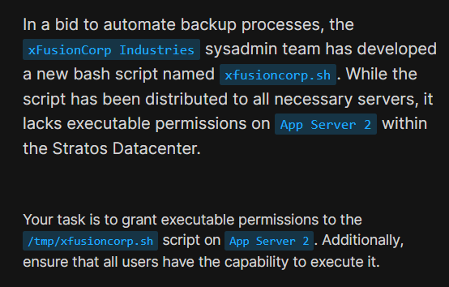
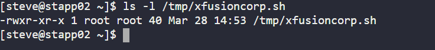

# Day 4: Script Execution Permissions | 100 Days of DevOps
<div style="border:1px solid #ccc; padding:10px; border-radius:10px; box-shadow:2px 2px 8px rgba(0,0,0,0.2); display:inline-block;">
  
</div>

## **Content:**

> Today I worked on granting execute permissions to a script on an application server as part of my DevOps journey.
> 
> This is an important practice to ensure scripts can be executed properly by users, especially in automation tasks like backups and deployments.

## **What I Learned**

Through this exercise, I learned how Linux file permissions work in a practical scenario. Specifically:

*   How to interpret permission strings like `----------`
    
*   The importance of execute (`x`) permissions for scripts
    
*   How to use the `chmod` command effectively
    
*   The meaning of numeric permission values like `755`
    
<div style="border:1px solid #ccc; padding:10px; border-radius:10px; box-shadow:2px 2px 8px rgba(0,0,0,0.2); display:inline-block;">
  
</div>

## **Steps I Followed :**

### **1\. Connect to App Servers**

From the jump host, I connected to the server:

```plaintext
ssh user@server-name
```
<div style="border:1px solid #ccc; padding:10px; border-radius:10px; box-shadow:2px 2px 8px rgba(0,0,0,0.2); display:inline-block;">
  
</div>

### **2\. Checked existing permissions**

```plaintext
ls -l /tmp/xfusioncorp.sh
```

Output showed:

```plaintext
----------
```
<div style="border:1px solid #ccc; padding:10px; border-radius:10px; box-shadow:2px 2px 8px rgba(0,0,0,0.2); display:inline-block;">
  
</div>

This means no permissions were set for any user.

### **3\. Granted execute permission to all users**

```plaintext
chmod 755 /tmp/xfusioncorp.sh
```
<div style="border:1px solid #ccc; padding:10px; border-radius:10px; box-shadow:2px 2px 8px rgba(0,0,0,0.2); display:inline-block;">
  
</div>

### **4\. Verified the updated permissions**

```plaintext
ls -l /tmp/xfusioncorp.sh
```

Expected output:

```plaintext
-rwxr-xr-x
```
<div style="border:1px solid #ccc; padding:10px; border-radius:10px; box-shadow:2px 2px 8px rgba(0,0,0,0.2); display:inline-block;">
  
</div>

## **My Understanding**

Linux permissions are divided into three categories:

*   **Owner**
    
*   **Group**
    
*   **Others**
    

Each category can have:

*   Read (`r`)
    
*   Write (`w`)
    
*   Execute (`x`)
    

The numeric value `755` translates to:

*   `7` → read + write + execute (owner)
    
*   `5` → read + execute (group)
    
*   `5` → read + execute (others)
    

By assigning `755`, I ensured that:

*   The script owner has full control
    
*   All users can execute the script, which was the main requirement
    

## **What I Found Interesting**

What stood out to me was how **a file can exist but still be completely unusable** due to missing permissions. Seeing `----------` was a strong reminder that permissions are just as important as the file itself.

I also found it interesting how a **simple numeric command (**`chmod 755`**) can control access for multiple user levels at once**, making system administration both powerful and efficient.

### Topics Covered

- ***Linux File Permissions (chmod, ls -l)***
- ***Script Execution and User Access Control***