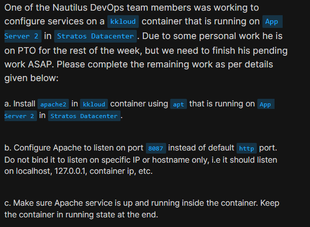
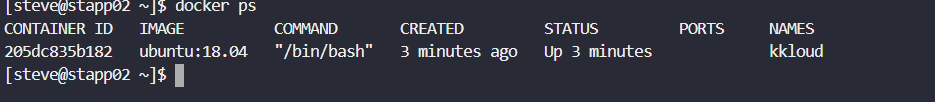
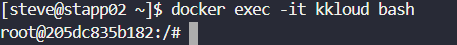
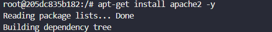
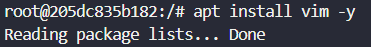
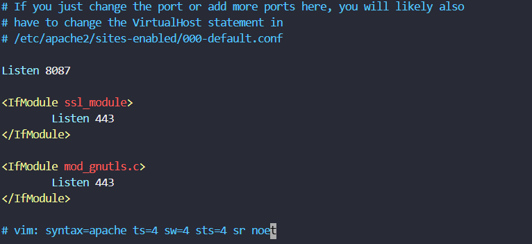
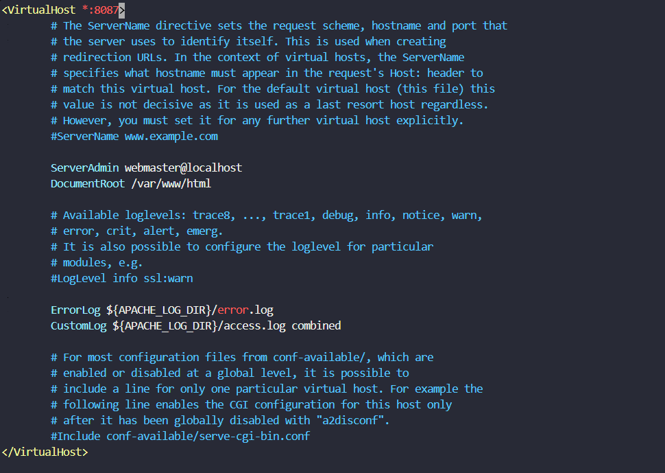
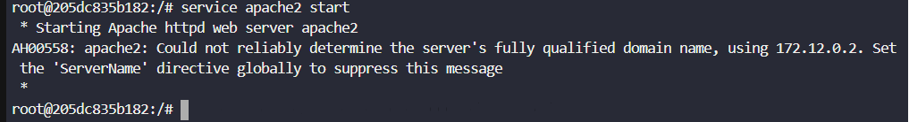
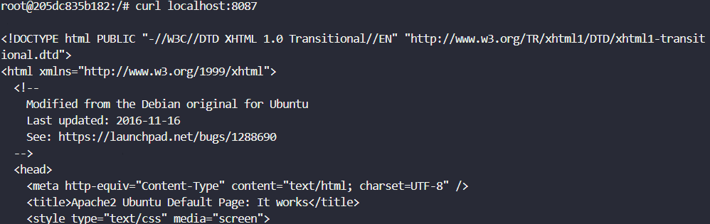

# Day 40: Docker EXEC Operations

<div style="border:1px solid #ccc; padding:10px; border-radius:10px; box-shadow:2px 2px 8px rgba(0,0,0,0.2); display:inline-block;">
  
</div>

### Content:

> Today I worked on configuring a service inside a running Docker container using `docker exec`. The task involved installing Apache, modifying its configuration, and ensuring it runs on a custom port inside the container. This helped me understand how to manage services inside already running containers.

* * *

## 🔹 What I Learned

*   How to access a running container using `docker exec`
    
*   Installing packages inside a container using `apt`
    
*   Configuring Apache to run on a custom port
    
*   Managing services inside a container manually
    

* * *
<div style="border:1px solid #ccc; padding:10px; border-radius:10px; box-shadow:2px 2px 8px rgba(0,0,0,0.2); display:inline-block;">
  
</div>

## 🔹 Steps I Followed

### 1\. Connected to Application Server

```bash
ssh steve@stapp02
```

* * *

### 2\. Verified Running Container

```bash
docker ps
```
<div style="border:1px solid #ccc; padding:10px; border-radius:10px; box-shadow:2px 2px 8px rgba(0,0,0,0.2); display:inline-block;">
  
</div>

**Observed:**

*   Container `kkloud` was running
    
*   Based on `ubuntu:18.04` image
    

* * *

### 3\. Entered the Container

```bash
docker exec -it kkloud bash
```
<div style="border:1px solid #ccc; padding:10px; border-radius:10px; box-shadow:2px 2px 8px rgba(0,0,0,0.2); display:inline-block;">
  
</div>

* * *

### 4\. Installed Apache

```bash
apt-get install apache2 -y
```
<div style="border:1px solid #ccc; padding:10px; border-radius:10px; box-shadow:2px 2px 8px rgba(0,0,0,0.2); display:inline-block;">
  
</div>

**Observed:**

*   Apache and dependencies installed successfully
    
*   Service didn’t start automatically (common in containers)
    

* * *

### 5\. Attempted to Edit Config (Failed Step)

```bash
vim /etc/apache2/ports.conf
```
<div style="border:1px solid #ccc; padding:10px; border-radius:10px; box-shadow:2px 2px 8px rgba(0,0,0,0.2); display:inline-block;">
  
</div>

**Observed:**

*   `vim` was not installed
    

* * *

### 6\. Installed vim (Required for Editing)

```bash
apt install vim -y
```
<div style="border:1px solid #ccc; padding:10px; border-radius:10px; box-shadow:2px 2px 8px rgba(0,0,0,0.2); display:inline-block;">
  
</div>

* * *

### 7\. Changed Apache Port

#### Edited ports.conf:

```bash
vim /etc/apache2/ports.conf
```
<div style="border:1px solid #ccc; padding:10px; border-radius:10px; box-shadow:2px 2px 8px rgba(0,0,0,0.2); display:inline-block;">
  
</div>

Changed:

```apache
Listen 8087
```

#### Edited Virtual Host:

```bash
vim /etc/apache2/sites-enabled/000-default.conf
```
<div style="border:1px solid #ccc; padding:10px; border-radius:10px; box-shadow:2px 2px 8px rgba(0,0,0,0.2); display:inline-block;">
  
</div>

<div style="border:1px solid #ccc; padding:10px; border-radius:10px; box-shadow:2px 2px 8px rgba(0,0,0,0.2); display:inline-block;">
  
</div>

Changed:

```apache
<VirtualHost *:8087>
```

**Observed:**

*   Apache configured to listen on port **8087**
    
*   Not restricted to any specific IP
    

* * *

### 8\. Started Apache Service

```bash
service apache2 start
```
<div style="border:1px solid #ccc; padding:10px; border-radius:10px; box-shadow:2px 2px 8px rgba(0,0,0,0.2); display:inline-block;">
  
</div>

**Observed:**

*   Service started successfully
    
*   Warning about ServerName (safe to ignore)
    

* * *

### 9\. Verified Apache Status

```bash
service apache2 status
```
<div style="border:1px solid #ccc; padding:10px; border-radius:10px; box-shadow:2px 2px 8px rgba(0,0,0,0.2); display:inline-block;">
  
</div>

**Observed:**

*   Apache is running
    

* * *

### 10\. Tested Apache

```bash
curl localhost:8087
```
<div style="border:1px solid #ccc; padding:10px; border-radius:10px; box-shadow:2px 2px 8px rgba(0,0,0,0.2); display:inline-block;">
  
</div>

**Observed:**

*   Apache default page displayed (“It works!”)
    

* * *

## 🔹 My Understanding

This task helped me understand how to configure services inside a live container instead of rebuilding images. Using `docker exec`, we can directly access the container, install software, and modify configurations just like a normal Linux system.

I also learned that services inside containers don’t behave exactly like full systems — they often require manual start because init systems are not fully active.

* * *

## 🔹 What I Found Interesting

I found it interesting that even though containers are lightweight, we can fully configure services like Apache inside them. Also, changing the port required modifying multiple configuration files, which shows how Apache separates concerns internally.

Another interesting part was handling small issues like missing tools (`vim`), which is common in minimal container environments.

* * *

### Topics Covered

- ***docker-EXEC***
- ***docker images***
- ***docker containers***
- *** apache ***


**Previous Task**: [Day 39: Create a Docker Image From Container ](../Day_39/day_39.md)

**Next Task**: [Day 41: Write a Docker File ](../Day_41/day_41.md)
