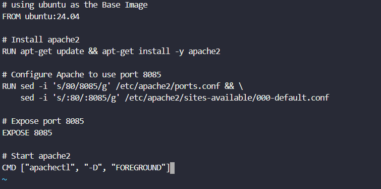
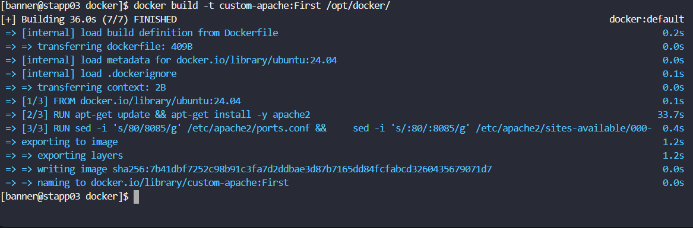
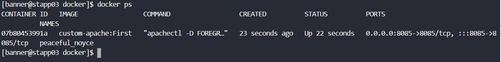
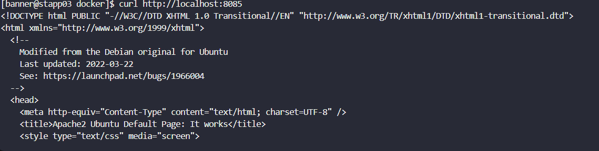

# Day 41: Write a Docker File

<div style="border:1px solid #ccc; padding:10px; border-radius:10px; box-shadow:2px 2px 8px rgba(0,0,0,0.2); display:inline-block;">
  
</div>

### **Content:**

Today I worked on creating a custom Docker image using a Dockerfile. The task required building an image with Apache installed and configured to run on a custom port (8085). This helped me understand how to automate container setup instead of configuring things manually inside a running container.

* * *

## 🔹 **What I Learned**

*   How to write a **Dockerfile** from scratch
    
*   Installing packages during image build using `RUN`
    
*   Modifying configuration files inside an image
    
*   Exposing and mapping custom ports in Docker
    

* * *

## 🔹 **Task Requirement**

As per recent requirements shared by the Nautilus application development team, they need custom images created for one of their projects. Several of the initial testing requirements have already been shared with the DevOps team.

Therefore, I needed to:

* Create a Dockerfile at `/opt/docker/Dockerfile` (**D must be capital**)
* Build an image with the following requirements:

  * Use `ubuntu:24.04` as the base image
  * Install `apache2`
  * Configure Apache to run on **port 8085**
  * Do not modify any other Apache configurations (like document root)

---

## 🔹 **Steps I Followed**

### **1\. Connected to Application Server**

```bash
ssh banner@stapp03
```
<div style="border:1px solid #ccc; padding:10px; border-radius:10px; box-shadow:2px 2px 8px rgba(0,0,0,0.2); display:inline-block;">
  
</div>


* * *

### **2\. Navigated to Docker Directory**

```bash
cd /opt/docker/
```
<div style="border:1px solid #ccc; padding:10px; border-radius:10px; box-shadow:2px 2px 8px rgba(0,0,0,0.2); display:inline-block;">
  
</div>

* * *

### **3\. Created Dockerfile**

```bash
sudo vi Dockerfile
```
<div style="border:1px solid #ccc; padding:10px; border-radius:10px; box-shadow:2px 2px 8px rgba(0,0,0,0.2); display:inline-block;">
  
</div>

### **Dockerfile Content:**

```dockerfile
FROM ubuntu:24.04

RUN apt-get update && apt-get install -y apache2

RUN sed -i 's/80/8085/g' /etc/apache2/ports.conf && \
    sed -i 's/:80/:8085/g' /etc/apache2/sites-available/000-default.conf

EXPOSE 8085

CMD ["apachectl", "-D", "FOREGROUND"]
```

<div style="border:1px solid #ccc; padding:10px; border-radius:10px; box-shadow:2px 2px 8px rgba(0,0,0,0.2); display:inline-block;">
  
</div>

* * *

### **4\. Built Docker Image**

```bash
docker build -t custom-apache:First /opt/docker/
```
<div style="border:1px solid #ccc; padding:10px; border-radius:10px; box-shadow:2px 2px 8px rgba(0,0,0,0.2); display:inline-block;">
  
</div>

### **Observed:**

*   Image built successfully
    
*   Apache installed during build process
    
*   Configuration changes applied automatically
    

* * *

### **5\. Ran Container**

```bash
docker run -d -p 8085:8085 custom-apache:First
```
<div style="border:1px solid #ccc; padding:10px; border-radius:10px; box-shadow:2px 2px 8px rgba(0,0,0,0.2); display:inline-block;">
  
</div>

### **Observed:**

*   Container started successfully
    
*   Port 8085 mapped from container to host
    

* * *

### **6\. Verified Running Container**

```bash
docker ps
```
<div style="border:1px solid #ccc; padding:10px; border-radius:10px; box-shadow:2px 2px 8px rgba(0,0,0,0.2); display:inline-block;">
  
</div>

### **Observed:**

*   Container is up and running
    
*   Port mapping visible (`8085->8085`)
    

* * *

### **7\. Tested Apache Service**

```bash
curl http://localhost:8085
```
<div style="border:1px solid #ccc; padding:10px; border-radius:10px; box-shadow:2px 2px 8px rgba(0,0,0,0.2); display:inline-block;">
  
</div>

### **Observed:**

*   Apache default page displayed (“It works!”)
    
*   Confirms Apache is running on port 8085
    

* * *

## 🔹 **My Understanding**

This task helped me understand the power of Dockerfiles in automating environment setup. Instead of manually installing and configuring Apache inside a container, I defined everything in a Dockerfile and built a reusable image.

I also learned that configuration changes (like port updates) can be baked directly into the image, making deployments faster and consistent.

* * *

## 🔹 **What I Found Interesting**

One interesting part was how simple commands like `sed` can modify configuration files during the build process. This eliminates the need for manual edits later.

Another key takeaway was the difference between this task and the previous one:

*   Earlier: Configured Apache **inside a running container**
    
*   Now: Configured Apache **while building the image**
    

This approach is much cleaner and production-friendly.

* * *
### Topics Covered

- ***docker-file***
- ***docker images***
- ***docker containers***
- *** apache2 ***


**Previous Task**: [Day 40: Docker EXEC Operations  ](../Day_40/day_40.md)

**Next Task**: [Day 42: Create a Docker Network ](../Day_42/day_42.md)
