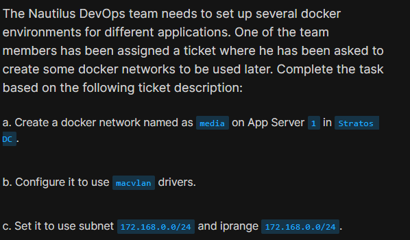
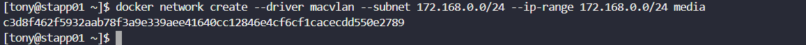
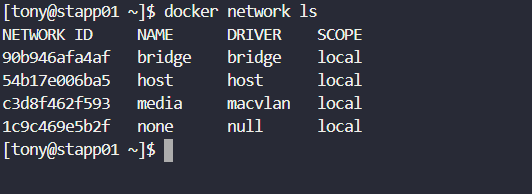
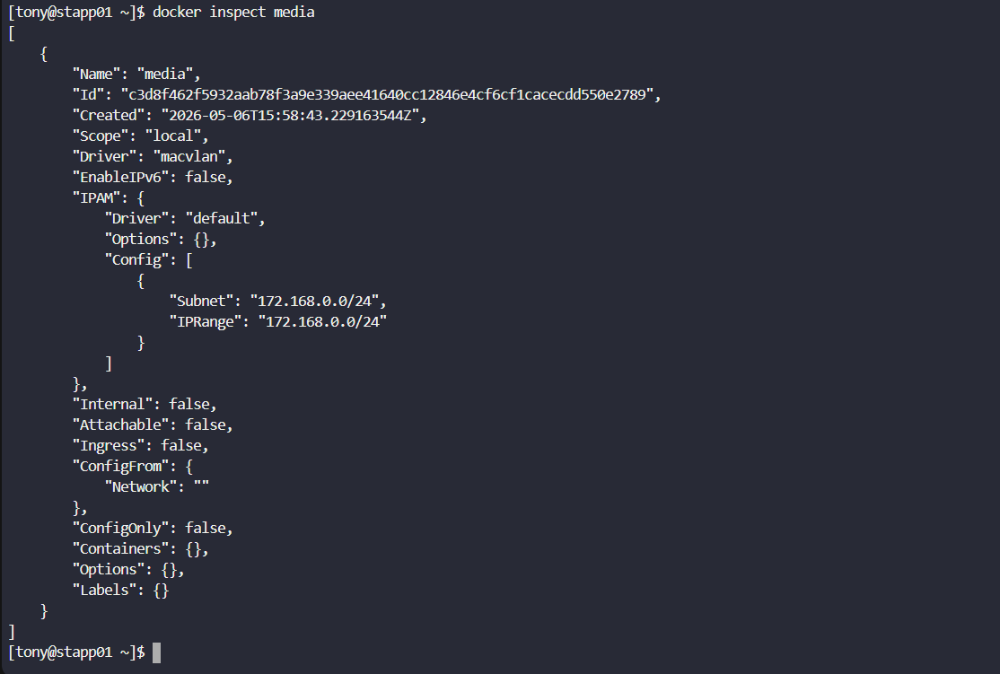

# Day 42: Create a Docker Network

<div style="border:1px solid #ccc; padding:10px; border-radius:10px; box-shadow:2px 2px 8px rgba(0,0,0,0.2); display:inline-block;">
  
</div>

### **Content:**

> Today I worked on creating a custom Docker network using the **macvlan driver**. The task involved configuring a network with a specific subnet and IP range. This helped me understand how Docker networking works beyond the default setup and how we can control IP allocation.

* * *

### 🔹 **What I Learned**

*   How to create a custom Docker network
    
*   Understanding the **macvlan driver**
    
*   How subnet and IP range control IP allocation
    
*   How to verify Docker network configuration
    

* * *

### 🔹 **Task Requirement**

As per the Nautilus DevOps team requirements, I needed to:

*   Create a Docker network named **media** on App Server 1
    
*   Use **macvlan driver**
    
*   Configure subnet as `172.168.0.0/24`
    
*   Configure IP range as `172.168.0.0/24`
    
<div style="border:1px solid #ccc; padding:10px; border-radius:10px; box-shadow:2px 2px 8px rgba(0,0,0,0.2); display:inline-block;">
  
</div>


* * *

### 🔹 **Steps I Followed**

#### **1\. Connected to Application Server**

```bash
ssh tony@stapp01
```

* * *

#### **2\. Created Docker Network**

```bash
docker network create --driver macvlan --subnet 172.168.0.0/24 --ip-range 172.168.0.0/24 media
```
<div style="border:1px solid #ccc; padding:10px; border-radius:10px; box-shadow:2px 2px 8px rgba(0,0,0,0.2); display:inline-block;">
  
</div>


**Simple Explanation of the Command:**

*   `docker network create` → creates a new network
    
*   `--driver macvlan` → containers will behave like separate machines with their own IPs
    
*   `--subnet 172.168.0.0/24` → defines the full network range
    
*   `--ip-range 172.168.0.0/24` → defines the range from which container IPs will be assigned
    
*   `media` → name of the network
    

👉 In simple terms:

> This command creates a network called **media** where containers get their own IP addresses from the 172.168.0.0/24 range and act like independent systems on the network.

**Observed:**

*   Network created successfully
    
*   Docker returned a network ID
    

* * *

#### **3\. Verified Docker Networks**

```bash
docker network ls
```
<div style="border:1px solid #ccc; padding:10px; border-radius:10px; box-shadow:2px 2px 8px rgba(0,0,0,0.2); display:inline-block;">
  
</div>


**Observed:**

*   Network **media** is listed
    
*   Driver shown as **macvlan**
    

* * *

#### **4\. Inspected the Network**

```bash
docker inspect media
```
<div style="border:1px solid #ccc; padding:10px; border-radius:10px; box-shadow:2px 2px 8px rgba(0,0,0,0.2); display:inline-block;">
  
</div>


**Observed:**

*   Driver: `macvlan`
    
*   Subnet: `172.168.0.0/24`
    
*   IPRange: `172.168.0.0/24`
    
*   Scope: local
    
*   No containers attached yet
    

* * *

### 🔹 **My Understanding**

This task helped me understand how Docker allows us to create custom networks with controlled IP allocation. Using the macvlan driver, containers can act like independent systems with their own IP addresses instead of sharing the host network.

* * *

### 🔹 **What I Found Interesting**

I found it interesting that Docker networks can be customized so deeply. With macvlan, containers behave like real devices on a network.

Another key takeaway was the difference from default networking:

*   Default (bridge): containers share host networking
    
*   Macvlan: containers act like separate devices
    

This makes macvlan useful for real-world network simulations and advanced deployments.

* * *

### Topics Covered

- ***docker-Network***
- ***docker***
- ***Macvlan***


**Previous Task**: [Day 41: Write a Docker File  ](../Day_41/day_41.md)

**Next Task**: [Day 43: Docker Ports Mapping ](../Day_43/day_43.md)
