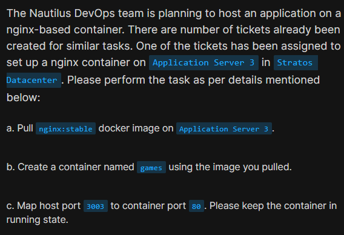
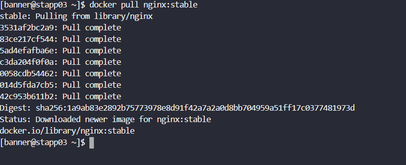
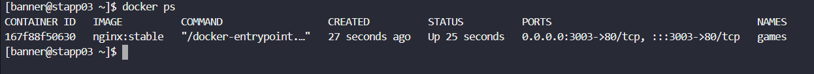

# Day 43: Docker Ports Mapping

<div style="border:1px solid #ccc; padding:10px; border-radius:10px; box-shadow:2px 2px 8px rgba(0,0,0,0.2); display:inline-block;">
  
</div>

## Content:

> Today I worked on deploying an Nginx container and configuring Docker port mapping. The task involved pulling the required Docker image, creating a container, and exposing the container service through a custom host port. This helped me understand how Docker containers communicate with external systems using port forwarding.

* * *

## 🔹 What I Learned

*   How to pull Docker images from Docker Hub
    
*   How to create and run a Docker container
    
*   Understanding Docker port mapping
    
*   Difference between host port and container port
    

* * *

## 🔹 Task Requirement

As per the Nautilus DevOps team requirements, I needed to:

*   Pull the `nginx:stable` Docker image on Application Server 3
    
*   Create a container named `games`
    
*   Map host port `3003` to container port `80`
    
*   Keep the container in running state
    
<div style="border:1px solid #ccc; padding:10px; border-radius:10px; box-shadow:2px 2px 8px rgba(0,0,0,0.2); display:inline-block;">
  
</div>

* * *

## 🔹 Steps I Followed

### 1\. Connected to Application Server

```bash
ssh banner@stapp03
```
<div style="border:1px solid #ccc; padding:10px; border-radius:10px; box-shadow:2px 2px 8px rgba(0,0,0,0.2); display:inline-block;">
  
</div>

Observed:

*   Successfully logged into Application Server 3
    

* * *

### 2\. Pulled the Nginx Stable Docker Image

```bash
docker pull nginx:stable
```
<div style="border:1px solid #ccc; padding:10px; border-radius:10px; box-shadow:2px 2px 8px rgba(0,0,0,0.2); display:inline-block;">
  
</div>

Simple Explanation of the Command:

*   `docker pull` → downloads an image from Docker Hub
    
*   `nginx:stable` → pulls the stable version of the Nginx image
    

👉 In simple terms:

This command downloads the official stable Nginx image so it can be used to create containers.

Observed:

*   Image downloaded successfully
    
*   Docker displayed the image digest and status
    

* * *

### 3\. Created and Started the Container with Port Mapping

```bash
docker run -d -p 3003:80 --name games nginx:stable
```
<div style="border:1px solid #ccc; padding:10px; border-radius:10px; box-shadow:2px 2px 8px rgba(0,0,0,0.2); display:inline-block;">
  
</div>

Simple Explanation of the Command:

*   `docker run` → creates and starts a new container
    
*   `-d` → runs the container in detached/background mode
    
*   `-p 3003:80` → maps host port 3003 to container port 80
    
*   `--name games` → assigns the container name `games`
    
*   `nginx:stable` → image used to create the container
    

👉 In simple terms:

This command starts an Nginx container in the background and makes the web service accessible through port `3003` on the host server.

Observed:

*   Container started successfully
    
*   Docker returned a container ID
    

* * *

### 4\. Verified Running Containers

```bash
docker ps
```
<div style="border:1px solid #ccc; padding:10px; border-radius:10px; box-shadow:2px 2px 8px rgba(0,0,0,0.2); display:inline-block;">
  
</div>

Observed:

*   Container `games` is running
    
*   Port mapping displayed as:
    

```text
0.0.0.0:3003->80/tcp
```

This confirms that requests coming to port `3003` on the server are forwarded to port `80` inside the container.

* * *

## 🔹 My Understanding

This task helped me understand how Docker port mapping works. Containers run in isolated environments, and port mapping allows external users or applications to access services running inside containers using host machine ports.

* * *

## 🔹 What I Found Interesting

I found it interesting that Docker can expose container services so easily using simple port mapping. With just one command, we can make applications inside containers accessible from outside the server without changing the application configuration itself.

* * *


### Topics Covered

- ***docker-Network***
- ***docker-port***
- ***docker***


**Previous Task**: [Day 42: Create a Docker Network  ](../Day_42/day_42.md)

**Next Task**: [Day 44: Write a Docker Compose File ](../Day_44/day_44.md)
