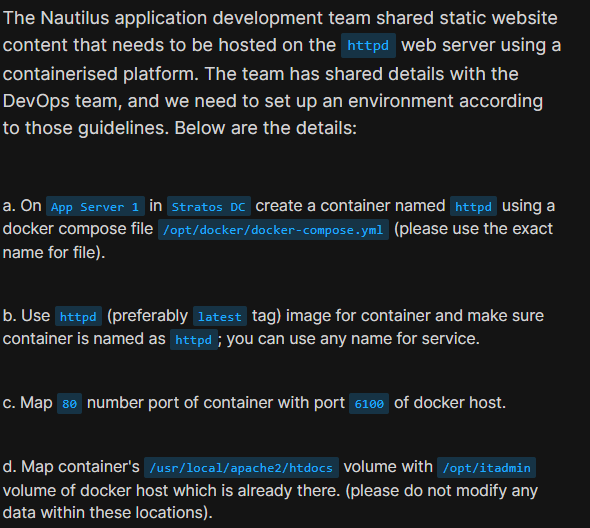
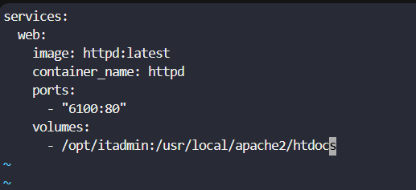
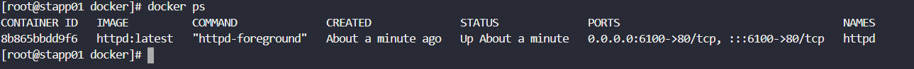

# Day 44: Write a Docker Compose File

<div style="border:1px solid #ccc; padding:10px; border-radius:10px; box-shadow:2px 2px 8px rgba(0,0,0,0.2); display:inline-block;">
  
</div>

## Content:

> Today I worked on deploying an Apache HTTPD container using Docker Compose and configuring volume and port mappings. The task involved creating a `docker-compose.yml` file, defining the container configuration, mapping host ports to container ports, and mounting a host directory inside the container.

* * *

## 🔹 What I Learned

*   How to use Docker Compose
    
*   Structure of a `docker-compose.yml` file
    
*   How to define services in Docker Compose
    
*   Understanding Docker port and volume mapping
    

* * *

## 🔹 Task Requirement

As per the Nautilus DevOps team requirements, I needed to:

*   Create a Docker Compose file at: `/opt/docker/docker-compose.yml`
    
*   Use the `httpd:latest` image
    
*   Create a container named `httpd`
    
*   Map host port `6100` to container port `80`
    
*   Mount host directory `/opt/itadmin` to: `/usr/local/apache2/htdocs`
    
*   Keep the container running
    

<div style="border:1px solid #ccc; padding:10px; border-radius:10px; box-shadow:2px 2px 8px rgba(0,0,0,0.2); display:inline-block;">
  
</div>


* * *

## 🔹 Steps I Followed

### 1\. Connected to Application Server 1

```bash
ssh tony@stapp01
```

<div style="border:1px solid #ccc; padding:10px; border-radius:10px; box-shadow:2px 2px 8px rgba(0,0,0,0.2); display:inline-block;">
  
</div>

Observed:

*   Successfully logged into Application Server 1
    

* * *

### 2\. Switched to Root User

```bash
sudo su
```

<div style="border:1px solid #ccc; padding:10px; border-radius:10px; box-shadow:2px 2px 8px rgba(0,0,0,0.2); display:inline-block;">
  
</div>

Simple Explanation of the Command:

*   `sudo` → execute command with elevated privileges
    
*   `su` → switch user
    
*   Combined together, it switches to the root user
    

Observed:

*   Switched successfully to root user
    

* * *

### 3\. Created the Docker Compose File

```bash
vi /opt/docker/docker-compose.yml
```

<div style="border:1px solid #ccc; padding:10px; border-radius:10px; box-shadow:2px 2px 8px rgba(0,0,0,0.2); display:inline-block;">
  
</div>

Added the following configuration:

```yaml
services:
  web:
    image: httpd:latest
    container_name: httpd
    ports:
      - "6100:80"
    volumes:
      - /opt/itadmin:/usr/local/apache2/htdocs
```

<div style="border:1px solid #ccc; padding:10px; border-radius:10px; box-shadow:2px 2px 8px rgba(0,0,0,0.2); display:inline-block;">
  
</div>

Simple Explanation of the Configuration:

*   `services` → defines container services
    
*   `web` → service name
    
*   `image: httpd:latest` → uses the latest Apache HTTPD image
    
*   `container_name: httpd` → names the container `httpd`
    
*   `6100:80` → maps host port 6100 to container port 80
    
*   `volumes` → mounts host directory inside the container
    

👉 In simple terms:

This configuration starts an Apache web server container and serves website files directly from the host system directory.

Observed:

*   Compose file created successfully
    

* * *

### 4\. Started the Container Using Docker Compose

```bash
cd /opt/docker
docker compose -f docker-compose.yml up -d
```

<div style="border:1px solid #ccc; padding:10px; border-radius:10px; box-shadow:2px 2px 8px rgba(0,0,0,0.2); display:inline-block;">
  
</div>

<div style="border:1px solid #ccc; padding:10px; border-radius:10px; box-shadow:2px 2px 8px rgba(0,0,0,0.2); display:inline-block;">
  
</div>

Simple Explanation of the Command:

*   `docker compose` → runs Docker Compose
    
*   `-f docker-compose.yml` → specifies the compose file
    
*   `up` → creates and starts services
    
*   `-d` → runs containers in detached/background mode
    

👉 In simple terms:

This command reads the compose file and starts the Apache container in the background.

Observed:

*   Docker pulled the `httpd:latest` image
    
*   Network created automatically
    
*   Container created and started successfully
    

* * *

### 5\. Verified Running Containers

```bash
docker ps
```

<div style="border:1px solid #ccc; padding:10px; border-radius:10px; box-shadow:2px 2px 8px rgba(0,0,0,0.2); display:inline-block;">
  
</div>

Observed:

```bash
CONTAINER ID   IMAGE          COMMAND              STATUS         PORTS                                   NAMES
8b865bbdd9f6   httpd:latest   "httpd-foreground"   Up          0.0.0.0:6100->80/tcp                  httpd
```

This confirms that:

*   The `httpd` container is running
    
*   Port `6100` on the host is mapped to port `80` inside the container
    

* * *

## 🔹 My Understanding

This task helped me understand how Docker Compose simplifies container deployment using configuration files instead of long Docker commands. I also learned how volume mapping allows containers to directly use files stored on the host machine, which is very useful for hosting static websites.

* * *

## 🔹 What I Found Interesting

I found it interesting that with Docker Compose, the entire container setup can be managed through a single YAML file. It makes deployments cleaner, reusable, and easier to manage compared to manually running multiple Docker commands.


* * *

### Topics Covered

- ***docker-compose***
- ***docker-Network***
- ***docker-port***
- ***docker***


**Previous Task**: [Day 43: Docker Ports Mapping  ](../Day_43/day_43.md)

**Next Task**: [Day 45: Resolve Dockerfile Issues ](../Day_45/day_45.md)
