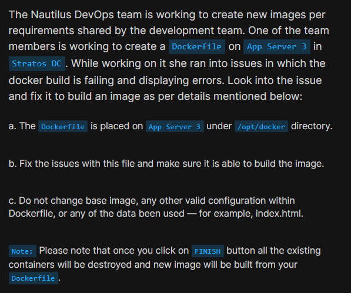
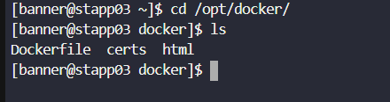
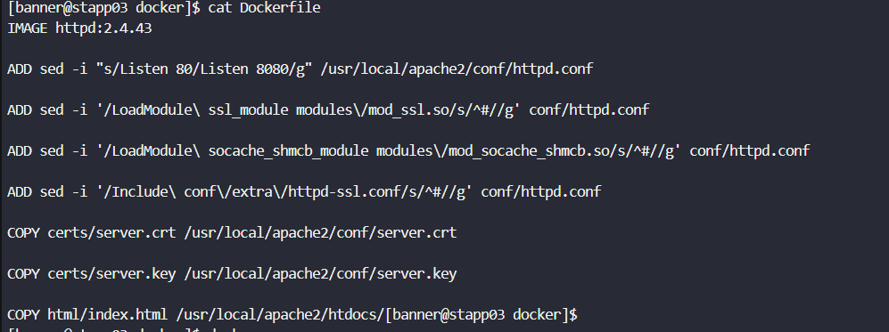
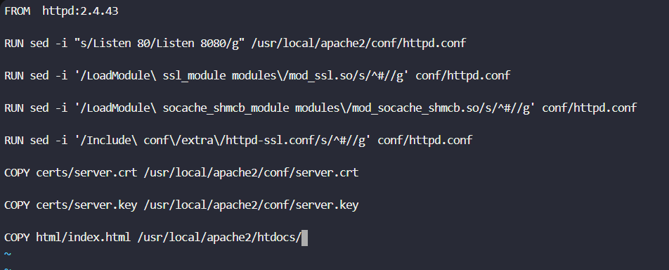
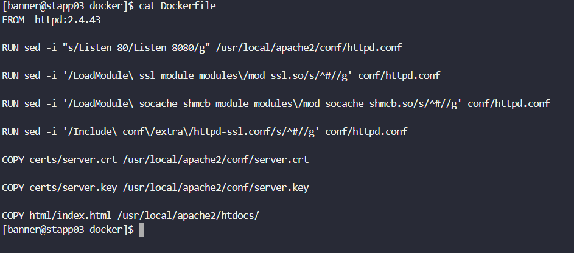
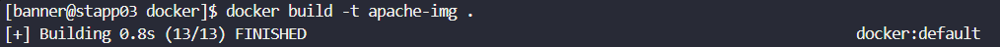
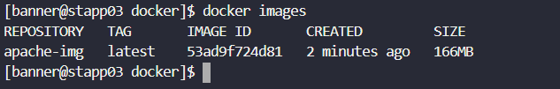

# Day 45: Resolve Dockerfile Issues

<div style="border:1px solid #ccc; padding:10px; border-radius:10px; box-shadow:2px 2px 8px rgba(0,0,0,0.2); display:inline-block;">
  
</div>

## Content:

> Today I worked on troubleshooting and fixing Dockerfile errors on App Server 3. The Docker image build was failing because of incorrect Dockerfile instructions. The task helped me understand the difference between Dockerfile instructions like `FROM`, `RUN`, `ADD`, and `COPY`, and how Docker processes commands during image creation.

* * *

## 🔹 What I Learned

*   How Dockerfile instructions work
    
*   Difference between `FROM`, `RUN`, `ADD`, and `COPY`
    
*   How to troubleshoot Docker build errors
    
*   How to identify Dockerfile syntax issues
    

* * *

## 🔹 Task Requirement

As per the Nautilus DevOps team requirements, I needed to:

*   Fix issues in the Dockerfile placed under `/opt/docker`
    
*   Ensure Docker image builds successfully
    
*   Avoid changing:
    
    *   Base image
        
    *   Existing valid configurations
        
    *   Existing application data/files like `index.html`
        
<div style="border:1px solid #ccc; padding:10px; border-radius:10px; box-shadow:2px 2px 8px rgba(0,0,0,0.2); display:inline-block;">
  
</div>

* * *

# 🔹 Steps I Followed

## 1\. Connected to Application Server 3

```bash
ssh banner@stapp03
```
<div style="border:1px solid #ccc; padding:10px; border-radius:10px; box-shadow:2px 2px 8px rgba(0,0,0,0.2); display:inline-block;">
  
</div>

* * *

## 2\. Navigated to Docker Directory

```bash
cd /opt/docker/
```

Checked available files:

```bash
ls
```

Output:

```bash
Dockerfile  certs  html
```
<div style="border:1px solid #ccc; padding:10px; border-radius:10px; box-shadow:2px 2px 8px rgba(0,0,0,0.2); display:inline-block;">
  
</div>

👉 This confirmed:

*   Dockerfile is present
    
*   SSL certificates are available
    
*   HTML application files are available
    

* * *

## 3\. Inspected the Existing Dockerfile

Command used:

```bash
cat Dockerfile
```
<div style="border:1px solid #ccc; padding:10px; border-radius:10px; box-shadow:2px 2px 8px rgba(0,0,0,0.2); display:inline-block;">
  
</div>

Observed Dockerfile content:

```Dockerfile
IMAGE httpd:2.4.43

ADD sed -i "s/Listen 80/Listen 8080/g" /usr/local/apache2/conf/httpd.conf

ADD sed -i '/LoadModule\ ssl_module modules\/mod_ssl.so/s/^#//g' conf/httpd.conf

ADD sed -i '/LoadModule\ socache_shmcb_module modules\/mod_socache_shmcb.so/s/^#//g' conf/httpd.conf

ADD sed -i '/Include\ conf\/extra\/httpd-ssl.conf/s/^#//g' conf/httpd.conf

COPY certs/server.crt /usr/local/apache2/conf/server.crt

COPY certs/server.key /usr/local/apache2/conf/server.key

COPY html/index.html /usr/local/apache2/htdocs/
```

* * *

# 🔹 Problem Observed

Tried building the image:

```bash
docker build .
```
<div style="border:1px solid #ccc; padding:10px; border-radius:10px; box-shadow:2px 2px 8px rgba(0,0,0,0.2); display:inline-block;">
  
</div>

Docker returned error:

```bash
ERROR: failed to solve: dockerfile parse error on line 1: unknown instruction: IMAGE
```

* * *

# 🔹 Problem Analysis

I identified two major issues in the Dockerfile.

* * *

## Issue 1: Wrong Dockerfile Instruction (`IMAGE`)

Wrong:

```Dockerfile
IMAGE httpd:2.4.43
```

Correct:

```Dockerfile
FROM httpd:2.4.43
```

### Explanation:

*   `FROM` is the correct Dockerfile instruction used to define the base image
    
*   Docker does not recognize `IMAGE`
    
*   Because of this, Docker build failed immediately
    

👉 In simple terms:

Docker needs `FROM` to know which base operating system or application image should be used.

* * *

## Issue 2: Wrong Usage of `ADD`

Wrong:

```Dockerfile
ADD sed -i ...
```

Correct:

```Dockerfile
RUN sed -i ...
```

### Explanation:

*   `ADD` is used only for copying files/directories
    
*   It cannot execute Linux commands
    
*   `RUN` is used to execute commands during image build
    

👉 In simple terms:

*   `ADD` = copy files
    
*   `RUN` = execute commands
    

* * *

# 🔹 Steps Taken to Fix the Dockerfile

Opened Dockerfile for editing:

```bash
vi Dockerfile
```
<div style="border:1px solid #ccc; padding:10px; border-radius:10px; box-shadow:2px 2px 8px rgba(0,0,0,0.2); display:inline-block;">
  
</div>

Updated Dockerfile content:

```Dockerfile
FROM httpd:2.4.43

RUN sed -i "s/Listen 80/Listen 8080/g" /usr/local/apache2/conf/httpd.conf

RUN sed -i '/LoadModule\ ssl_module modules\/mod_ssl.so/s/^#//g' conf/httpd.conf

RUN sed -i '/LoadModule\ socache_shmcb_module modules\/mod_socache_shmcb.so/s/^#//g' conf/httpd.conf

RUN sed -i '/Include\ conf\/extra\/httpd-ssl.conf/s/^#//g' conf/httpd.conf

COPY certs/server.crt /usr/local/apache2/conf/server.crt

COPY certs/server.key /usr/local/apache2/conf/server.key

COPY html/index.html /usr/local/apache2/htdocs/
```
<div style="border:1px solid #ccc; padding:10px; border-radius:10px; box-shadow:2px 2px 8px rgba(0,0,0,0.2); display:inline-block;">
  
</div>

<div style="border:1px solid #ccc; padding:10px; border-radius:10px; box-shadow:2px 2px 8px rgba(0,0,0,0.2); display:inline-block;">
  
</div>

Saved and exited the file.

* * *

# 🔹 Understanding the Correct Dockerfile

## FROM

```Dockerfile
FROM httpd:2.4.43
```

Uses Apache HTTP Server image version `2.4.43` as the base image.

* * *

## RUN Commands

Example:

```Dockerfile
RUN sed -i "s/Listen 80/Listen 8080/g" /usr/local/apache2/conf/httpd.conf
```

### What it does:

*   Modifies Apache configuration
    
*   Changes Apache listening port from `80` to `8080`
    

Other RUN commands:

*   Enable SSL module
    
*   Enable shared memory cache module
    
*   Enable SSL configuration include file
    

👉 These commands customize Apache during image build.

* * *

# 🔹 Rebuilt the Docker Image

Command used:

```bash
docker build -t apache-img .
```
<div style="border:1px solid #ccc; padding:10px; border-radius:10px; box-shadow:2px 2px 8px rgba(0,0,0,0.2); display:inline-block;">
  
</div>

Observed:

*   Docker image built successfully
    
*   No syntax errors
    
*   Build completed successfully
    

Docker generated image:

```bash
apache-img
```

* * *

# 🔹 Verified Docker Images

Command used:

```bash
docker images
```
<div style="border:1px solid #ccc; padding:10px; border-radius:10px; box-shadow:2px 2px 8px rgba(0,0,0,0.2); display:inline-block;">
  
</div>

Observed:

```bash
REPOSITORY   TAG       IMAGE ID       SIZE
apache-img   latest    53ad9f724d81   166MB
```

👉 This confirmed:

*   Image exists successfully
    
*   Build process completed properly
    

* * *

# 🔹 My Understanding

This task helped me understand how sensitive Dockerfiles are to instruction names. Even a small mistake like using `IMAGE` instead of `FROM` causes the entire build to fail.

I also clearly understood the purpose of:

*   `FROM` → defines base image
    
*   `RUN` → executes commands
    
*   `COPY` → copies files
    
*   `ADD` → copies/extracts files but not for executing commands
    

* * *

# 🔹 What I Found Interesting

I found it interesting that Docker builds images layer by layer, and every Dockerfile instruction creates a separate image layer.

Another important takeaway was understanding how configuration changes can be automated directly during image build using `RUN` commands.

This task also improved my troubleshooting skills because I had to:

*   Read Docker errors carefully
    
*   Identify invalid instructions
    
*   Replace them with proper Dockerfile commands
    
*   Rebuild and verify the image successfully
    

* * *


### Topics Covered

- ***docker-issues***
- ***docker-images***
- ***docker-file***
- ***docker***


**Previous Task**: [Day 44: Write a Docker Compose File  ](../Day_44/day_44.md)

**Next Task**: [Day 46: Deploy an App on Docker Containers ](../Day_46/day_46.md)
