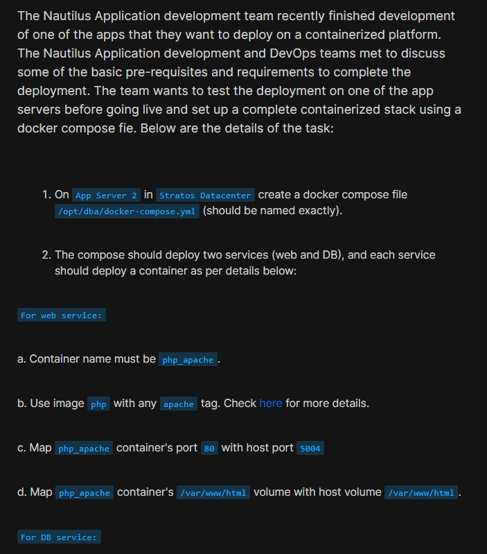
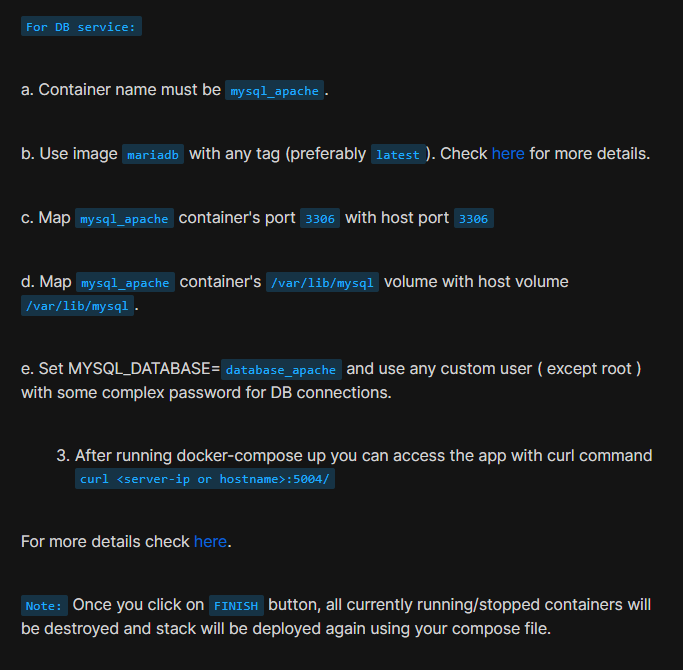
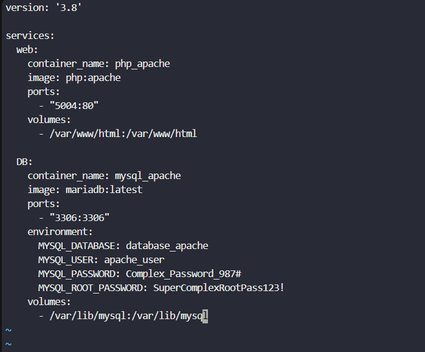
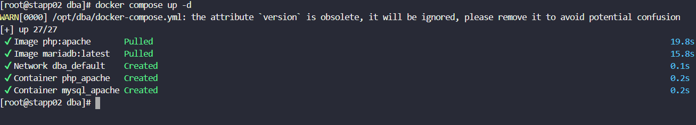
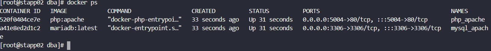
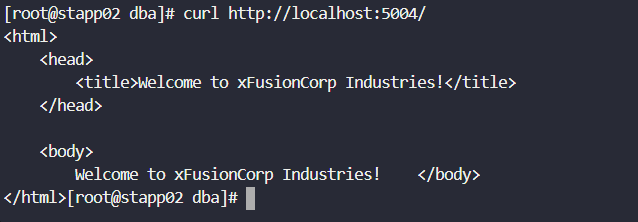

# Day 46: Deploy an App on Docker Containers

<div style="border:1px solid #ccc; padding:10px; border-radius:10px; box-shadow:2px 2px 8px rgba(0,0,0,0.2); display:inline-block;">
  
</div>

## Content:

>Today I worked on deploying a multi-container application stack using Docker Compose.  This helped me understand how Docker Compose simplifies managing multiple containers together and how services can be configured with networking, ports, environment variables, and persistent storage.

---

## 🔹 What I Learned

* How to create and use a Docker Compose file
* How to deploy multiple containers together using Docker Compose
* Port mapping between host and containers
* Volume mapping for persistent storage
* Configuring environment variables for database setup


---

## 🔹 Task Requirement

<div style="border:1px solid #ccc; padding:10px; border-radius:10px; box-shadow:2px 2px 8px rgba(0,0,0,0.2); display:inline-block;">
  
</div>
<div style="border:1px solid #ccc; padding:10px; border-radius:10px; box-shadow:2px 2px 8px rgba(0,0,0,0.2); display:inline-block;">
  
</div>

As per the Nautilus DevOps team requirements, I needed to:

* Create a Docker Compose file at:

```bash
/opt/dba/docker-compose.yml
```

* Deploy two services:

  * Web Service
  * Database Service

### Web Service Requirements

* Container name: `php_apache`
* Use `php` image with apache tag
* Map container port `80` to host port `5004`
* Map volume:

```bash
/var/www/html:/var/www/html
```

### Database Service Requirements

* Container name: `mysql_apache`
* Use `mariadb` image
* Map container port `3306` to host port `3306`
* Map volume:

```bash
/var/lib/mysql:/var/lib/mysql
```

* Configure:

  * MYSQL_DATABASE
  * MYSQL_USER
  * MYSQL_PASSWORD

---

# 🔹 Steps I Followed

## 1. Connected to Application Server

```bash
ssh steve@stapp02
```
<div style="border:1px solid #ccc; padding:10px; border-radius:10px; box-shadow:2px 2px 8px rgba(0,0,0,0.2); display:inline-block;">
  
</div>

Observed:

* Successfully connected to App Server 2

---

## 2. Navigated to Working Directory

```bash
cd /opt/dba/
```
<div style="border:1px solid #ccc; padding:10px; border-radius:10px; box-shadow:2px 2px 8px rgba(0,0,0,0.2); display:inline-block;">
  
</div>

---

## 3. Switched to Root User

```bash
sudo su
```
<div style="border:1px solid #ccc; padding:10px; border-radius:10px; box-shadow:2px 2px 8px rgba(0,0,0,0.2); display:inline-block;">
  
</div>

---

## 4. Created Docker Compose File

Opened the compose file:

```bash
vi docker-compose.yml
```
<div style="border:1px solid #ccc; padding:10px; border-radius:10px; box-shadow:2px 2px 8px rgba(0,0,0,0.2); display:inline-block;">
  
</div>

Added the following configuration:

```yaml
version: '3.8'

services:
  web:
    container_name: php_apache
    image: php:apache
    ports:
      - "5004:80"
    volumes:
      - /var/www/html:/var/www/html

  DB:
    container_name: mysql_apache
    image: mariadb:latest
    ports:
      - "3306:3306"
    environment:
      MYSQL_DATABASE: database_apache
      MYSQL_USER: apache_user
      MYSQL_PASSWORD: Complex_Password_987#
      MYSQL_ROOT_PASSWORD: SuperComplexRootPass123!
    volumes:
      - /var/lib/mysql:/var/lib/mysql
```

<div style="border:1px solid #ccc; padding:10px; border-radius:10px; box-shadow:2px 2px 8px rgba(0,0,0,0.2); display:inline-block;">
  
</div>

---

## Simple Explanation of the Compose File

### Web Service

```yaml
image: php:apache
```

Uses a PHP image with Apache web server.

```yaml
ports:
  - "5004:80"
```

Maps host port 5004 to container port 80.

```yaml
volumes:
  - /var/www/html:/var/www/html
```

Shares website files between host and container.

---

### Database Service

```yaml
image: mariadb:latest
```

Uses the latest MariaDB image.

```yaml
environment:
```

Sets database name, user, and passwords.

```yaml
ports:
  - "3306:3306"
```

Maps MySQL port for database access.

```yaml
volumes:
  - /var/lib/mysql:/var/lib/mysql
```

Stores database data persistently on the host.

---

👉 In simple terms:

This compose file deploys a complete application stack where:

* PHP Apache serves the web application
* MariaDB stores the application data
* Both services run together and are managed using Docker Compose

---

## 5. Started the Docker Compose Stack

Executed:

```bash
docker compose up -d
```

<div style="border:1px solid #ccc; padding:10px; border-radius:10px; box-shadow:2px 2px 8px rgba(0,0,0,0.2); display:inline-block;">
  
</div>


Observed:

* Docker images downloaded successfully
* Containers created and started successfully
* Docker network created automatically

Received warning:

```bash
the attribute `version` is obsolete
```

This warning is harmless and does not affect functionality.

---

## 6. Verified Running Containers

Executed:

```bash
docker ps
```
<div style="border:1px solid #ccc; padding:10px; border-radius:10px; box-shadow:2px 2px 8px rgba(0,0,0,0.2); display:inline-block;">
  
</div>

Observed:

* `php_apache` container running
* `mysql_apache` container running
* Port mappings visible

---

## 7. Tested the Web Application

Executed:

```bash
curl http://localhost:5004/
```
<div style="border:1px solid #ccc; padding:10px; border-radius:10px; box-shadow:2px 2px 8px rgba(0,0,0,0.2); display:inline-block;">
  
</div>

Observed:

```html
<html>
    <head>
        <title>Welcome to xFusionCorp Industries!</title>
    </head>

    <body>
        Welcome to xFusionCorp Industries!
    </body>
</html>
```

This confirmed the application was accessible successfully.

---

# 🔹 My Understanding

This task helped me understand how Docker Compose makes multi-container deployments much easier. Instead of manually running separate docker commands, everything can be managed from a single YAML file.

---

# 🔹 What I Found Interesting

I found it interesting that with Docker Compose we can deploy an entire application stack using just one command:

```bash
docker compose up -d
```
---

* * *

### Topics Covered

- ***docker-compose***
- ***docker-file***
- ***docker***


**Previous Task**: [Day 45: Resolve Dockerfile Issues ](../Day_45/day_45.md)

**Next Task**: [Day 47: Docker Python App ](../Day_47/day_47.md)

