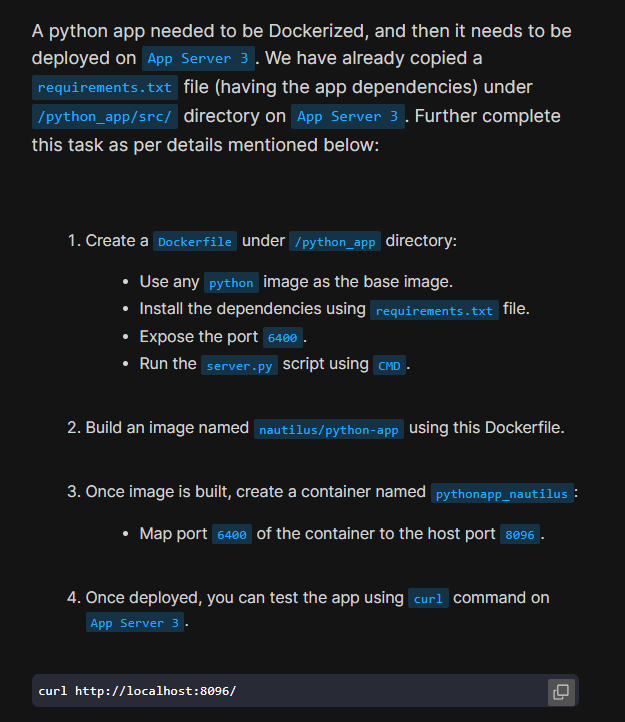
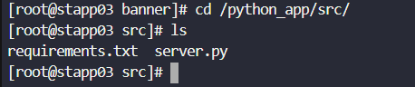
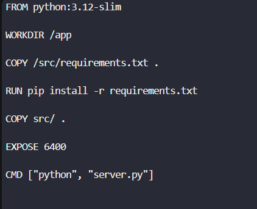
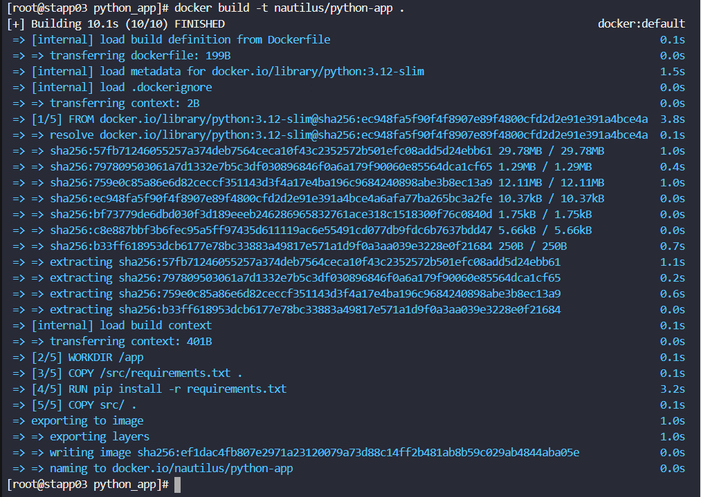
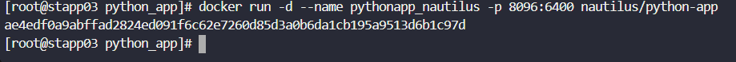
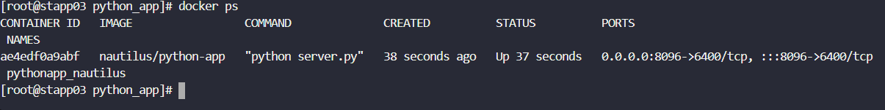

# Day 47: Docker Python App

<div style="border:1px solid #ccc; padding:10px; border-radius:10px; box-shadow:2px 2px 8px rgba(0,0,0,0.2); display:inline-block;">
  
</div>

## Content:

>Today I worked on Dockerizing a Python application and deploying it on a Docker container. This task helped me understand how to create Docker images for Python applications, install dependencies using a requirements file, expose application ports, and deploy containers with custom port mappings.

---

## 🔹 What I Learned

* How to create a Dockerfile for a Python application
* How Docker images are built using `docker build`
* Installing Python dependencies using `requirements.txt`
* How to expose application ports in Docker
* Running containers with custom host-to-container port mapping
* Testing deployed applications using `curl`

---

## 🔹 Task Requirement

<div style="border:1px solid #ccc; padding:10px; border-radius:10px; box-shadow:2px 2px 8px rgba(0,0,0,0.2); display:inline-block;">
  
</div>


As per the Nautilus DevOps team requirements, I needed to:

Create a Dockerfile under:

```bash
/python_app/
```

Requirements for the Dockerfile:

* Use any Python base image
* Install dependencies using `requirements.txt`
* Expose port `6400`
* Run `server.py` using CMD

Then:

* Build an image named:

```bash
nautilus/python-app
```

* Create a container named:

```bash
pythonapp_nautilus
```

* Map container port `6400` to host port `8096`

Finally, verify the application using:

```bash
curl http://localhost:8096/
```

---

## 🔹 Steps I Followed

### 1. Connected to App Server 3

```bash
ssh banner@stapp03
```
<div style="border:1px solid #ccc; padding:10px; border-radius:10px; box-shadow:2px 2px 8px rgba(0,0,0,0.2); display:inline-block;">
  
</div>

Observed:

* Successfully connected to App Server 3

---

### 2. Switched to Root User

```bash
sudo su
```
<div style="border:1px solid #ccc; padding:10px; border-radius:10px; box-shadow:2px 2px 8px rgba(0,0,0,0.2); display:inline-block;">
  
</div>

Observed:

* Root access granted

---

### 3. Verified Application Files

Navigated to source directory:

```bash
cd /python_app/src/
```

Listed files:

```bash
ls
```

Observed:

```bash
requirements.txt  server.py
```

<div style="border:1px solid #ccc; padding:10px; border-radius:10px; box-shadow:2px 2px 8px rgba(0,0,0,0.2); display:inline-block;">
  
</div>


This confirmed the Python application files were already available.

---

### 4. Navigated to Application Directory

```bash
cd /python_app/
```

---

### 5. Created Dockerfile

Opened Dockerfile:

```bash
vi Dockerfile
```
<div style="border:1px solid #ccc; padding:10px; border-radius:10px; box-shadow:2px 2px 8px rgba(0,0,0,0.2); display:inline-block;">
  
</div>

Added the following configuration:

```dockerfile
FROM python:3.12-slim

WORKDIR /app

COPY /src/requirements.txt .

RUN pip install -r requirements.txt

COPY src/ .

EXPOSE 6400

CMD ["python", "server.py"]
```

---

## Simple Explanation of the Dockerfile

<div style="border:1px solid #ccc; padding:10px; border-radius:10px; box-shadow:2px 2px 8px rgba(0,0,0,0.2); display:inline-block;">
  
</div>


## Base Image

```dockerfile
FROM python:3.12-slim
```

Uses a lightweight Python 3.12 image.

---

### Working Directory

```dockerfile
WORKDIR /app
```

Sets `/app` as the working directory inside the container.

---

### Copy Requirements File

```dockerfile
COPY /src/requirements.txt .
```

Copies dependency file into the container.

---

### Install Dependencies

```dockerfile
RUN pip install -r requirements.txt
```

Installs all required Python packages.

---

### Copy Application Files

```dockerfile
COPY src/ .
```

Copies application source code into the container.

---

### Expose Application Port

```dockerfile
EXPOSE 6400
```

Makes container port `6400` available.

---

### Start Application

```dockerfile
CMD ["python", "server.py"]
```

Runs the Python application when the container starts.

---

## 👉 In simple terms:

This Dockerfile packages the Python application along with all required dependencies into a portable Docker image that can run consistently anywhere.

---

### 6. Built Docker Image

Executed:

```bash
docker build -t nautilus/python-app .
```
<div style="border:1px solid #ccc; padding:10px; border-radius:10px; box-shadow:2px 2px 8px rgba(0,0,0,0.2); display:inline-block;">
  
</div>

Observed:

* Docker image built successfully
* Image named:

```bash
nautilus/python-app
```

---

### 7. Created and Started Container

Executed:

```bash
docker run -d --name pythonapp_nautilus -p 8096:6400 nautilus/python-app
```
<div style="border:1px solid #ccc; padding:10px; border-radius:10px; box-shadow:2px 2px 8px rgba(0,0,0,0.2); display:inline-block;">
  
</div>

Explanation:

```bash
-p 8096:6400
```

Maps:

* Host Port → `8096`
* Container Port → `6400`

Observed:

* Container started successfully

---

### 8. Verified Running Container

Executed:

```bash
docker ps
```
<div style="border:1px solid #ccc; padding:10px; border-radius:10px; box-shadow:2px 2px 8px rgba(0,0,0,0.2); display:inline-block;">
  
</div>

Observed:

```bash
CONTAINER ID   IMAGE                 COMMAND              STATUS          PORTS
ae4edf0a9abf   nautilus/python-app   "python server.py"  Up              0.0.0.0:8096->6400/tcp
```

This confirmed:

* Container is running
* Port mapping is working correctly

---

### 9. Tested the Application

Executed:

```bash
curl http://localhost:8096/
```
<div style="border:1px solid #ccc; padding:10px; border-radius:10px; box-shadow:2px 2px 8px rgba(0,0,0,0.2); display:inline-block;">
  
</div>

Observed:

```bash
Welcome to xFusionCorp Industries!
```

This confirmed the Python application was deployed successfully and accessible through the browser/host port.

---

## 🔹 My Understanding

This task helped me understand the complete workflow of containerizing a Python application using Docker. I learned how Dockerfiles define the application environment and how containers make deployment simple and consistent.

---

## 🔹 What I Found Interesting

I found it interesting how Docker creates a consistent runtime environment for the application. Once the Docker image was built, the Python app ran successfully without needing to manually configure Python dependencies on the server.


* * *

### Topics Covered

- ***docker-python-app***
- ***docker-file***
- ***docker***


**Previous Task**: [Day 46: Deploy an App on Docker Containers ](../Day_46/day_46.md)

**Next Task**: [Day 48: Deploy Pods in Kubernetes Cluster ](../Day_48/day_48.md)
