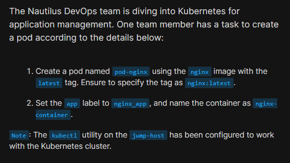
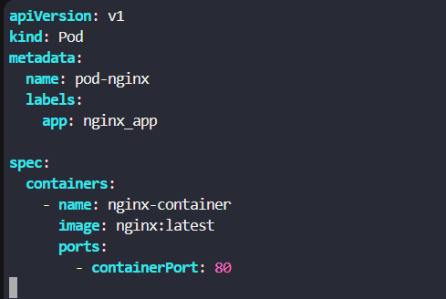
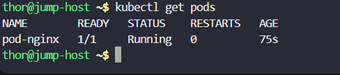

# Day 48: Deploy Pods in Kubernetes Cluster

<div style="border:1px solid #ccc; padding:10px; border-radius:10px; box-shadow:2px 2px 8px rgba(0,0,0,0.2); display:inline-block;">
  
</div>

## Content:

>Today I worked on deploying a Pod in a Kubernetes cluster using a YAML manifest file. This task helped me understand the basic structure of Kubernetes Pod definitions, how labels are assigned, how containers are configured inside Pods, and how to deploy resources using `kubectl`.

---

## 🔹 What I Learned

* How to create a Kubernetes Pod using a YAML manifest
* Basic structure of Kubernetes resource definitions
* Understanding `apiVersion`, `kind`, `metadata`, and `spec`
* Deploying resources using `kubectl apply`

---

## 🔹 Task Requirement

<div style="border:1px solid #ccc; padding:10px; border-radius:10px; box-shadow:2px 2px 8px rgba(0,0,0,0.2); display:inline-block;">
  
</div>

As per the Nautilus DevOps team requirements, I needed to:

Create a Pod with the following details:

| Requirement    | Value             |
| -------------- | ----------------- |
| Pod Name       | `pod-nginx`       |
| Image          | `nginx:latest`    |
| Label          | `app: nginx_app`  |
| Container Name | `nginx-container` |

The Pod needed to be deployed successfully in the Kubernetes cluster using `kubectl`.

---

## 🔹 Steps I Followed

### 1. Connected to the Jump Host

Logged into the jump host where `kubectl` was already configured for cluster access.

Observed:

* Kubernetes cluster access was already configured
* Ready to create Kubernetes resources

---

### 2. Created Pod Manifest File

Executed:

```bash 
vi pod-nginx.yml
```
<div style="border:1px solid #ccc; padding:10px; border-radius:10px; box-shadow:2px 2px 8px rgba(0,0,0,0.2); display:inline-block;">
  
</div>

Added the following YAML configuration:

```yaml 
apiVersion: v1
kind: Pod
metadata:
  name: pod-nginx
  labels:
    app: nginx_app

spec:
  containers:
    - name: nginx-container
      image: nginx:latest
      ports:
        - containerPort: 80
```

---

## 🔹 Simple Explanation of the YAML File

<div style="border:1px solid #ccc; padding:10px; border-radius:10px; box-shadow:2px 2px 8px rgba(0,0,0,0.2); display:inline-block;">
  
</div>

### API Version

```yaml 
apiVersion: v1
```

Specifies the Kubernetes API version used for the Pod resource.

---

### Resource Type

```yaml 
kind: Pod
```

Defines that the resource being created is a Pod.

---

### Metadata Section

```yaml 
metadata:
  name: pod-nginx
  labels:
    app: nginx_app
```

* `name` defines the Pod name
* `labels` help identify and organize Kubernetes resources

---

### Spec Section

```yaml 
spec:
```

Defines the Pod configuration details.

---

### Container Configuration

```yaml 
containers:
  - name: nginx-container
    image: nginx:latest
```

* Creates a container named `nginx-container`
* Uses the latest official Nginx image

---

### Exposed Container Port

```yaml 
ports:
  - containerPort: 80
```

Exposes port 80 inside the container for web traffic.

---

👉 In simple terms:

This YAML file tells Kubernetes to create a Pod named `pod-nginx` running an Nginx container using the `nginx:latest` image with the label `nginx_app`.

---

### 3. Applied the Pod Configuration

<div style="border:1px solid #ccc; padding:10px; border-radius:10px; box-shadow:2px 2px 8px rgba(0,0,0,0.2); display:inline-block;">
  
</div>

Executed:

```bash 
kubectl apply -f pod-nginx.yml
```

Observed:

```bash 
pod/pod-nginx created
```

This confirmed the Pod was successfully created in the cluster.

---

### 4. Verified Pod Status

Executed:

```bash 
kubectl get pods
```

Observed:

```bash 
NAME        READY   STATUS    RESTARTS   AGE
pod-nginx   1/1     Running   0          75s
```

<div style="border:1px solid #ccc; padding:10px; border-radius:10px; box-shadow:2px 2px 8px rgba(0,0,0,0.2); display:inline-block;">
  
</div>

This confirmed:

* Pod was successfully deployed
* Container was running properly
* Pod status was `Running`

---

## 🔹 My Understanding

This task helped me understand the foundational concepts of Kubernetes resource deployment. I learned how YAML manifests define Kubernetes objects and how `kubectl` is used to create and manage resources inside a cluster.


---

## 🔹 What I Found Interesting

I found it interesting how Kubernetes can deploy containers declaratively using simple YAML files. Instead of manually starting containers, Kubernetes automatically manages and maintains the desired state defined in the manifest file.


* * *

### Topics Covered

- ***kubernetes***
- ***kubernetes-pods***
- ***kubectl***
- ***pod-manifest***


**Previous Task**: [Day 47: Docker Python App ](../Day_47/day_47.md)

**Next Task**: [Day 49: Deploy Applications with Kubernetes Deployments ](../Day_49/day_49.md)