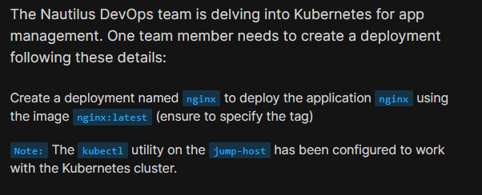
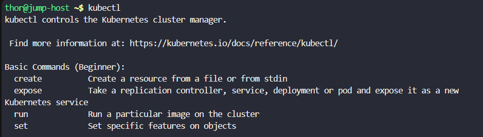
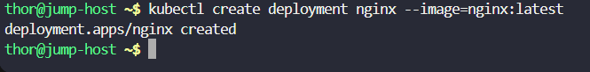
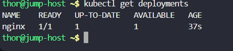
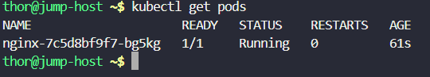

# Day 49: Deploy Applications with Kubernetes Deployments

<div style="border:1px solid #ccc; padding:10px; border-radius:10px; box-shadow:2px 2px 8px rgba(0,0,0,0.2); display:inline-block;">
  
</div>

## Content:

>Today I worked on creating a Kubernetes Deployment for an Nginx application. This task helped me understand how Kubernetes Deployments are used to manage applications, automatically create Pods, and maintain the desired application state inside the cluster.

---

## 🔹 What I Learned

* How to create a Kubernetes Deployment using `kubectl`
* Difference between a Pod and a Deployment
* How Deployments automatically manage Pods
* Using container images with specific tags

---

## 🔹 Task Requirement

<div style="border:1px solid #ccc; padding:10px; border-radius:10px; box-shadow:2px 2px 8px rgba(0,0,0,0.2); display:inline-block;">
  
</div>

As per the Nautilus DevOps team requirements, I needed to:

Create a Deployment with the following details:

| Requirement     | Value        |
| --------------- | ------------ |
| Deployment Name | nginx        |
| Image           | nginx:latest |

The Deployment needed to be successfully created in the Kubernetes cluster using `kubectl`.

---

## 🔹 Steps I Followed

### 1. Connected to the Jump Host

Logged into the jump host where `kubectl` was already configured for cluster access.

Executed:

```bash
kubectl
```
<div style="border:1px solid #ccc; padding:10px; border-radius:10px; box-shadow:2px 2px 8px rgba(0,0,0,0.2); display:inline-block;">
  
</div>

Observed:

* Kubernetes CLI was accessible
* Cluster connection was properly configured
* Ready to create Kubernetes resources

---

### 2. Created the Kubernetes Deployment

Executed:

```bash
kubectl create deployment nginx --image=nginx:latest
```
<div style="border:1px solid #ccc; padding:10px; border-radius:10px; box-shadow:2px 2px 8px rgba(0,0,0,0.2); display:inline-block;">
  
</div>

Observed:

```bash
deployment.apps/nginx created
```

This confirmed that the Deployment was successfully created in the Kubernetes cluster.

---

## 🔹 Simple Explanation of the Command

### Deployment Creation Command

```bash
kubectl create deployment nginx --image=nginx:latest
```

### Breaking It Down

| Part                   | Explanation                                    |
| ---------------------- | ---------------------------------------------- |
| `kubectl`              | Kubernetes command-line utility                |
| `create deployment`    | Creates a new Deployment resource              |
| `nginx`                | Name of the Deployment                         |
| `--image=nginx:latest` | Uses the latest official Nginx container image |

---

## 🔹 3. Verified the Deployment

Executed:

```bash
kubectl get deployments
```
<div style="border:1px solid #ccc; padding:10px; border-radius:10px; box-shadow:2px 2px 8px rgba(0,0,0,0.2); display:inline-block;">
  
</div>

Observed:

```bash
NAME    READY   UP-TO-DATE   AVAILABLE   AGE
nginx   1/1     1            1           37s
```

### Understanding the Output

| Column     | Meaning                        |
| ---------- | ------------------------------ |
| READY      | Number of running Pods         |
| UP-TO-DATE | Updated Pods created           |
| AVAILABLE  | Available healthy Pods         |
| AGE        | Time since Deployment creation |

This confirmed:

* Deployment was healthy
* Pod was successfully created
* Application was available

---

## 🔹 4. Verified the Pod Created by Deployment

Executed:

```bash
kubectl get pods
```
<div style="border:1px solid #ccc; padding:10px; border-radius:10px; box-shadow:2px 2px 8px rgba(0,0,0,0.2); display:inline-block;">
  
</div>

Observed:

```bash
NAME                     READY   STATUS    RESTARTS   AGE
nginx-7c5d8bf9f7-bg5kg   1/1     Running   0          61s
```

This confirmed:

* Pod was automatically created by the Deployment
* Container was running properly
* Pod status was `Running`
* No container restarts occurred

---

## 🔹 My Understanding

This task helped me understand how Kubernetes Deployments simplify application management. Instead of manually managing Pods, Deployments automatically handle Pod creation, recovery, and updates.

I also learned that Deployments are one of the most commonly used Kubernetes resources in real-world DevOps and production environments.

---

## 🔹 What I Found Interesting

I found it interesting how a single Kubernetes command can automatically create and manage application Pods. Kubernetes continuously monitors the Deployment and ensures the application remains available without manual intervention.

It was also interesting to see that the Deployment automatically created a Pod with a generated name and maintained its running state.

* * *

### Topics Covered

- ***kubernetes***
- ***kubernetes-deployment***
- ***kubectl***


**Previous Task**: [Day 48: Deploy Pods in Kubernetes Cluster ](../Day_48/day_48.md)

**Next Task**: [Day 50: Set Resource Limits in Kubernetes Pods ](../Day_49/day_49.md)
