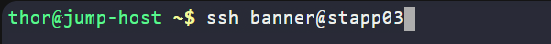
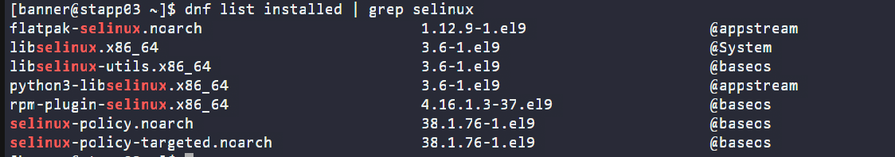
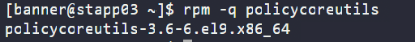
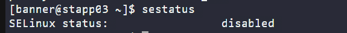
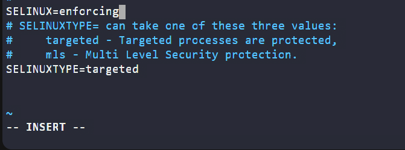
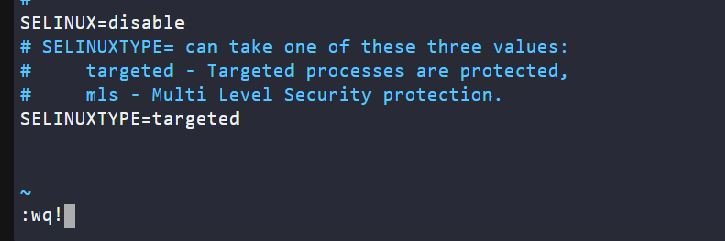

# Day 5: SElinux Installation and Configuration

<div style="border:1px solid #ccc; padding:10px; border-radius:10px; box-shadow:2px 2px 8px rgba(0,0,0,0.2); display:inline-block;">
  
</div>

## Content:

> Today I worked on installing and configuring SELinux on an application server as part of my DevOps journey.
> 
> This is an important practice to understand how security is managed in Linux systems, especially when controlling access between applications and system resources.

## What I Learned

In this task, I worked with **SELinux (Security-Enhanced Linux)** on a **CentOS Stream 9** system.

At first, SELinux felt confusing, but I learned it is simply a **security system that controls what programs can and cannot do**.

👉 Think of SELinux like:

> A strict security guard inside your system that allows only approved actions.

I also learned:

*   How to identify my Linux OS
    
*   How to install and verify required packages
    
*   The difference between temporary vs permanent system settings
    
*   How to safely disable SELinux for testing
    

<div style="border:1px solid #ccc; padding:10px; border-radius:10px; box-shadow:2px 2px 8px rgba(0,0,0,0.2); display:inline-block;">
  
</div>

## Steps I Followed

### 🔹 Step 1: **Connect to App Servers**

From the jump host, I connected to the server:

```bash
ssh user@server-name
```

<div style="border:1px solid #ccc; padding:10px; border-radius:10px; box-shadow:2px 2px 8px rgba(0,0,0,0.2); display:inline-block;">
  
</div>

### 🔹 Step 2: Identify the Operating System

I ran:

```bash
cat /etc/os-release
```

<div style="border:1px solid #ccc; padding:10px; border-radius:10px; box-shadow:2px 2px 8px rgba(0,0,0,0.2); display:inline-block;">
  
</div>

### What this does:

*   This file contains details about your OS
    
*   It tells you **which Linux distribution you are using**
    

### Why this matters:

Different Linux systems use different tools:

*   CentOS/RHEL → `dnf` or `yum`
    
*   Ubuntu → `apt`
    

👉 My output showed **CentOS Stream 9**, so I knew I should use `dnf`.

### 🔹 Step 3: Install SELinux Packages

```bash
sudo dnf install -y selinux-policy selinux-policy-targeted policycoreutils
```

<div style="border:1px solid #ccc; padding:10px; border-radius:10px; box-shadow:2px 2px 8px rgba(0,0,0,0.2); display:inline-block;">
  
</div>

### 🧠 Breaking it down:

*   `sudo` → run as admin
    
*   `dnf` → package manager (installs software)
    
*   `install` → action to install packages
    
*   `-y` → auto-confirm installation
    

### 📦 Packages:

*   `selinux-policy` → security rules
    
*   `selinux-policy-targeted` → default protection mode
    
*   `policycoreutils` → tools to manage SELinux
    

👉 In simple terms:

> This command installs everything needed for SELinux to work.

### 🔹 Step 4: Verify SELinux Packages

```bash
dnf list installed | grep selinux
```

<div style="border:1px solid #ccc; padding:10px; border-radius:10px; box-shadow:2px 2px 8px rgba(0,0,0,0.2); display:inline-block;">
  
</div>

### What this does:

*   `dnf list installed` → shows all installed packages
    
*   `grep selinux` → filters only SELinux-related ones
    

👉 This confirms whether installation was successful.

* * *

### 🔹 Step 5: Check Specific Package

```bash
rpm -q policycoreutils
```

<div style="border:1px solid #ccc; padding:10px; border-radius:10px; box-shadow:2px 2px 8px rgba(0,0,0,0.2); display:inline-block;">
  
</div>

### What this does:

*   `rpm` → low-level package tool
    
*   `-q` → query (check if installed)
    

👉 It answers:

> “Is this package installed or not?”

✔️ If installed → shows version ❌ If not → says not installed

### 🔹 Step 6: Check SELinux Status

```bash
sestatus
```

Output:

```plaintext
SELinux status: disabled
```

<div style="border:1px solid #ccc; padding:10px; border-radius:10px; box-shadow:2px 2px 8px rgba(0,0,0,0.2); display:inline-block;">
  
</div>

### Important concept:

There are **two types of SELinux states**:

1.  **Current (runtime) state**
    
    *   What the system is doing right now
        
2.  **Permanent (config) state**
    
    *   What will happen after reboot
        

👉 In this task, I was told:

> Ignore the current status

### 🔹 Step 7: Permanently Disable SELinux

```bash
sudo vi /etc/selinux/config
```

<div style="border:1px solid #ccc; padding:10px; border-radius:10px; box-shadow:2px 2px 8px rgba(0,0,0,0.2); display:inline-block;">
  
</div>

### What this does:

*   Opens the SELinux configuration file
    
*   This file controls **permanent behavior**
    

### I changed:

```bash
SELINUX=disabled
```

<div style="border:1px solid #ccc; padding:10px; border-radius:10px; box-shadow:2px 2px 8px rgba(0,0,0,0.2); display:inline-block;">
  
</div>


<div style="border:1px solid #ccc; padding:10px; border-radius:10px; box-shadow:2px 2px 8px rgba(0,0,0,0.2); display:inline-block;">
  
</div>


### Meaning:

*   SELinux will stay disabled even after reboot
    

## My Understanding

Here’s how I now understand everything:

*   SELinux is an **extra security layer** in Linux
    
*   It restricts what programs can access (files, ports, etc.)
    
*   Even if something is hacked, SELinux can limit damage
    

### Most important concept I learned:

👉 **Temporary vs Permanent settings**

| Type | Command/File | Meaning |
| --- | --- | --- |
| Runtime | `sestatus` | Current state |
| Permanent | `/etc/selinux/config` | After reboot |

## What I Found Interesting

*   Even when SELinux was already disabled, I still had to configure it properly
    
*   A small typo in a package name can cause installation failure
    
*   `rpm -q` is a very quick way to check packages
    
*   SELinux is powerful but often temporarily disabled during setup
    
### Topics Covered

- ***Selinux installation***
- ***Selinux configration***

**Previous Task**: [Day 4: Secure Root SSH Access](../Day_4/day_4.md)

**Next Task**: [Day 6: SElinux Installation and Configuration](../Day_6/day_6.md)