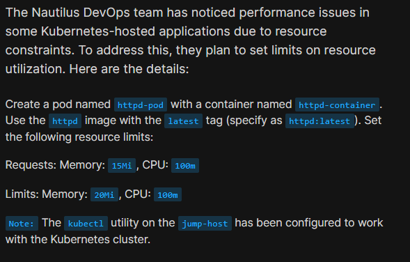
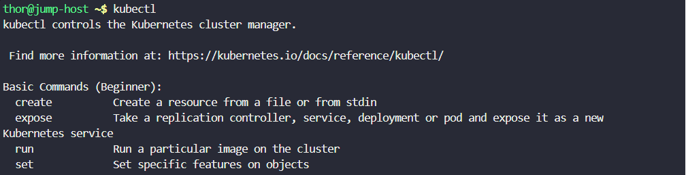
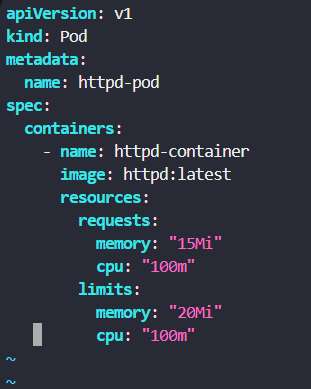
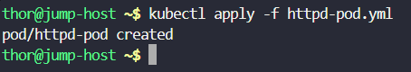
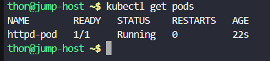
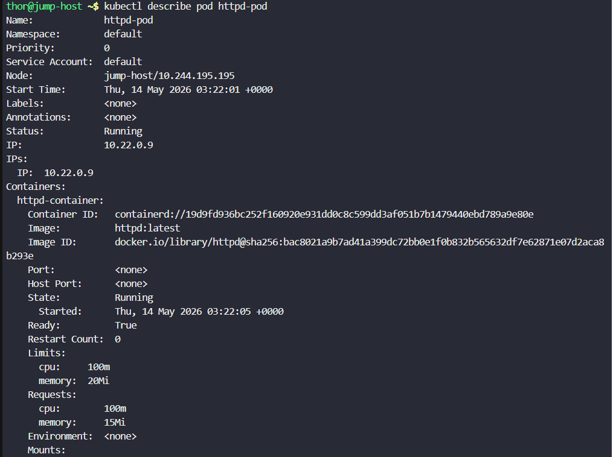

# Day 50: Set Resource Limits in Kubernetes Pods

<div style="border:1px solid #ccc; padding:10px; border-radius:10px; box-shadow:2px 2px 8px rgba(0,0,0,0.2); display:inline-block;">
  
</div>


## Content:

>Today I worked on configuring resource requests and limits for a Kubernetes Pod. This task helped me understand how Kubernetes manages CPU and memory allocation for containers and how resource limits help prevent applications from consuming excessive cluster resources.

---

## 🔹 What I Learned

* How to create a Pod using a YAML manifest
* Difference between resource requests and limits
* How Kubernetes schedules Pods based on resource requests
* How CPU and memory limits help control container resource usage

---

## 🔹 Task Requirement

<div style="border:1px solid #ccc; padding:10px; border-radius:10px; box-shadow:2px 2px 8px rgba(0,0,0,0.2); display:inline-block;">
  
</div>

As per the Nautilus DevOps team requirements, I needed to:

Create a Pod with the following details:

| Requirement    | Value           |
| -------------- | --------------- |
| Pod Name       | httpd-pod       |
| Container Name | httpd-container |
| Image          | httpd:latest    |
| Memory Request | 15Mi            |
| CPU Request    | 100m            |
| Memory Limit   | 20Mi            |
| CPU Limit      | 100m            |

The Pod needed to be successfully created and run inside the Kubernetes cluster.

---

## 🔹 Steps I Followed

### 1. Connected to the Jump Host

Logged into the jump host where `kubectl` was already configured for Kubernetes cluster access.

Executed:

```bash
kubectl
```
<div style="border:1px solid #ccc; padding:10px; border-radius:10px; box-shadow:2px 2px 8px rgba(0,0,0,0.2); display:inline-block;">
  
</div>

Observed:

* Kubernetes CLI was accessible
* Cluster connection was properly configured
* Ready to create Kubernetes resources

---

### 🔹 2. Created the Pod Manifest File

Created a YAML file for the Pod configuration.

Executed:

```bash
vi httpd-pod.yml
```
<div style="border:1px solid #ccc; padding:10px; border-radius:10px; box-shadow:2px 2px 8px rgba(0,0,0,0.2); display:inline-block;">
  
</div>

Added the following configuration:

```yaml
apiVersion: v1
kind: Pod
metadata:
  name: httpd-pod
spec:
  containers:
    - name: httpd-container
      image: httpd:latest
      resources:
        requests:
          memory: "15Mi"
          cpu: "100m"
        limits:
          memory: "20Mi"
          cpu: "100m"
```

---

### 🔹 Simple Explanation of the YAML Configuration

<div style="border:1px solid #ccc; padding:10px; border-radius:10px; box-shadow:2px 2px 8px rgba(0,0,0,0.2); display:inline-block;">
  
</div>

| Section             | Explanation                          |
| ------------------- | ------------------------------------ |
| apiVersion: v1      | Uses Kubernetes core API             |
| kind: Pod           | Creates a Pod resource               |
| metadata            | Defines Pod details                  |
| name: httpd-pod     | Name of the Pod                      |
| containers          | Defines container configuration      |
| image: httpd:latest | Uses latest Apache HTTP server image |
| requests            | Minimum resources guaranteed         |
| limits              | Maximum resources container can use  |

---

### 🔹 3. Applied the Manifest File

Executed:

```bash
kubectl apply -f httpd-pod.yml
```
<div style="border:1px solid #ccc; padding:10px; border-radius:10px; box-shadow:2px 2px 8px rgba(0,0,0,0.2); display:inline-block;">
  
</div>

Observed:

```bash
pod/httpd-pod created
```

This confirmed that the Pod was successfully created in the Kubernetes cluster.

---

### 🔹 4. Verified the Pod Configuration

Executed:

```bash
kubectl describe pod httpd-pod
```

<div style="border:1px solid #ccc; padding:10px; border-radius:10px; box-shadow:2px 2px 8px rgba(0,0,0,0.2); display:inline-block;">
  
</div>
<div style="border:1px solid #ccc; padding:10px; border-radius:10px; box-shadow:2px 2px 8px rgba(0,0,0,0.2); display:inline-block;">
  
</div>

Observed:

```text
Limits:
  cpu:     100m
  memory:  20Mi

Requests:
  cpu:     100m
  memory:  15Mi
```

Also verified:

* Pod status was `Running`
* Container started successfully
* Resource requests and limits were properly applied

---

### 🔹 Understanding Resource Requests and Limits

| Resource Type | Purpose                                                 |
| ------------- | ------------------------------------------------------- |
| Requests      | Minimum resources Kubernetes reserves for the container |
| Limits        | Maximum resources the container can consume             |

### CPU Unit Explanation

* `100m` means 100 millicores
* Equivalent to `0.1 CPU`

### Memory Unit Explanation

* `Mi` stands for Mebibytes
* `15Mi` and `20Mi` define memory allocation boundaries

---

### 🔹 My Understanding

This task helped me understand how Kubernetes controls container resource consumption using requests and limits. Resource requests help Kubernetes decide where to schedule the Pod, while limits prevent containers from using excessive CPU or memory.

---

### 🔹 What I Found Interesting

I found it interesting how Kubernetes allows fine-grained resource control at the container level. By simply defining requests and limits inside the Pod specification, Kubernetes can efficiently manage workloads and prevent resource exhaustion across the cluster.


* * *

### Topics Covered

- ***kubernetes***
- ***kubernetes-resource-limits***
- ***kubernetes-deployment***
- ***kubectl***


**Previous Task**: [Day 49: Deploy Applications with Kubernetes Deployments ](../Day_48/day_48.md)

**Next Task**: [Day 51: Execute Rolling Updates in Kubernetes ](../Day_49/day_49.md)