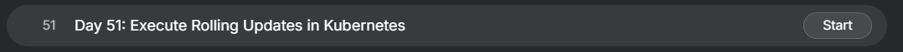
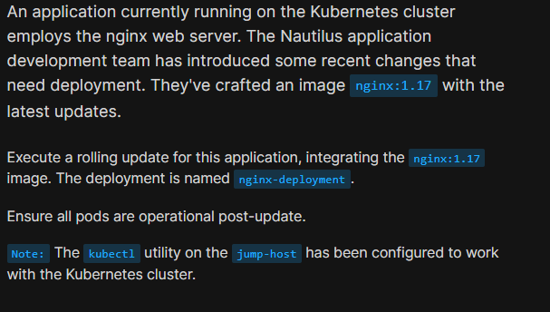
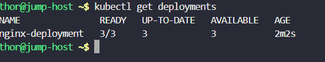
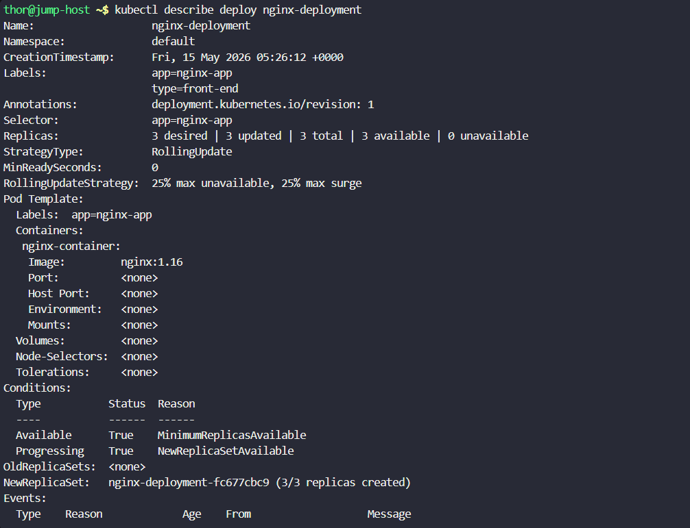
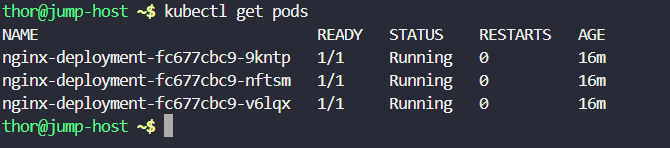
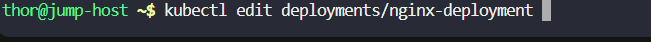
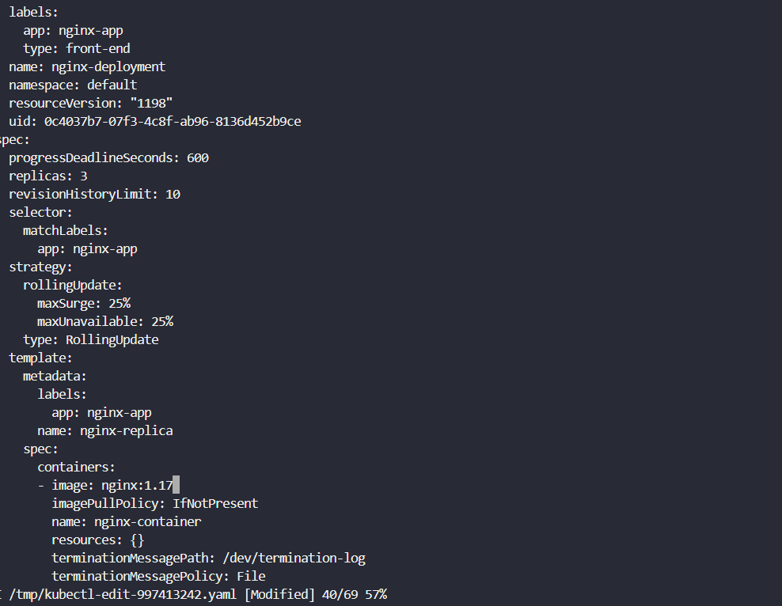
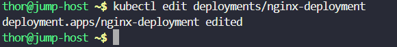
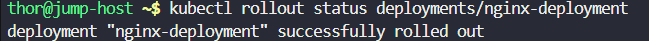
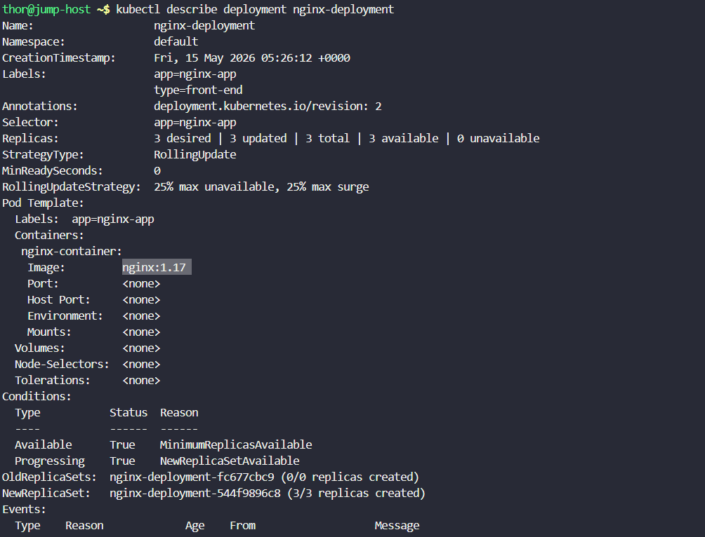

# Day 51: Execute Rolling Updates in Kubernetes

<div style="border:1px solid #ccc; padding:10px; border-radius:10px; box-shadow:2px 2px 8px rgba(0,0,0,0.2); display:inline-block;">
  
</div>

## Content:

> Today I worked on performing a Rolling Update in Kubernetes. This task helped me understand how Kubernetes updates application containers without downtime by gradually replacing old Pods with new ones.

> The Nautilus application development team introduced a new application version using the image `nginx:1.17`, and I needed to update the existing deployment running `nginx:1.16`.

* * *

### 🔹 What I Learned

*   How Kubernetes Rolling Updates work
    
*   How to update container images in a Deployment
    
*   How Kubernetes replaces old Pods gradually
    
*   How Kubernetes ensures zero downtime during deployments
    

* * *

### 🔹 Task Requirement

<div style="border:1px solid #ccc; padding:10px; border-radius:10px; box-shadow:2px 2px 8px rgba(0,0,0,0.2); display:inline-block;">
  
</div>

As per the Nautilus DevOps team requirements, I needed to:

Update the existing Kubernetes deployment with a new image version.

| Requirement | Value |
| --- | --- |
| Deployment Name | nginx-deployment |
| Existing Image | nginx:1.16 |
| New Image | nginx:1.17 |
| Update Strategy | RollingUpdate |

The deployment needed to complete successfully with all Pods running after the update.

* * *

## 🔹 Steps I Followed

### 1\. Verified Existing Deployment

First, I checked the available deployments in the cluster.

Executed:

```bash
kubectl get deployments
```
<div style="border:1px solid #ccc; padding:10px; border-radius:10px; box-shadow:2px 2px 8px rgba(0,0,0,0.2); display:inline-block;">
  
</div>

Observed:

```bash
NAME               READY   UP-TO-DATE   AVAILABLE   AGE
nginx-deployment   3/3     3            3           2m2s
```

This confirmed:

*   Deployment already existed
    
*   3 Pods were running successfully
    

* * *

### 🔹 2. Inspected Deployment Details

Executed:

```bash
kubectl describe deployment nginx-deployment
```
<div style="border:1px solid #ccc; padding:10px; border-radius:10px; box-shadow:2px 2px 8px rgba(0,0,0,0.2); display:inline-block;">
  
</div>

Observed:

```bash
Containers:
 nginx-container:
  Image: nginx:1.16
```

This confirmed that the deployment was currently using:

```bash
nginx:1.16
```

Also noticed:

```bash
StrategyType: RollingUpdate
```

This means Kubernetes would update Pods gradually instead of deleting everything at once.

* * *

### 🔹 3. Verified Running Pods

Executed:

```bash
kubectl get pods
```
<div style="border:1px solid #ccc; padding:10px; border-radius:10px; box-shadow:2px 2px 8px rgba(0,0,0,0.2); display:inline-block;">
  
</div>

Observed:

```bash
NAME                               READY   STATUS    RESTARTS   AGE
nginx-deployment-fc677cbc9-9kntp   1/1     Running   0          16m
nginx-deployment-fc677cbc9-nftsm   1/1     Running   0          16m
nginx-deployment-fc677cbc9-v6lqx   1/1     Running   0          16m
```

All Pods were healthy before performing the update.

* * *

### 🔹 4. Edited the Deployment

Executed:

```bash
kubectl edit deployment nginx-deployment
```
<div style="border:1px solid #ccc; padding:10px; border-radius:10px; box-shadow:2px 2px 8px rgba(0,0,0,0.2); display:inline-block;">
  
</div>

Inside the deployment YAML, located this section:

<div style="border:1px solid #ccc; padding:10px; border-radius:10px; box-shadow:2px 2px 8px rgba(0,0,0,0.2); display:inline-block;">
  
</div>

```yaml
containers:
- image: nginx:1.16
```

Updated it to:

```yaml
containers:
- image: nginx:1.17
```

Saved and exited the editor.

Observed:

<div style="border:1px solid #ccc; padding:10px; border-radius:10px; box-shadow:2px 2px 8px rgba(0,0,0,0.2); display:inline-block;">
  
</div>

```bash
deployment.apps/nginx-deployment edited
```

This triggered Kubernetes Rolling Update automatically.

* * *

### 🔹 5. Monitored Rollout Status

Executed:

```bash
kubectl rollout status deployment nginx-deployment
```
<div style="border:1px solid #ccc; padding:10px; border-radius:10px; box-shadow:2px 2px 8px rgba(0,0,0,0.2); display:inline-block;">
  
</div>

Observed:

```bash
deployment "nginx-deployment" successfully rolled out
```

This confirmed:

*   New Pods were created successfully
    
*   Old Pods were terminated gradually
    
*   Deployment completed without downtime
    

* * *

### 🔹 6. Verified Updated Pods

Executed:

```bash
kubectl get pods
```

Observed:

```bash
NAME                                READY   STATUS    RESTARTS   AGE
nginx-deployment-544f9896c8-b8dwv   1/1     Running   0          2m23s
nginx-deployment-544f9896c8-l8h2c   1/1     Running   0          2m22s
nginx-deployment-544f9896c8-lr6sz   1/1     Running   0          2m28s
```

Verified:

*   New Pods were created
    
*   All Pods were in Running state
    
*   Old Pods were removed automatically
    

* * *

### 🔹 7. Confirmed Updated Image

Executed:

```bash
kubectl describe deployment nginx-deployment
```
<div style="border:1px solid #ccc; padding:10px; border-radius:10px; box-shadow:2px 2px 8px rgba(0,0,0,0.2); display:inline-block;">
  
</div>

Observed:

```bash
Containers:
 nginx-container:
  Image: nginx:1.17
```

Also observed:

```bash
deployment.kubernetes.io/revision: 2
```

This confirmed:

*   Deployment revision increased
    
*   Rolling update completed successfully
    

* * *

### 🔹 Understanding Rolling Updates

| Concept | Explanation |
| --- | --- |
| Rolling Update | Gradually replaces old Pods with new Pods |
| ReplicaSet | Manages a group of identical Pods |
| Zero Downtime | Application remains available during update |
| Revision | Deployment version history |

* * *

### 🔹 Rolling Update Events Observed

Kubernetes automatically performed these actions:

```bash
Scaled up new ReplicaSet
Scaled down old ReplicaSet
```

Observed events:

```bash
Scaled up replica set nginx-deployment-544f9896c8
Scaled down replica set nginx-deployment-fc677cbc9
```

This showed how Kubernetes carefully replaced Pods one by one.

* * *

### 🔹 Alternative Faster Method

Instead of manually editing the deployment, the image can also be updated using:

Executed:

```bash
kubectl set image deployment/nginx-deployment nginx-container=nginx:1.17
```

Then verify rollout:

```bash
kubectl rollout status deployment/nginx-deployment
```

* * *

### 🔹 My Understanding

This task helped me understand how Kubernetes performs application updates without downtime using Rolling Updates. Kubernetes automatically creates new Pods with the updated image while gradually removing old Pods, ensuring application availability throughout the deployment process.

I also learned how Deployments and ReplicaSets work together to manage application updates efficiently.

* * *

### 🔹 What I Found Interesting

I found it interesting how Kubernetes automates the entire deployment process with minimal commands. Simply changing the container image triggered Kubernetes to create new Pods, monitor their health, and safely remove old Pods automatically without affecting application availability.

* * *

### Topics Covered

- ***kubernetes***
- ***kubernetes-rolling-upates***
- ***kubernetes-set-image***
- ***kubectl***


**Previous Task**: [Day 50: Set Resource Limits in Kubernetes Pods ](../Day_50/day_50.md)

**Next Task**: [Day 52: Revert Deployment to Previous Version in Kubernetes ](../Day_52/day_52.md)