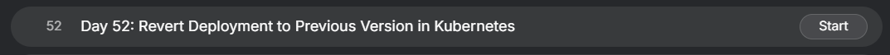
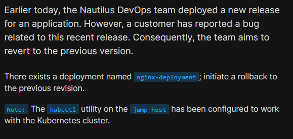
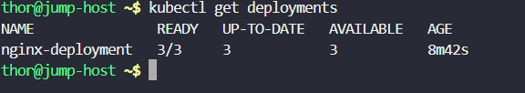
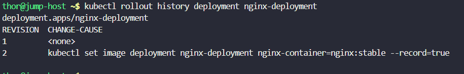
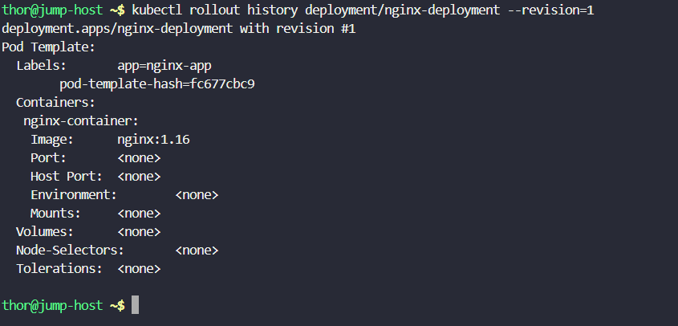
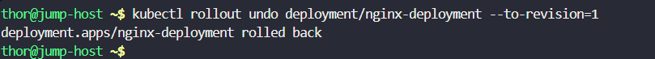
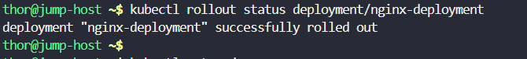
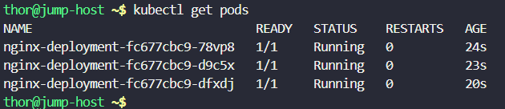

# Day 52: Revert Deployment to Previous Version in Kubernetes

<div style="border:1px solid #ccc; padding:10px; border-radius:10px; box-shadow:2px 2px 8px rgba(0,0,0,0.2); display:inline-block;">
  
</div>

## Content:

> Today I worked on reverting a Kubernetes Deployment to its previous stable version after a faulty application release. This task helped me understand how Kubernetes Rollback works and how Deployments maintain revision history for quick recovery during failed updates.

* * *

## 🔹 What I Learned

*   How Kubernetes maintains Deployment revision history
    
*   How to check rollout history of a Deployment
    
*   How to rollback to a previous Deployment revision
    

* * *

## 🔹 Task Requirement

<div style="border:1px solid #ccc; padding:10px; border-radius:10px; box-shadow:2px 2px 8px rgba(0,0,0,0.2); display:inline-block;">
  
</div>

As per the Nautilus DevOps team requirements, I needed to:

Rollback the deployment to its previous stable version.

| Requirement | Value |
| --- | --- |
| Deployment Name | nginx-deployment |
| Current Revision | 2 |
| Rollback Target | Revision 1 |
| Previous Stable Image | nginx:1.16 |

The deployment needed to rollback successfully with all Pods running properly after restoration.

* * *

# 🔹 Steps I Followed

### 1\. Verified Existing Deployment

First, I checked the available deployments in the Kubernetes cluster.

### Executed:

```bash
kubectl get deployments
```
<div style="border:1px solid #ccc; padding:10px; border-radius:10px; box-shadow:2px 2px 8px rgba(0,0,0,0.2); display:inline-block;">
  
</div>

### Observed:

```bash
NAME               READY   UP-TO-DATE   AVAILABLE   AGE
nginx-deployment   3/3     3            3           8m42s
```

This confirmed:

*   Deployment already existed
    
*   All 3 Pods were healthy
    
*   Deployment was currently active
    

* * *

### 🔹 2. Checked Deployment Rollout History

Next, I checked the Deployment revision history.

### Executed:

```bash
kubectl rollout history deployment nginx-deployment
```
<div style="border:1px solid #ccc; padding:10px; border-radius:10px; box-shadow:2px 2px 8px rgba(0,0,0,0.2); display:inline-block;">
  
</div>

### Observed:

```bash
deployment.apps/nginx-deployment

REVISION  CHANGE-CAUSE
1         <none>
2         kubectl set image deployment nginx-deployment nginx-container=nginx:stable --record=true
```

This confirmed:

*   Revision 1 was the original stable deployment
    
*   Revision 2 introduced the newer image update
    
*   Kubernetes stored Deployment history automatically
    

* * *

### 🔹 3. Inspected Previous Revision Details

To verify the stable version before rollback, I inspected revision 1.

### Executed:

```bash
kubectl rollout history deployment/nginx-deployment --revision=1
```
<div style="border:1px solid #ccc; padding:10px; border-radius:10px; box-shadow:2px 2px 8px rgba(0,0,0,0.2); display:inline-block;">
  
</div>


### Observed:

```bash
deployment.apps/nginx-deployment with revision #1

Containers:
 nginx-container:
  Image: nginx:1.16
```

This confirmed:

*   Revision 1 was using the stable image:
    

```bash
nginx:1.16
```

* * *

### 🔹 4. Performed Rollback to Previous Revision

After confirming the correct revision, I initiated the rollback.

### Executed:

```bash
kubectl rollout undo deployment/nginx-deployment --to-revision=1
```
<div style="border:1px solid #ccc; padding:10px; border-radius:10px; box-shadow:2px 2px 8px rgba(0,0,0,0.2); display:inline-block;">
  
</div>

### Observed:

```bash
deployment.apps/nginx-deployment rolled back
```

This triggered Kubernetes to:

*   Restore the old ReplicaSet
    
*   Recreate Pods using the previous image
    
*   Gradually terminate Pods from the faulty release
    

* * *

### 🔹 5. Verified Rollout Status

Next, I monitored the rollback progress.

### Executed:

```bash
kubectl rollout status deployment/nginx-deployment
```
<div style="border:1px solid #ccc; padding:10px; border-radius:10px; box-shadow:2px 2px 8px rgba(0,0,0,0.2); display:inline-block;">
  
</div>

### Observed:

```bash
deployment "nginx-deployment" successfully rolled out
```

This confirmed:

*   Rollback completed successfully
    
*   New Pods became healthy
    
*   Deployment returned to stable state
    

* * *

### 🔹 6. Verified Running Pods After Rollback

Finally, I checked the running Pods.

### Executed:

```bash
kubectl get pods
```
<div style="border:1px solid #ccc; padding:10px; border-radius:10px; box-shadow:2px 2px 8px rgba(0,0,0,0.2); display:inline-block;">
  
</div>

### Observed:

```bash
NAME                                READY   STATUS    RESTARTS   AGE
nginx-deployment-fc677cbc9-78vp8   1/1     Running   0          24s
nginx-deployment-fc677cbc9-d9c5x   1/1     Running   0          23s
nginx-deployment-fc677cbc9-dfxdj   1/1     Running   0          20s
```

Verified:

*   New Pods were created from the previous stable ReplicaSet
    
*   All Pods were in Running state
    
*   Rollback completed successfully
    

* * *

### 🔹 Understanding Kubernetes Rollback

| Concept | Explanation |
| --- | --- |
| Rollback | Restores Deployment to a previous revision |
| Revision | Stored version history of a Deployment |
| ReplicaSet | Maintains specific Pod versions |
| Rollout Undo | Kubernetes command used for rollback |
| Stable Release | Last working application version |

* * *

### 🔹 Rollback Process Observed

During rollback, Kubernetes automatically:

*   Restored the old ReplicaSet
    
*   Created Pods using the old image
    
*   Removed Pods from the faulty revision
    

This ensured application recovery with minimal downtime.

* * *

### 🔹 Important Rollback Commands

### View rollout history

```bash
kubectl rollout history deployment nginx-deployment
```

### Check specific revision

```bash
kubectl rollout history deployment/nginx-deployment --revision=1
```

### Rollback to previous revision

```bash
kubectl rollout undo deployment/nginx-deployment
```

### Rollback to a specific revision

```bash
kubectl rollout undo deployment/nginx-deployment --to-revision=1
```

### Verify rollout status

```bash
kubectl rollout status deployment/nginx-deployment
```

* * *

### 🔹 My Understanding

This task helped me understand how Kubernetes provides a powerful rollback mechanism for Deployments. Whenever a faulty application version is deployed, Kubernetes can quickly restore the previous stable version using Deployment revision history.

* * *

### 🔹 What I Found Interesting

I found it interesting how Kubernetes keeps track of Deployment history automatically. With a single rollback command, Kubernetes restored the previous stable version, recreated healthy Pods, and removed faulty Pods without requiring manual reconfiguration.

This demonstrates how Kubernetes simplifies application recovery and ensures high availability during failed deployments.

* * *

### Topics Covered

- ***kubernetes***
- ***kubernetes-rollout-undo***
- ***kubernetes-rollout-history***
- ***kubectl***


**Previous Task**: [Day 51: Execute Rolling Updates in Kubernetes ](../Day_51/day_51.md)

**Next Task**: [Day 53: Resolve VolumeMounts Issue in Kubernetes ](../Day_53/day_53.md)