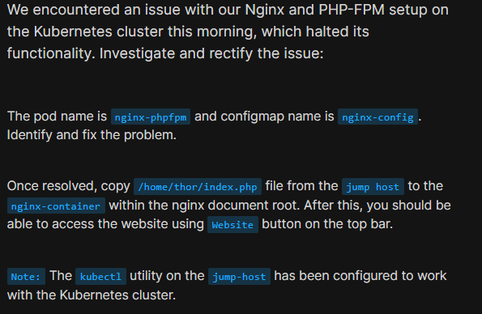
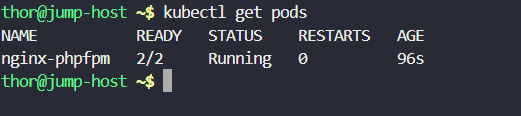
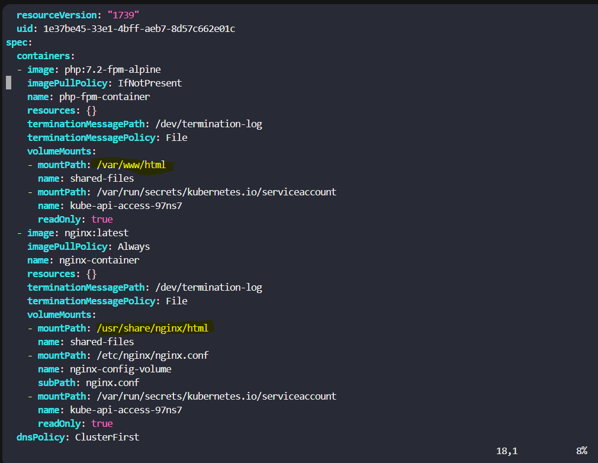
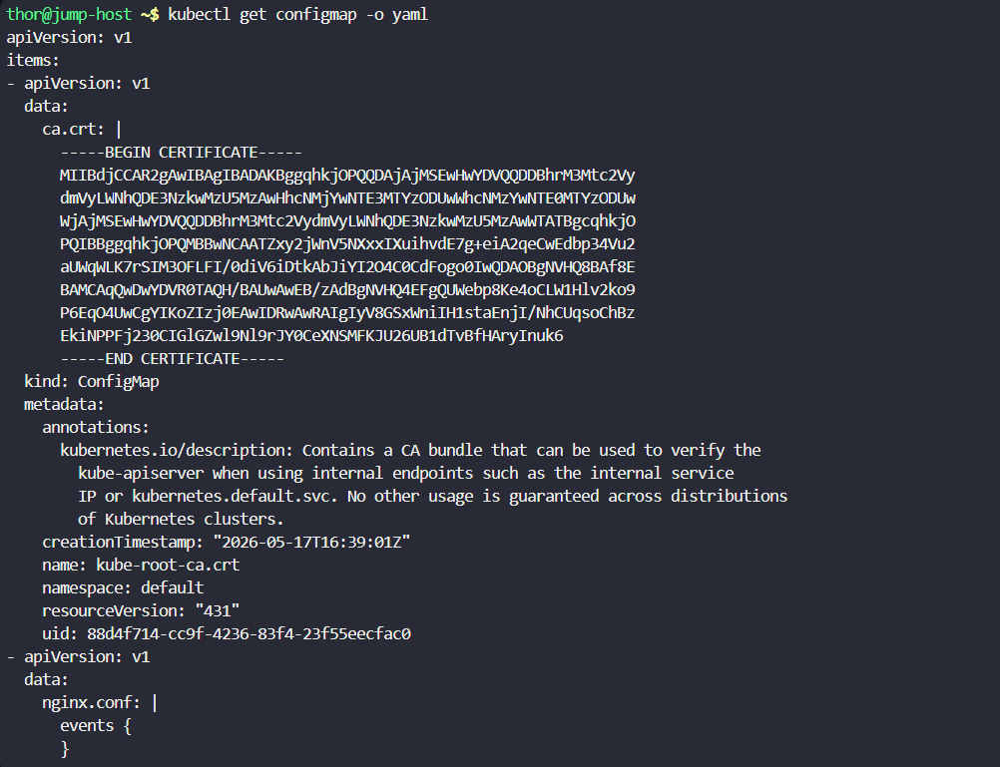
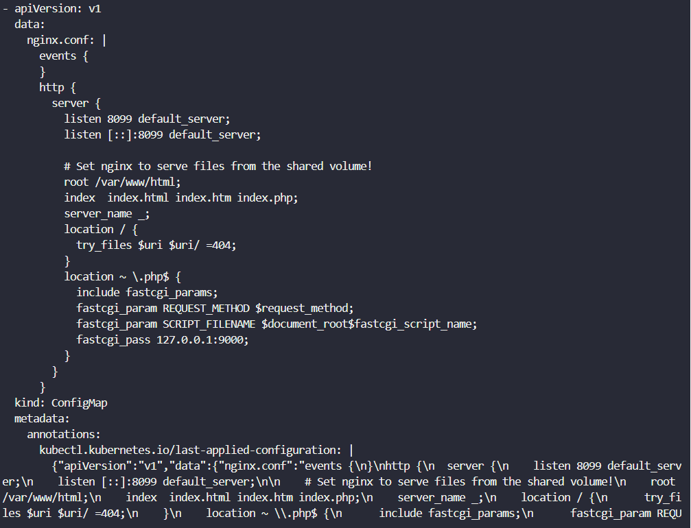
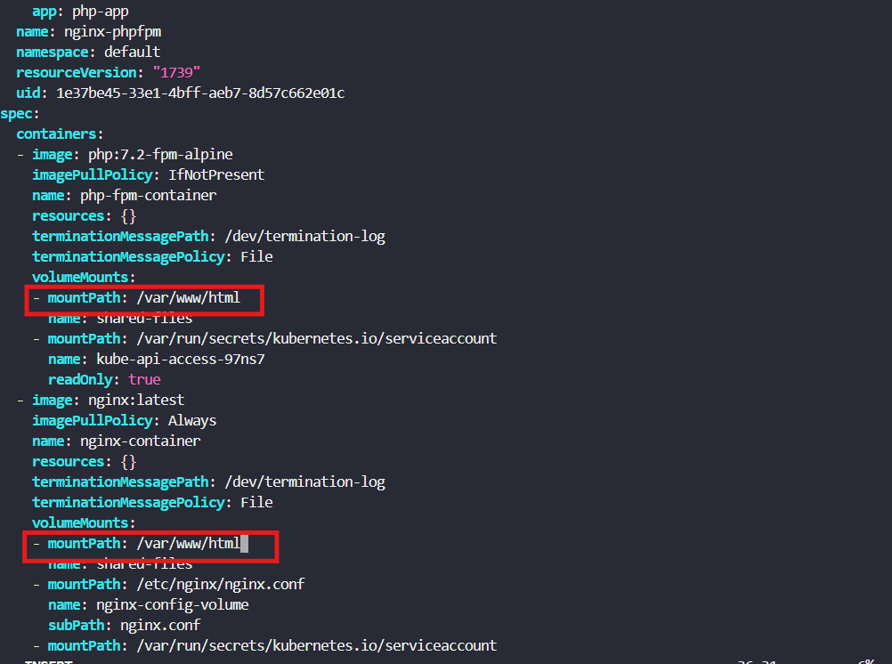
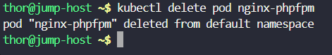
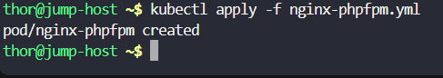

# Day 53: Resolve VolumeMounts Issue in Kubernetes

<div style="border:1px solid #ccc; padding:10px; border-radius:10px; box-shadow:2px 2px 8px rgba(0,0,0,0.2); display:inline-block;">
  
</div>

## Content:

> Today I worked on troubleshooting and fixing a **VolumeMounts configuration issue** in a Kubernetes-based **Nginx + PHP-FPM application setup**. Although the Pod was showing as healthy, the application was not functioning correctly due to a storage mount path mismatch between containers.

* * *

## 🔹 What I Learned

*   How shared volumes work in multi-container Kubernetes Pods
    
*   How to inspect Pod YAML configurations for troubleshooting
    
*   How VolumeMount path mismatches can break applications
    
*   How ConfigMaps influence application configuration
    

* * *

## 🔹 Task Requirement

<div style="border:1px solid #ccc; padding:10px; border-radius:10px; box-shadow:2px 2px 8px rgba(0,0,0,0.2); display:inline-block;">
  
</div>

As per the Nautilus DevOps team requirements, I needed to:

*   Investigate and fix the Kubernetes setup issue.
    
*   Pod name: **nginx-phpfpm**
    
*   ConfigMap name: **nginx-config**
    
*   Identify and resolve the configuration problem.
    
*   Copy `/home/thor/index.php` into the **nginx-container document root**.
    
*   Ensure the website becomes accessible after the fix.
    

* * *

## 🔹 Steps I Followed

### 1\. Verified Existing Pod Status

First, I checked the running Pods in the cluster.

Executed:

```bash
kubectl get pods
```
<div style="border:1px solid #ccc; padding:10px; border-radius:10px; box-shadow:2px 2px 8px rgba(0,0,0,0.2); display:inline-block;">
  
</div>

Observed:

```bash
NAME           READY   STATUS    RESTARTS   AGE
nginx-phpfpm   2/2     Running   0          96s
```

This confirmed:

*   Pod already existed
    
*   Both containers were running
    
*   No restart failures
    
*   Issue was likely configuration-related rather than container failure
    

* * *

## 🔹 2. Exported Pod YAML for Investigation

Next, I exported the complete Pod definition for detailed analysis.

Executed:

```bash
kubectl get pod nginx-phpfpm -o yaml > nginx-phpfpm.yml
```
<div style="border:1px solid #ccc; padding:10px; border-radius:10px; box-shadow:2px 2px 8px rgba(0,0,0,0.2); display:inline-block;">
  
</div>

Then opened the file:

```bash
vi nginx-phpfpm.yml
```
<div style="border:1px solid #ccc; padding:10px; border-radius:10px; box-shadow:2px 2px 8px rgba(0,0,0,0.2); display:inline-block;">
  
</div>

This allowed me to inspect:

*   Container definitions
    
*   VolumeMounts
    
*   Shared volumes
    
*   ConfigMap references
    

* * *

## 🔹 3. Investigated VolumeMount Configuration

I compared the VolumeMount paths in both containers.

### PHP-FPM Container

<div style="border:1px solid #ccc; padding:10px; border-radius:10px; box-shadow:2px 2px 8px rgba(0,0,0,0.2); display:inline-block;">
  
</div>

Observed:

```yaml
volumeMounts:
- mountPath: /var/www/html
  name: shared-files
```

### Nginx Container

Observed:

```yaml
volumeMounts:
- mountPath: /usr/share/nginx/html
  name: shared-files
```

This immediately looked suspicious.

Both containers were sharing the same volume:

```yaml
shared-files
```

But they mounted it at **different filesystem locations**.

* * *

## 🔹 4. Inspected ConfigMap Configuration

Next, I checked the ConfigMap configuration.

Executed:

```bash
kubectl get configmap -o yaml
```
<div style="border:1px solid #ccc; padding:10px; border-radius:10px; box-shadow:2px 2px 8px rgba(0,0,0,0.2); display:inline-block;">
  
</div>
<div style="border:1px solid #ccc; padding:10px; border-radius:10px; box-shadow:2px 2px 8px rgba(0,0,0,0.2); display:inline-block;">
  
</div>

Observed inside `nginx-config`:

```nginx
root /var/www/html;
```

This revealed an important clue.

Nginx was configured to serve files from:

```text
/var/www/html
```

But inside the nginx container, the shared volume was mounted at:

```text
/usr/share/nginx/html
```

* * *

## 🔹 Root Cause Identified

The problem was a **VolumeMount path mismatch**.

Current configuration:

| Component | Path |
| --- | --- |
| PHP-FPM Container | /var/www/html |
| Nginx ConfigMap Root | /var/www/html |
| Nginx Container VolumeMount | /usr/share/nginx/html |

Since Nginx expected content from `/var/www/html` but mounted the shared volume elsewhere, the application could not properly access shared files.

* * *

## 🔹 5. Fixed the VolumeMount Issue

I updated the nginx container VolumeMount path.

<div style="border:1px solid #ccc; padding:10px; border-radius:10px; box-shadow:2px 2px 8px rgba(0,0,0,0.2); display:inline-block;">
  
</div>
<div style="border:1px solid #ccc; padding:10px; border-radius:10px; box-shadow:2px 2px 8px rgba(0,0,0,0.2); display:inline-block;">
  
</div>

### Before Fix

```yaml
- mountPath: /usr/share/nginx/html
  name: shared-files
```

### After Fix

```yaml
- mountPath: /var/www/html
  name: shared-files
```

Now both containers shared the volume at the **same path**.

* * *

## 🔹 6. Recreated the Pod

Since Pod specifications cannot be updated directly for this change, I recreated the Pod.

Deleted existing Pod:

```bash
kubectl delete pod nginx-phpfpm
```
<div style="border:1px solid #ccc; padding:10px; border-radius:10px; box-shadow:2px 2px 8px rgba(0,0,0,0.2); display:inline-block;">
  
</div>

Observed:

```bash
pod "nginx-phpfpm" deleted
```

Applied corrected YAML:

```bash
kubectl apply -f nginx-phpfpm.yml
```
<div style="border:1px solid #ccc; padding:10px; border-radius:10px; box-shadow:2px 2px 8px rgba(0,0,0,0.2); display:inline-block;">
  
</div>

Observed:

```bash
pod/nginx-phpfpm created
```

This recreated the Pod using the corrected configuration.

* * *

## 🔹 7. Copied Application File into Container

As required by the task, I copied the PHP file into the nginx container document root.

Executed:

```bash
kubectl cp /home/thor/index.php \
nginx-phpfpm:/var/www/html/index.php \
-c nginx-container
```
<div style="border:1px solid #ccc; padding:10px; border-radius:10px; box-shadow:2px 2px 8px rgba(0,0,0,0.2); display:inline-block;">
  
</div>

The file copy completed successfully.

* * *

## 🔹 8. Verified Application Accessibility

Finally, I tested the application.

Executed:

```bash
curl localhost:8080
```
<div style="border:1px solid #ccc; padding:10px; border-radius:10px; box-shadow:2px 2px 8px rgba(0,0,0,0.2); display:inline-block;">
  
</div>

Observed:

Large application response output returned successfully.

This confirmed:

*   Nginx was responding properly
    
*   Shared storage configuration was fixed
    
*   Application became accessible
    
*   Task completed successfully
    

* * *

## 🔹 Understanding the Issue

| Concept | Explanation |
| --- | --- |
| VolumeMount | Mounts Kubernetes volumes inside containers |
| Shared Volume | Allows multiple containers to access same storage |
| ConfigMap | Stores application configuration data |
| Multi-Container Pod | Multiple containers sharing resources |
| Mount Path Mismatch | Containers reference different filesystem locations |

* * *

## 🔹 Troubleshooting Process Observed

During investigation, I followed this troubleshooting flow:

1.  Verified Pod health
    
2.  Exported Pod YAML
    
3.  Compared container VolumeMounts
    
4.  Inspected ConfigMap configuration
    
5.  Identified path mismatch
    
6.  Corrected mount path
    
7.  Recreated Pod
    
8.  Validated application functionality
    

This systematic approach helped quickly isolate the root cause.

* * *

## 🔹 Important Commands Used

Check Pods

```bash
kubectl get pods
```

Export Pod YAML

```bash
kubectl get pod nginx-phpfpm -o yaml
```

Check ConfigMaps

```bash
kubectl get configmap -o yaml
```

Delete Pod

```bash
kubectl delete pod nginx-phpfpm
```

Apply Updated YAML

```bash
kubectl apply -f nginx-phpfpm.yml
```

Copy file into container

```bash
kubectl cp /home/thor/index.php nginx-phpfpm:/var/www/html/index.php -c nginx-container
```

Verify application

```bash
curl localhost:8080
```

* * *

## 🔹 My Understanding

This task strengthened my understanding of **shared storage management in Kubernetes multi-container Pods**. Even when containers appear healthy, incorrect VolumeMount paths can silently break application functionality.

I learned the importance of cross-checking:

*   Container VolumeMounts
    
*   ConfigMap paths
    
*   Application document roots
    
*   Shared volume locations
    

during Kubernetes troubleshooting.

* * *

## 🔹 What I Found Interesting

I found it interesting that the Pod showed **2/2 Running**, yet the application was still broken. This demonstrated that Kubernetes resource health alone does not always guarantee application correctness.

The actual issue came down to a simple **mount path mismatch**, and by systematically analyzing the Pod YAML and ConfigMap configuration, the problem was identified and resolved successfully.

* * *

### Topics Covered

- ***kubernetes***
- ***kubernetes-volumes***
- ***kubernetes-config***
- ***kubectl***


**Previous Task**: [Day 52: Execute Rolling Updates in Kubernetes ](../Day_52/day_52.md)

**Next Task**: [Day 54: Kubernetes Shared Volumes](../Day_54/day_54.md)
