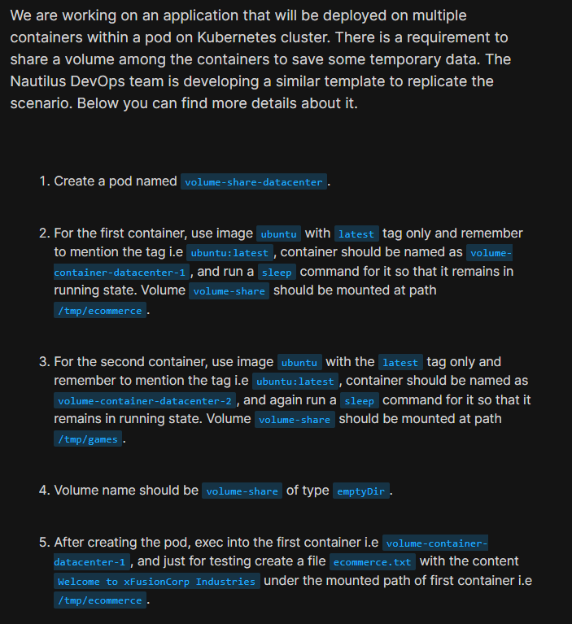
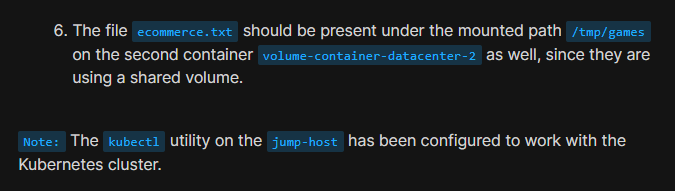
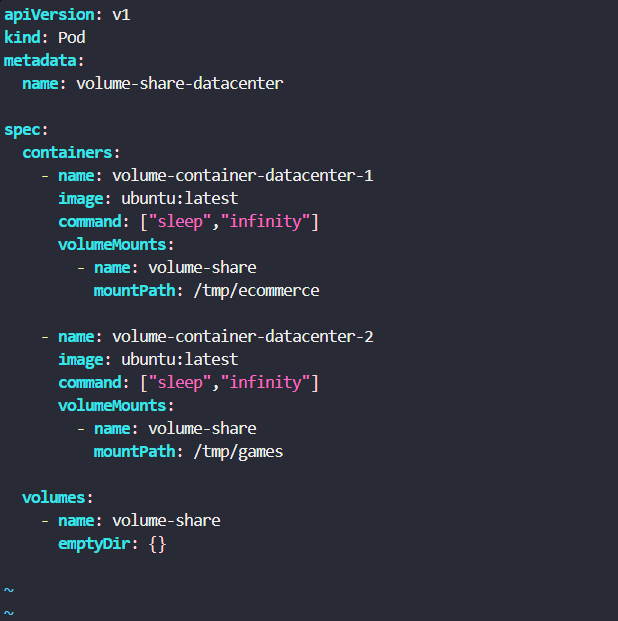
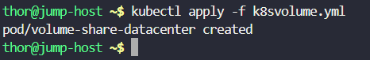
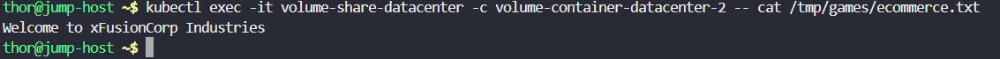

# Day 54: Kubernetes Shared Volumes

<div style="border:1px solid #ccc; padding:10px; border-radius:10px; box-shadow:2px 2px 8px rgba(0,0,0,0.2); display:inline-block;">
  
</div>

## Content:

>Today I worked on configuring **shared storage between multiple containers inside a Kubernetes Pod** using the **emptyDir volume type**. The task focused on understanding how containers within the same Pod can share temporary data through a common volume mount.

---

## 🔹 What I Learned

* How **multi-container Pods** work in Kubernetes
* Understanding **shared volumes** inside a Pod
* Using **emptyDir volumes** for temporary shared storage
* Configuring **VolumeMounts** in multiple containers
* Testing shared data accessibility across containers

---

## 🔹 Task Requirement

<div style="border:1px solid #ccc; padding:10px; border-radius:10px; box-shadow:2px 2px 8px rgba(0,0,0,0.2); display:inline-block;">
  
</div>
<div style="border:1px solid #ccc; padding:10px; border-radius:10px; box-shadow:2px 2px 8px rgba(0,0,0,0.2); display:inline-block;">
  
</div>

As per the Nautilus DevOps team requirements, I needed to:

* Create a Pod named **volume-share-datacenter**
* Use **2 Ubuntu containers**
* Configure a shared volume named **volume-share**
* Use **emptyDir** volume type
* Mount the shared volume at:

| Container                     | Mount Path     |
| ----------------------------- | -------------- |
| volume-container-datacenter-1 | /tmp/ecommerce |
| volume-container-datacenter-2 | /tmp/games     |

* Create a file inside the first container.
* Verify the same file becomes accessible inside the second container.

---

## 🔹 Steps I Followed

### 1. Created Kubernetes Pod YAML

First, I created the Pod definition file.

Executed:

```bash
vi k8svolume.yml
```
<div style="border:1px solid #ccc; padding:10px; border-radius:10px; box-shadow:2px 2px 8px rgba(0,0,0,0.2); display:inline-block;">
  
</div>

Configured the Pod with:

* Pod Name: `volume-share-datacenter`
* Two containers using `ubuntu:latest`
* Shared volume using `emptyDir`
* Proper VolumeMount configuration.

YAML Used:
<div style="border:1px solid #ccc; padding:10px; border-radius:10px; box-shadow:2px 2px 8px rgba(0,0,0,0.2); display:inline-block;">
  
</div>

```yaml
apiVersion: v1
kind: Pod
metadata:
  name: volume-share-datacenter

spec:
  containers:
    - name: volume-container-datacenter-1
      image: ubuntu:latest
      command: ["sleep","infinity"]
      volumeMounts:
        - name: volume-share
          mountPath: /tmp/ecommerce

    - name: volume-container-datacenter-2
      image: ubuntu:latest
      command: ["sleep","infinity"]
      volumeMounts:
        - name: volume-share
          mountPath: /tmp/games

  volumes:
    - name: volume-share
      emptyDir: {}
```

---

## 🔹 2. Applied the Pod Configuration

After saving the YAML file, I deployed it to the Kubernetes cluster.

Executed:

```bash
kubectl apply -f k8svolume.yml
```
<div style="border:1px solid #ccc; padding:10px; border-radius:10px; box-shadow:2px 2px 8px rgba(0,0,0,0.2); display:inline-block;">
  
</div>

Observed:

```text
pod/volume-share-datacenter created
```

---

## 🔹 3. Verified Pod Status

Next, I checked whether the Pod and both containers were running successfully.

Executed:

```bash
kubectl get pods
```
<div style="border:1px solid #ccc; padding:10px; border-radius:10px; box-shadow:2px 2px 8px rgba(0,0,0,0.2); display:inline-block;">
  
</div>

Observed:

```text
NAME                      READY   STATUS    RESTARTS   AGE
volume-share-datacenter   2/2     Running   0          100s
```

This confirmed:

* Pod creation succeeded
* Both containers were healthy
* Shared volume configuration loaded successfully

---

## 🔹 4. Created File in First Container

As required by the task, I accessed the first container and created a test file inside its mounted directory.

Executed:

```bash
kubectl exec -it volume-share-datacenter \
-c volume-container-datacenter-1 -- bash
```

Inside the container:

```bash
echo "Welcome to xFusionCorp Industries" > /tmp/ecommerce/ecommerce.txt
```

Verified:

```bash
cat /tmp/ecommerce/ecommerce.txt
```
<div style="border:1px solid #ccc; padding:10px; border-radius:10px; box-shadow:2px 2px 8px rgba(0,0,0,0.2); display:inline-block;">
  
</div>

Observed:

```text
Welcome to xFusionCorp Industries
```

This confirmed the file was created successfully inside the mounted volume.

---

## 🔹 5. Verified Shared Volume Functionality

Next, I tested whether the second container could access the same file.

Executed:

```bash
kubectl exec -it volume-share-datacenter \
-c volume-container-datacenter-2 \
-- cat /tmp/games/ecommerce.txt
```
<div style="border:1px solid #ccc; padding:10px; border-radius:10px; box-shadow:2px 2px 8px rgba(0,0,0,0.2); display:inline-block;">
  
</div>

Observed:

```text
Welcome to xFusionCorp Industries
```

Success.

This proved that both containers were sharing the same storage volume.

---

## 🔹 Understanding the Shared Volume Setup

### Shared Volume Architecture

```text
                Pod: volume-share-datacenter
      -------------------------------------------------
      |                                               |
      |   Container 1             Container 2         |
      |   /tmp/ecommerce          /tmp/games          |
      |         |                     |               |
      |         |                     |               |
      |         +------ volume-share ------+          |
      |                (emptyDir)                     |
      -------------------------------------------------
```

Both containers mounted the same Kubernetes volume at different filesystem paths.

---

### 🔹 Understanding `emptyDir`

`emptyDir` is a Kubernetes volume type that:

* Is created when the Pod starts.
* Exists as long as the Pod is running.
* Allows containers inside the same Pod to share data.
* Gets deleted automatically when the Pod is removed.

This makes it useful for:

* Temporary storage
* Shared cache data
* Inter-container communication
* Scratch space

---

## 🔹 Important Commands Used

### Create Pod

```bash
kubectl apply -f k8svolume.yml
```

### Check Pod Status

```bash
kubectl get pods
```

### Access First Container

```bash
kubectl exec -it volume-share-datacenter \
-c volume-container-datacenter-1 -- bash
```

### Create Test File

```bash
echo "Welcome to xFusionCorp Industries" > /tmp/ecommerce/ecommerce.txt
```

### Verify Shared File

```bash
kubectl exec -it volume-share-datacenter \
-c volume-container-datacenter-2 \
-- cat /tmp/games/ecommerce.txt
```

---

### 🔹 My Understanding

This task strengthened my understanding of **shared storage management in Kubernetes multi-container Pods**.

I learned that containers inside the same Pod can access common data by mounting the same Kubernetes volume, even when using different mount paths.

I also gained practical experience configuring:

* `emptyDir` volumes
* VolumeMounts
* Multi-container Pods
* Shared filesystem behavior

---

### 🔹 What I Found Interesting

I found it interesting how Kubernetes allows **multiple containers to share the same storage seamlessly** inside a Pod.

Even though the containers used different mount paths (`/tmp/ecommerce` and `/tmp/games`), the underlying shared volume allowed instant visibility of files across containers.

This task gave me a clear hands-on understanding of **inter-container shared storage in Kubernetes**.


* * *

### Topics Covered

- ***kubernetes***
- ***kubernetes-volumes***
- ***kubernetes-shared-volume***
- ***kubectl***


**Previous Task**: [Day 53: Resolve VolumeMounts Issue in Kubernetes ](../Day_53/day_53.md)

**Next Task**: [Day 55: Kubernetes Sidecar Containers](../Day_55/day_55.md)

